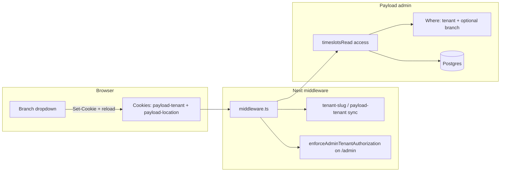

# Multi-Tenant Setup for atnd-me App

## Progress at a glance

| Area | Status | Where to read |
|------|--------|----------------|
| **Tracked MVP todos** (YAML frontmatter) | All `done` | Lines 5–161 in this file |
| **Phase 1** – Multi-tenant MVP | **Complete** (per codebase scan) | [Phase 1 Completion Status](#phase-1-completion-status-vs-codebase) |
| **Phase 2** – Payments / Connect / class passes | **Core built**; verification & test hardening called out | [Phase 2 Completion Status](#phase-2-completion-status-vs-codebase) |
| **Phase 2.5** – Stripe sync (admin-managed Stripe-backed docs) | **Shipped** in app code (hooks + webhooks); keep hardening where *Current Implementation To-Do* still applies | [Phase 2.5](#phase-25-stripe-sync-for-stripe-backed-collections-next) |
| **Phase 4.5** – Product / discount sync | **Shipped** (webhook-driven sync path) | [Phase 4.5](#phase-45-stripe-product-sync--discount-codes) |
| **Phase 4.6** – Class pass UI in bookings | **Main + manage flows shipped**; children booking route **out of scope**; polish items may remain in *Current Implementation To-Do* | [Phase 4.6](#phase-46-class-pass-ui-in-bookings-page) |
| **Phase 5** – Bulk admin / Payload timeslots UI | **Not planned** (baseline admin only); numbering kept for 5.5 / 6 | [Phase 5](#phase-5-admin-ux-current-app-not-planned) |
| **Next infra milestone** | **Phase 5.5** – Media on R2/S3 (plugin + env in code; tests & Media `staticDir` polish per plan) | [Phase 5.5](#phase-55-image-storage-s3--cloudflare-r2) |
| **Next large product milestone** | **Phase 6** – Auth across subdomain ↔ custom domain (**session propagation** and named E2E gaps remain) | [Phase 6](#phase-6-authentication-across-subdomains-and-custom-domains) |
| **Closeout / polish** | *Current Implementation To-Do* (access review, webhooks, booking UX parity where listed) | [Current Implementation To-Do](#current-implementation-to-do) |

**Where you are on the roadmap:** Phases **1**, **2**, and **2.5** are in place in code, with **4.5** and the scoped **4.6** class-pass surfaces shipped. **Phase 5** is intentionally not a build target. The next **infrastructure** chunk is **Phase 5.5** (object storage for Media). The next **product/security** chunk is **Phase 6**, mainly **single sign-on across a tenant’s platform subdomain and custom domain** (session handoff or equivalent), on top of validation, middleware, and trusted origins that are already largely implemented.

## Table of contents

**Status & next steps**

- [Progress at a glance](#progress-at-a-glance) (this section)
- [Phase 1 Completion Status](#phase-1-completion-status-vs-codebase)
- [Current Implementation To-Do](#current-implementation-to-do)
- [Phase 2 Completion Status](#phase-2-completion-status-vs-codebase)

**Concepts & reference (read once)**

- [Overview](#overview) · [MVP Scope](#mvp-scope) · [Roadmap](#roadmap-execution-order)
- [Code Organization](#code-organization-app-vs-packages) · [TDD Approach](#test-driven-development-approach) · [Architecture](#architecture)
- [Key Files to Modify](#key-files-to-modify) · [Test Files](#test-files-to-create) · [Migration Strategy](#migration-strategy)

**Long-form TDD walkthrough (Phase 1 era; kept as archive)**

- [Implementation Steps (detailed)](#implementation-steps-detailed-phase-1-reference)

**Future phases (by execution order)**

- [Phase 2 – Payments](#phase-2-payment-functionality-future) · [2.5 – Stripe sync](#phase-25-stripe-sync-for-stripe-backed-collections-next)
- [Phase 3 – Tenant blocks](#phase-3-custom-tenant-scoped-blocks) · [Phase 4 – Admin homepage](#phase-4-custom-admin-dashboard-homepage)
- [Phase 4.5 – Product sync](#phase-45-stripe-product-sync--discount-codes) · [Phase 4.6 – Class pass UI](#phase-46-class-pass-ui-in-bookings-page)
- [Phase 5 – Admin UX (current app; not planned)](#phase-5-admin-ux-current-app-not-planned) · [5.5 – R2 media](#phase-55-image-storage-s3--cloudflare-r2)
- [Phase 6 – Auth across domains](#phase-6-authentication-across-subdomains-and-custom-domains) · [Phase 7 – Multi-location](#phase-7-multi-location-architecture) · [Phase 7 TDD chunks](#phase-7-tdd-build-plan-chunks-tests-cadence) · [Phase 7 user stories & tests](#phase-7-user-stories-and-associated-tests) · [Phase 7 implementation context](#phase-7-implementation-context) · [7.5 – Organisations](#phase-75-organisation-brand-above-tenants-future) · [7.5 roadmap / Stripe](#roadmap-and-stripe-hierarchy-decision-record)
- [Phase 8 – Self-onboarding](#phase-8-self-onboarding-with-mcp-driven-personalisation) · [Phase 9 – Analytics](#phase-9-dashboard-analytics-future) · [Phase 10 – UTM](#phase-10-event-tracking--marketing-attribution-utm-future)
- [Phase 11 – App fees (deferred)](#phase-11-application-fee-management--platform-revenue-tracking-future-deferred)

## Document map

1. **Start here:** [Progress at a glance](#progress-at-a-glance) and [Current Implementation To-Do](#current-implementation-to-do).
2. **Historical / deep detail:** The [Implementation Steps](#implementation-steps-detailed-phase-1-reference) section is a long TDD checklist from the original Phase 1 build; the canonical “what’s built” view is the **Phase 1 / Phase 2 Completion Status** sections later in the file.
3. **Future work:** Each `Phase N` heading after Phase 2 describes goals and outlines; several phases appear **out of numerical order** in the file body (e.g. Phase 11 before Phase 8)—use the table of contents above, not scroll order, when planning. **Phase 7:** read [implementation context](#phase-7-implementation-context) before coding cookies or admin list filters; use [TDD build plan (chunks)](#phase-7-tdd-build-plan-chunks-tests-cadence) when executing the MVP.

## Overview

Transform the atnd-me app into a multi-tenant application using `@payloadcms/plugin-multi-tenant`. Each tenant will have isolated instances of pages, timeslots, staffMembers, event-types, scheduler, navbar, footer, and users, with subdomain-based tenant identification.

## MVP Scope

### Included in MVP (Phase 1)

**Core Multi-Tenant Features:**

- Tenant collection and management
- Subdomain-based tenant identification
- Tenant-scoped collections (pages, timeslots, staffMembers, event-types, scheduler, navbar, footer)
- Role structure (admin, tenant-admin, user)
- User access control with cross-tenant booking capability
- Marketing landing page and tenants listing page
- Basic booking functionality (create, view, cancel)
- Booking status management (pending, confirmed, cancelled, waiting)

**Current atnd-me Functionality:**

- Pages collection with layout builder
- Posts collection
- Media collection
- Categories collection
- Timeslots collection
- StaffMembers collection
- Class Options collection
- Bookings collection (without payment validation)
- Scheduler global (converted to collection)
- Header/Footer globals (converted to collections)

### Excluded from MVP (Phase 2 - Future)

**Payment Functionality:**

- Payment method validation for bookings
- Subscription/membership validation
- Stripe integration for bookings
- Payment processing flows
- Drop-in payment methods
- Membership plans and subscriptions

**Why Excluded:**

- MVP atnd-me did not have payment/membership features enabled
- Phase 2 uses the unified `@repo/bookings-payments` plugin (`bookingsPaymentsPlugin`), which provides payments, memberships, and class passes in one plugin

### Architecture for Future Payments

The MVP will be structured to easily add payment functionality later:

- Booking access controls will be extensible
- Tenant-aware payment validation helpers can be added
- No breaking changes needed when adding payments

### Roadmap (execution order)

| Order | Phase | Summary |
|------:|-------|---------|
| 1 | **Phase 1** | Multi-tenant MVP: tenants, roles, scoped collections, middleware, marketing pages, onboarding |
| 2 | **Phase 2** | Payments: Stripe Connect, booking fees, class passes, `bookingsPaymentsPlugin` |
| 2.5 | **Phase 2.5** | **Next implementation focus:** Stripe sync—admin is source of truth; create/update/archive Stripe objects for plans, class pass types, discount codes, etc. *(Detailed product/price/coupon behaviour also described under Phase 4.5 below; treat 4.5 as an expanded spec that Phase 2.5 implements.)* |
| 3 | **Phase 3** | Custom tenant-scoped blocks (per-tenant layout builder allowlist) |
| 4 | **Phase 4** | Custom admin dashboard homepage (`payloadcms/ui`, analytics entry) |
| 4.5 | **Phase 4.5** | Stripe product sync & discount codes (see note on 2.5) |
| 4.6 | **Phase 4.6** | Class pass tab & booking UX parity in bookings UI |
| 5 | **Phase 5** | *(Retained)* Bookings + timeslots **admin as shipped**; no roadmap mandate for dedicated bookings bulk ops/tests or a full timeslots-admin `payloadcms/ui` migration. |
| 5.5 | **Phase 5.5** | Media uploads → S3-compatible storage (e.g. Cloudflare R2) |
| 6 | **Phase 6** | Auth across subdomains + custom domains; session propagation |
| 7 | **Phase 7** | Multi-location (sub-subdomain, Locations, location-manager) |
| 7.5 | **Phase 7.5** | Organisation (brand) above tenants; org domain & combined schedule |
| 8 | **Phase 8** | Self-onboarding + MCP-driven personalisation |
| 9 | **Phase 9** | Tenant-scoped dashboard analytics |
| 10 | **Phase 10** | Event tracking & UTM attribution |
| 11 | **Phase 11** | Application fees & platform revenue *(deferred)* |

## Code Organization: App vs Packages

### Architecture Principles

**Packages (`packages/`)** - Reusable code shared across multiple apps:

- Generic multi-tenant utilities and helpers
- Reusable access control patterns
- Tenant-aware business logic
- Shared types and interfaces

**App (`apps/atnd-me/`)** - App-specific code:

- Collection configurations specific to atnd-me
- Plugin configuration and overrides
- App-specific access control implementations
- Frontend routes and components
- App-specific business rules

### Code Distribution Strategy

#### In Packages (Reusable)

**New Package: `packages/multi-tenant-utils/**` (Optional - if reusable patterns emerge)

- `getTenantFromRequest()` - Extract tenant from request context
- `setTenantContext()` - Set tenant context in requests
- `validateTenantAccess()` - Generic tenant access validation
- Tenant context types and interfaces

**Extend Existing: `packages/shared-services/**`

- `access/is-admin-or-tenant-admin.ts` - Reusable access control for admin/tenant-admin
- `access/tenant-scoped-access.ts` - Generic tenant-scoped access patterns
- `tenant/getTenantFromTimeslot.ts` - Extract tenant from lesson (if reusable pattern)

**Extend Existing: `packages/shared-utils/**`

- `check-admin-role.ts` - Helper to check admin or tenant-admin roles
- Tenant-related type guards and utilities

#### In App (`apps/atnd-me/`)

**Collections** - App-specific:

- `src/collections/Tenants/` - Tenant collection config (app-specific fields)
- `src/collections/Navbar/` - Navbar collection (converted from global)
- `src/collections/Footer/` - Footer collection (converted from global)
- `src/collections/Scheduler/` - Scheduler collection (converted from global)
- `src/collections/Users/` - User collection with tenant fields (app-specific)

**Access Control** - App-specific implementations:

- `src/access/userTenantAccess.ts` - User visibility rules specific to atnd-me
- `src/access/tenantAccess.ts` - Collection-level access for atnd-me collections
- `src/access/bookingAccess.ts` - Booking access with atnd-me-specific payment validation

**Configuration** - App-specific:

- `src/plugins/index.ts` - Plugin configuration with atnd-me overrides
- `src/payload.config.ts` - Payload config with atnd-me collections
- `src/lib/auth/options.ts` - Better auth config for atnd-me

**Frontend** - App-specific:

- `src/middleware.ts` - Next.js middleware for atnd-me subdomain routing
- `src/app/(frontend)/**` - Frontend routes and components
- `src/utilities/getTenantContext.ts` - App-specific tenant context extraction
- `src/utilities/getTenantFromTimeslot.ts` - App-specific tenant extraction logic

**Tests** - App-specific:

- All test files in `tests/` directory

### Decision Matrix

| Code Type | Location | Reason |
|-----------|----------|--------|
| Generic tenant utilities | `packages/multi-tenant-utils/` or `shared-services` | Reusable across apps |
| Tenant access patterns | `packages/shared-services/access/` | Reusable access control |
| Role checking helpers | `packages/shared-utils/` | Already used by all apps |
| Collection configs | `apps/atnd-me/src/collections/` | App-specific schema |
| App-specific access control | `apps/atnd-me/src/access/` | App-specific business rules |
| Plugin configuration | `apps/atnd-me/src/plugins/` | App-specific plugin setup |
| Frontend routes | `apps/atnd-me/src/app/` | App-specific UI |
| Middleware | `apps/atnd-me/src/middleware.ts` | App-specific routing |
| Tests | `apps/atnd-me/tests/` | App-specific tests |

### When to Create New Package vs Extend Existing

**Create New Package (`packages/multi-tenant-utils/`)** if:

- Multiple apps will use multi-tenant features
- Generic utilities that don't fit existing packages
- Clear separation of concerns needed

**Extend Existing Package** if:

- Fits naturally into existing package purpose
- Only one or two apps need it initially
- Can be added incrementally

**Keep in App** if:

- Highly specific to atnd-me business logic
- Unlikely to be reused
- Tightly coupled to app configuration

## Test-Driven Development Approach

This implementation will follow **Test-Driven Development (TDD)** principles:

1. **Write tests first** - Define expected behavior through tests before implementation
2. **Run tests** - Verify tests fail (Red phase)
3. **Implement feature** - Write minimal code to make tests pass (Green phase)
4. **Refactor** - Improve code while keeping tests passing (Refactor phase)

### Testing Strategy

**Test Types:**

- **Unit Tests**: Utilities, helpers, access control functions
- **Integration Tests**: Collections, plugins, tenant context, payment validation
- **E2E Tests**: User flows, subdomain routing, cross-tenant bookings

**Test Structure:**

- `tests/unit/` - Unit tests for utilities and helpers
- `tests/int/` - Integration tests for Payload collections and plugins
- `tests/e2e/` - End-to-end tests for user flows

**Testing Tools:**

- **Vitest** - Unit and integration tests
- **Playwright** - E2E tests
- **Test Database** - Isolated PostgreSQL database per test run

## Architecture

### Tenant Identification

- **Method**: Subdomain-based (e.g., `tenant1.atnd-me.com`)
- **Implementation**: Next.js middleware will detect subdomain and set tenant context
- **Tenant Collection**: Create a `tenants` collection with fields: `name`, `slug`, `domain`

### Role Structure

- `**admin**` (Super Admin): Can access all tenants and all data across the entire system
- `**tenant-admin**`: Can only access their assigned tenant's data (pages, timeslots, staffMembers, bookings, etc.)
- `**user**`: Regular users who can book classes across any tenant

### User Scoping Model

- Users can book into **any tenant** (cross-tenant capability)
- Each tenant can only see users who:
  1. Registered through their domain, OR
  2. Made a booking through their version of the app
- **Super admins** (`admin` role) can access all tenants and all users
- **Tenant admins** (`tenant-admin` role) can only access their assigned tenant's data

## Implementation Steps (detailed; Phase 1 reference)

The checklist below is the **original step-by-step TDD plan** for the Phase 1 multi-tenant MVP. Implementation has largely shipped; use **[Phase 1 Completion Status](#phase-1-completion-status-vs-codebase)** and the YAML `todos` in the frontmatter for “done vs not”, not this section alone.

### 0. Test-Driven Development Setup

Before implementing features, set up test infrastructure:

#### 0.1 Create Test Utilities

Create `apps/atnd-me/tests/helpers/tenant-test-helpers.ts`:

- `createTestTenant()` - Helper to create test tenant
- `createTestUserWithTenant()` - Helper to create user with tenant assignment
- `setTenantContext()` - Helper to set tenant context in requests
- `getTenantFromSubdomain()` - Helper to extract tenant from subdomain

#### 0.2 Create Test Config

Create `apps/atnd-me/tests/int/multi-tenant.config.ts`:

- Payload config with multi-tenant plugin enabled
- Test database setup
- Test tenant creation

### 1. Install Multi-Tenant Plugin

**TDD Step 1: Write Tests First**

Create `apps/atnd-me/tests/int/multi-tenant-plugin.int.spec.ts`:

- Test that multi-tenant plugin is configured correctly
- Test that tenant collection exists
- Test that tenant field is added to collections
- Test that queries are filtered by tenant

**TDD Step 2: Implement**

Add `@payloadcms/plugin-multi-tenant` to `apps/atnd-me/package.json`

Add `@payloadcms/plugin-multi-tenant` to `apps/atnd-me/package.json`:

```json
{
  "dependencies": {
    "@payloadcms/plugin-multi-tenant": "^1.0.0"
  }
}
```

### 2. Create Tenants Collection

**TDD Step 1: Write Tests First**

Create `apps/atnd-me/tests/int/tenants-collection.int.spec.ts`:

- Test tenant creation with required fields
- Test tenant slug uniqueness
- Test tenant access control (only admins can create/update/delete)
- Test tenant-admin can read tenants
- Test regular users cannot access tenants
- Test public read access for tenants listing page (read: () => true)
- Test tenants can be queried without authentication for listing page
- Test that default data is created when tenant is created:
  - Default home page with HeroScheduleBlock
  - Default class options (2-3 options)
  - Default timeslots (2-3 upcoming timeslots)
  - Default instructor (optional)
  - Default navbar and footer

**TDD Step 2: Implement**

Create `apps/atnd-me/src/collections/Tenants/index.ts`:

- Fields: 
  - `name` (text, required) - Display name of tenant
  - `slug` (text, unique, required) - Subdomain slug (e.g., "tenant1")
  - `domain` (text, optional) - Custom domain if applicable
  - `description` (textarea, optional) - Description for tenants listing page
  - `logo` (upload, optional) - Logo/image for tenants listing page
  - **Phase 2 (Stripe Connect)**: `stripeConnectAccountId` (text, optional) - Stripe Connect account ID for this tenant
  - **Phase 2 (Stripe Connect)**: `stripeConnectOnboardingStatus` (select, optional) - Status of Stripe Connect onboarding (pending, active, restricted)
  - **Phase 2 (Class Passes)**: `classPassSettings` (group, optional) - Class pass configuration for tenant
    - `enabled` (checkbox) - Enable class passes
    - `defaultExpirationDays` (number) - Default expiration period
    - `pricing` (array) - Available pass packages
  - **Phase 11 (Application Fees)**: `applicationFeeOverrides` (group, optional) - Per-tenant fee overrides
    - `dropInFee` (number, optional) - Override default drop-in fee (percentage or fixed amount)
    - `subscriptionFee` (number, optional) - Override default subscription fee (percentage or fixed amount)
    - `feeType` (select, optional) - Override fee type (percentage or fixed) - if not set, uses global default
- Access: 
  - `read`: Public access (`() => true`) for tenants listing page
  - `create/update/delete`: Only admins
  - **Phase 2**: `stripeConnectAccountId` and `stripeConnectOnboardingStatus` only readable/updatable by tenant-admin and super admin
- Admin: Group under "Configuration"
- Hooks:
  - `afterChange`: Create default data when tenant is created (operation === 'create')

### 3. Convert Globals to Collections

#### 3.1 Convert Header to Collection

- Create `apps/atnd-me/src/collections/Navbar/index.ts`
- Move fields from `apps/atnd-me/src/Header/config.ts`
- Configure with `isGlobal: true` in multi-tenant plugin

#### 3.2 Convert Footer to Collection

- Create `apps/atnd-me/src/collections/Footer/index.ts`
- Move fields from `apps/atnd-me/src/Footer/config.ts`
- Configure with `isGlobal: true` in multi-tenant plugin

#### 3.3 Convert Scheduler to Collection

- Modify `packages/bookings/bookings-plugin/src/globals/scheduler.tsx` to support collection mode
- Create `apps/atnd-me/src/collections/Scheduler/index.ts` wrapper
- Configure with `isGlobal: true` in multi-tenant plugin

### 4. Configure Multi-Tenant Plugin

Update `apps/atnd-me/src/plugins/index.ts` to add multi-tenant plugin:

```typescript
multiTenantPlugin({
  tenantCollectionSlug: 'tenants',
  collections: {
    // Standard collections
    pages: {},
    timeslots: {},
    staffMembers: {},
    'event-types': {},
    bookings: {}, // Tenant-scoped for tracking which tenant bookings belong to
    
    // Globals converted to collections
    navbar: { isGlobal: true },
    footer: { isGlobal: true },
    scheduler: { isGlobal: true },
    
    // Users with custom access control
    users: {
      useUsersTenantFilter: false, // We'll implement custom access
    },
  },
})
```

### 5. Update Roles Configuration

**TDD Step 1: Write Tests First**

Create `apps/atnd-me/tests/int/roles.int.spec.ts`:

- Test that three roles exist: admin, tenant-admin, user
- Test that first user gets admin role
- Test that new users get user role by default
- Test that tenant-admin role exists in better auth config
- Test that tenant-admin can access admin panel

**TDD Step 2: Implement**

#### 5.1 Update Roles Plugin

Update `apps/atnd-me/src/plugins/index.ts`:

- Change roles from `['user', 'admin']` to `['admin', 'tenant-admin', 'user']`
- Update `defaultRole` to `'user'`
- Update `firstUserRole` to `'admin'` (first user becomes super admin)

#### 5.2 Update Better Auth Options

Update `apps/atnd-me/src/lib/auth/options.ts`:

- Add `'tenant-admin'` to `roles` array
- Add `'tenant-admin'` to `adminRoles` array (so tenant-admins can access admin panel)
- Keep `defaultRole` as `'user'`
- Keep `defaultAdminRole` as `'admin'`

### 6. Package Compatibility with Roles

#### 6.1 Understanding Current Role Checks

The monorepo packages extensively use `checkRole(["admin"], user)` from `@repo/shared-utils`. These checks need to be updated to support `tenant-admin` role while maintaining security.

**Current Pattern:**

- Packages check `checkRole(["admin"], user)` for admin-only operations
- This works for super admin but excludes tenant-admin

**Solution:**

- For **tenant-scoped collections** (timeslots, staffMembers, event-types, bookings): Allow both `admin` and `tenant-admin`
- For **system-wide operations** (managing tenants, system config): Only allow `admin` (super admin)
- Multi-tenant plugin automatically filters by tenant, so tenant-admin checks are naturally scoped

#### 6.2 Create Admin Role Helper

Create `packages/shared-utils/src/check-admin-role.ts`:

```typescript
// Checks if user is admin (super admin) or tenant-admin
// For tenant-scoped operations, tenant-admin should be allowed
// For system operations, only super admin should be allowed
export const checkAdminRole = (
  roles: ("admin" | "tenant-admin")[],
  user: User | null,
  requireSuperAdmin: boolean = false
): boolean => {
  if (requireSuperAdmin) {
    return checkRole(["admin"], user);
  }
  return checkRole(roles, user);
};
```

#### 6.3 Update Package Access Controls

**Option A: Update packages to accept tenant-admin (Recommended)**

- Update `packages/bookings/bookings-plugin` access controls to allow `tenant-admin`
- Update `packages/shared-services` access functions to support tenant-admin
- Keep system operations (tenant management) as super-admin only

**Option B: Override in atnd-me app (Simpler, less invasive)**

- Keep packages unchanged
- Override access controls in atnd-me app config for tenant-scoped collections
- Use plugin overrides to add tenant-admin support

**Recommended Approach:** Use Option B initially (override in app), then gradually migrate packages if needed.

#### 6.4 Update Bookings Plugin Overrides (MVP)

In `apps/atnd-me/src/plugins/index.ts`, update bookingsPlugin configuration for MVP:

```typescript
bookingsPlugin({
  enabled: true,
  timeslotsOverrides: {
    access: ({ defaultAccess }) => ({
      ...defaultAccess,
      create: ({ req: { user } }) => 
        checkRole(["admin", "tenant-admin"], user as User | null),
      update: ({ req: { user } }) => 
        checkRole(["admin", "tenant-admin"], user as User | null),
      delete: ({ req: { user } }) => 
        checkRole(["admin", "tenant-admin"], user as User | null),
    }),
  },
  staffMembersOverrides: {
    access: ({ defaultAccess }) => ({
      ...defaultAccess,
      create: ({ req: { user } }) => 
        checkRole(["admin", "tenant-admin"], user as User | null),
      update: ({ req: { user } }) => 
        checkRole(["admin", "tenant-admin"], user as User | null),
      delete: ({ req: { user } }) => 
        checkRole(["admin", "tenant-admin"], user as User | null),
    }),
  },
  eventTypesOverrides: {
    access: ({ defaultAccess }) => ({
      ...defaultAccess,
      create: ({ req: { user } }) => 
        checkRole(["admin", "tenant-admin"], user as User | null),
      update: ({ req: { user } }) => 
        checkRole(["admin", "tenant-admin"], user as User | null),
      delete: ({ req: { user } }) => 
        checkRole(["admin", "tenant-admin"], user as User | null),
    }),
  },
  bookingOverrides: {
    access: ({ defaultAccess }) => ({
      ...defaultAccess,
      // MVP: Use default booking access (no payment validation)
      // Allow tenant-admin to manage bookings in their tenant
      // Multi-tenant plugin automatically filters by tenant
    }),
  },
})
```

**Note:** Payment validation will be added in Phase 2. MVP uses default booking access controls.

### 7. Implement Custom User Access Control

#### 6.1 Add Tenant Assignment Fields

Update `apps/atnd-me/src/collections/Users/index.ts`:

- Add `registrationTenant` field (relationship to tenants, optional) - tracks where user registered
- Add `tenant` field (relationship to tenants, optional) - for tenant-admin assignment
- Add hook to automatically set `registrationTenant` based on subdomain during user creation
- Add validation: if user has `tenant-admin` role, `tenant` field is required

#### 6.2 Custom Access Control

Create `apps/atnd-me/src/access/userTenantAccess.ts`:

- `read`: Users visible if:
  - Super admin (`admin` role) - can see all
  - Tenant admin (`tenant-admin` role) - can see users in their assigned tenant
  - User's `registrationTenant` matches current tenant, OR
  - User has bookings with timeslots belonging to current tenant
- `update`: 
  - Super admin can update anyone
  - Tenant admin can only update users in their tenant
  - Users can update themselves
- `delete`: Only super admins
- `create`: Super admins and tenant admins (tenant admins create users in their tenant)

#### 6.3 Collection-Level Access Control

Update all tenant-scoped collections (pages, timeslots, staffMembers, event-types, bookings, navbar, footer, scheduler):

- `read`: 
  - Super admin can read all
  - Tenant admin can only read their tenant's data
  - Public read access filtered by tenant context
- `create`/`update`/`delete`:
  - Super admin can do all operations
  - Tenant admin can only operate on their tenant's data
  - Regular users follow existing access rules

### 8. Update Bookings Plugin Integration (MVP - No Payments)

**TDD Step 1: Write Tests First**

Create `apps/atnd-me/tests/int/booking-access-control.int.spec.ts`:

- Test that bookings can be created without payment validation (MVP)
- Test cross-tenant booking: user from Tenant A booking lesson in Tenant B
- Test that bookings inherit tenant from lesson
- Test that tenant-admin can manage bookings in their tenant
- Test that tenant-admin cannot manage bookings in other tenants
- Test that super admin can manage all bookings
- Test booking status management (pending, confirmed, cancelled, waiting)
- **Phase 2 (Future)**: Test payment method validation
- **Phase 2 (Future)**: Test subscription validation

**TDD Step 2: Implement (MVP)**

The bookings plugin already creates tenant-scoped collections. For MVP:

- `bookings` collection is tenant-scoped (via multi-tenant plugin)
- Bookings automatically inherit tenant from the lesson they're booking
- Access control allows cross-tenant bookings but filters by tenant for admin views
- **MVP**: Use default booking access controls (no payment validation)
- **MVP**: Bookings can be created directly without payment checks
- Override booking access only to add tenant-admin support

**MVP Implementation:**

In `apps/atnd-me/src/plugins/index.ts`:

```typescript
bookingsPlugin({
  enabled: true,
  bookingOverrides: {
    access: ({ defaultAccess }) => ({
      ...defaultAccess,
      // MVP: Use default access, just ensure tenant-admin can manage bookings
      // No payment validation needed for MVP
      // Multi-tenant plugin automatically filters by tenant
    }),
  },
})
```

#### 8.1 Phase 2: Payment Method Validation (Future)

**When adding payments in Phase 2:**

**Challenge:**

- Users can book across tenants (cross-tenant capability)
- Payment method validation checks user subscriptions against lesson's allowed plans
- Subscriptions, plans, and event-types are tenant-scoped
- Need to validate subscriptions from the **lesson's tenant**, not the user's registration tenant

**Solution:**

Create `apps/atnd-me/src/access/bookingAccess.ts`:

```typescript
import { bookingCreateMembershipDropinAccess as baseAccess } from '@repo/shared-services'
import { AccessArgs, Booking } from 'payload'
import { getTenantFromTimeslot } from '@/utilities/getTenantFromTimeslot'

export const bookingCreateMembershipDropinAccess = async (args: AccessArgs<Booking>) => {
  const { req, data } = args
  
  // Get tenant from lesson
  const lessonId = typeof data?.lesson === 'object' ? data?.lesson.id : data?.lesson
  const tenantId = await getTenantFromTimeslot(lessonId, req.payload)
  
  // Set tenant context for subscription validation
  req.context = { ...req.context, tenant: tenantId }
  
  // Call base access control with payment validation
  return baseAccess(args)
}
```

**Key Points for Phase 2:**

- Multi-tenant plugin automatically filters queries by tenant context
- When checking subscriptions, ensure tenant context matches lesson's tenant
- Users can have subscriptions in multiple tenants
- Validation checks subscriptions in the **lesson's tenant**, not user's registration tenant

### 10. Tenant Onboarding - Default Data Creation

**TDD Step 1: Write Tests First**

Create `apps/atnd-me/tests/int/tenant-onboarding.int.spec.ts`:

- Test that creating a tenant triggers default data creation
- Test that default home page is created with HeroScheduleBlock
- Test that default class options are created (2-3 options)
- Test that default timeslots are created (2-3 upcoming timeslots)
- Test that default navbar and footer are created
- Test that all default data is scoped to the tenant
- Test that default data uses tenant context correctly
- Test that default instructor is created (if applicable)

**TDD Step 2: Implement**

Create `apps/atnd-me/src/collections/Tenants/hooks/createDefaultData.ts`:

This hook will automatically create default data when a tenant is created to help new tenants understand the application.

**Default Data Created:**

1. **Default Home Page** (`slug: 'home'`):
  - HeroScheduleBlock with:
    - Background image (use default/placeholder or tenant logo)
    - Title: "Welcome to {tenant.name}"
    - CTA button: "Book a Class" linking to `/bookings`
  - Additional blocks (optional):
    - About block with description
    - Location block (if applicable)
    - FAQs block with common questions
2. **Default Class Options** (2-3 options):
  - "Yoga Class" - 10 places - "A relaxing yoga class for all levels"
  - "Fitness Class" - 15 places - "High-intensity fitness training"
  - "Small Group Class" - 5 places (optional) - "Intimate small group session"
3. **Default Timeslots** (2-3 upcoming timeslots):
  - Tomorrow at 10:00-11:00 (Yoga Class)
  - Day after tomorrow at 14:00-15:00 (Fitness Class)
  - 3 days from now at 16:00-17:00 (optional)
  - All active, with default lockOutTime (30 minutes)
  - Use default class options created above
4. **Default StaffMember** (optional):
  - Create a placeholder instructor user
  - Or skip if staffMembers require manual setup
  - Assign to default timeslots if created
5. **Default Navbar**:
  - Basic navigation items:
    - Home (link to `/`)
    - Bookings (link to `/bookings`)
  - Use tenant logo if available
6. **Default Footer**:
  - Basic footer with copyright text
  - Optional: Links to pages

**Implementation:**

**Note:** Reference `apps/atnd-me/src/endpoints/seed/home.ts` and `apps/atnd-me/src/endpoints/seed/bookings.ts` for the structure of default data. The onboarding hook should create similar data but scoped to the tenant.

```typescript
// apps/atnd-me/src/collections/Tenants/hooks/createDefaultData.ts
import type { Payload, PayloadRequest } from 'payload'
import type { Tenant } from '@/payload-types'
import { home } from '@/endpoints/seed/home' // Reuse home page structure

export const createDefaultTenantData = async ({
  tenant,
  payload,
  req,
}: {
  tenant: Tenant
  payload: Payload
  req: PayloadRequest
}) => {
  // Set tenant context for all operations
  req.context = { ...req.context, tenant: tenant.id }
  
  // Get or create default media (background image, logo)
  // Use tenant logo if available, otherwise use placeholder
  // Reference: apps/atnd-me/src/endpoints/seed/index.ts for media creation
  
  // 1. Create default class options
  // Reference: apps/atnd-me/src/endpoints/seed/bookings.ts lines 225-258
  const eventTypes = await Promise.all([
    payload.create({
      collection: 'event-types',
      data: {
        name: 'Yoga Class',
        places: 10,
        description: 'A relaxing yoga class for all levels',
      },
      req, // Maintains tenant context
    }),
    payload.create({
      collection: 'event-types',
      data: {
        name: 'Fitness Class',
        places: 15,
        description: 'High-intensity fitness training',
      },
      req,
    }),
    // Optional: Small Group Class
  ])
  
  // 2. Create default home page with HeroScheduleBlock
  // Reference: apps/atnd-me/src/endpoints/seed/home.ts for structure
  // Use home() helper function but customize for tenant
  const homePageData = home({
    heroImage: defaultBackgroundImage,
    metaImage: defaultBackgroundImage,
    logo: tenant.logo || null,
  })
  
  // Customize title and HeroScheduleBlock
  homePageData.title = `Welcome to ${tenant.name}`
  if (homePageData.layout && homePageData.layout[0]?.blockType === 'heroSchedule') {
    homePageData.layout[0].title = `Welcome to ${tenant.name}`
    homePageData.layout[0].logo = tenant.logo?.id || undefined
  }
  
  await payload.create({
    collection: 'pages',
    data: {
      ...homePageData,
      slug: 'home',
    },
    req,
  })
  
  // 3. Create default timeslots (2-3 upcoming timeslots)
  // Reference: apps/atnd-me/src/endpoints/seed/bookings.ts lines 260-350
  const now = new Date()
  const tomorrow = new Date(now)
  tomorrow.setDate(tomorrow.getDate() + 1)
  tomorrow.setHours(10, 0, 0, 0)
  const tomorrowEnd = new Date(tomorrow)
  tomorrowEnd.setHours(11, 0, 0, 0)
  
  await payload.create({
    collection: 'timeslots',
    data: {
      date: tomorrow.toISOString(),
      startTime: tomorrow.toISOString(),
      endTime: tomorrowEnd.toISOString(),
      classOption: eventTypes[0].id,
      location: 'Main Studio',
      active: true,
      lockOutTime: 30,
      // Note: StaffMember is optional - can be null or create placeholder
    },
    req,
  })
  
  // Create additional timeslots (day after tomorrow, etc.)
  
  // 4. Create default navbar
  await payload.create({
    collection: 'navbar',
    data: {
      navItems: [
        {
          link: {
            type: 'reference',
            reference: { relationTo: 'pages', value: homePageId },
            label: 'Home',
          },
        },
        {
          link: {
            type: 'custom',
            url: '/bookings',
            label: 'Bookings',
          },
        },
      ],
    },
    req,
  })
  
  // 5. Create default footer
  await payload.create({
    collection: 'footer',
    data: {
      copyright: `© ${new Date().getFullYear()} ${tenant.name}. All rights reserved.`,
      // Add footer links if needed
    },
    req,
  })
}
```

**Add to Tenants Collection:**

```typescript
// apps/atnd-me/src/collections/Tenants/index.ts
import { createDefaultTenantData } from './hooks/createDefaultData'

export const Tenants: CollectionConfig = {
  slug: 'tenants',
  // ... fields ...
  hooks: {
    afterChange: [
      async ({ doc, operation, req }) => {
        if (operation === 'create') {
          await createDefaultTenantData({
            tenant: doc,
            payload: req.payload,
            req,
          })
        }
      },
    ],
  },
}
```

**Key Points:**

- All default data must be created with tenant context set (`req.context.tenant`)
- Multi-tenant plugin automatically assigns tenant to all collections
- Default data should be minimal but helpful for onboarding
- Tenants can customize/delete default data after creation
- Use `req` parameter in all payload operations to maintain tenant context

### 11. Frontend Integration

**TDD Step 1: Write Tests First**

Create `apps/atnd-me/tests/e2e/tenant-routing.e2e.spec.ts`:

- Test subdomain routing (tenant1.atnd-me.com shows tenant1's data)
- Test root domain shows marketing landing page
- Test /tenants page lists all tenants with links
- Test marketing landing page links to /tenants page
- Test that each tenant sees their own home page
- Test that pages are filtered by tenant
- Test that navbar/footer are tenant-specific

**TDD Step 2: Implement**

#### 7.1 Next.js Middleware

Create `apps/atnd-me/src/middleware.ts`:

- Extract subdomain from request hostname
- Handle root domain (`atnd-me.com`) - redirect to default tenant or show tenant selector
- Look up tenant by subdomain slug
- Set tenant context in headers (`x-tenant-id`) and cookies for Payload API calls
- Pass tenant context to all requests

#### 7.2 Landing Page Handling

**Root Domain (`atnd-me.com`):**

- **Option C Selected**: Show marketing/landing page with tenant selection
- Create marketing landing page at root route (`/`)
- Include call-to-action linking to `/tenants` page
- Marketing page should be tenant-agnostic (no tenant context required)

**Tenants Listing Page (`/tenants`):**

- Create new route: `apps/atnd-me/src/app/(frontend)/tenants/page.tsx`
- Query all tenants from `tenants` collection (public access, no tenant filtering)
- Display list of tenants with:
  - Tenant name
  - Tenant description (if available)
  - Link to tenant subdomain (e.g., `https://tenant1.atnd-me.com`)
  - Optional: Tenant logo/image if available
- Public access (no authentication required)
- No tenant context needed (shows all tenants)
- Use `overrideAccess: true` or public access control to query all tenants

**Subdomain (`tenant1.atnd-me.com`):**

- Show that tenant's "home" page (slug: "home")
- Query pages collection filtered by current tenant
- All routes automatically scoped to tenant

**Implementation:**

- Create `apps/atnd-me/src/app/(frontend)/page.tsx`:
  - Check if tenant context exists (from middleware via subdomain)
  - If no tenant (root domain): Show marketing landing page component
  - If tenant exists: Redirect to tenant's home page or show tenant's home page (slug: "home")
  - Marketing page should include:
    - Hero section with value proposition
    - Call-to-action button linking to `/tenants`
    - No tenant-specific data (static or from non-tenant-scoped source)
- Create `apps/atnd-me/src/app/(frontend)/tenants/page.tsx`:
  - Query all tenants using Payload Local API with `overrideAccess: true`
  - Or create public access control for tenants collection (read: () => true)
  - Display tenant list in a grid or list layout
  - Each tenant card/link should:
    - Show tenant name and description
    - Link to `https://{tenant.slug}.atnd-me.com` (or custom domain if set)
    - Be visually appealing and clickable
- Update `apps/atnd-me/src/app/(frontend)/[slug]/page.tsx`:
  - `queryPageBySlug` must include tenant filter in `where` clause
  - Multi-tenant plugin automatically adds tenant filtering, but ensure tenant context is set
  - `generateStaticParams` should be disabled or made tenant-aware (use dynamic rendering)
  - Skip tenant filtering for special routes like `/tenants`

#### 7.3 Update API Routes

- All Payload API calls must include tenant context
- Frontend components fetch data filtered by current tenant
- Create utility function `getTenantFromRequest(req)` to extract tenant from headers/cookies

#### 7.3.1 Update tRPC Router for Tenant Context

**Schedule Component from `@repo/bookings-next`:**

The `Schedule` component exported from `packages/bookings/bookings-next/src/components/schedule.tsx` does **not** need modification. It's a pure UI component that calls `trpc.timeslots.getByDate.queryOptions()`.

**tRPC Router Modifications Required:**

The tRPC router (`packages/trpc/src/routers/timeslots.ts`) needs to be updated to extract tenant context from headers and set it on `req.context.tenant` before querying timeslots. This allows the multi-tenant plugin to automatically filter queries.

**Implementation:**

1. **Update tRPC Context Creation:**

Modify `apps/atnd-me/src/app/api/trpc/[trpc]/route.ts` and `apps/atnd-me/src/trpc/server.tsx` to extract tenant from headers and pass it to tRPC context:

1. **Update tRPC Context Type:**

Modify `packages/trpc/src/trpc.ts` to include `tenantId` in context:

1. **Update Timeslots Router to Use Tenant Context:**

Modify `packages/trpc/src/routers/timeslots.ts` to set tenant context before querying:

**Alternative Approach (Recommended):**

Instead of modifying the shared `packages/trpc` package, create a tenant-aware wrapper in the app:

Or, modify the tRPC context creation in `apps/atnd-me` to inject tenant context into Payload requests automatically.

**Key Points:**

- The `Schedule` component from `bookings-next` package does **not** need modification
- The tRPC router needs to extract tenant from headers and set `req.context.tenant` before querying
- Multi-tenant plugin automatically filters queries when `req.context.tenant` is set
- All tRPC procedures that query tenant-scoped collections need similar updates
- Consider creating a tRPC middleware to automatically set tenant context for all procedures

**Files to Modify:**

- `apps/atnd-me/src/app/api/trpc/[trpc]/route.ts` - Extract tenant from headers and pass to context
- `apps/atnd-me/src/trpc/server.tsx` - Extract tenant from headers and pass to context
- `packages/trpc/src/trpc.ts` - Add `tenantId` to context type (or handle in app-specific context)
- `packages/trpc/src/routers/timeslots.ts` - Set tenant context before querying timeslots
- Consider: `packages/trpc/src/routers/bookings.ts` - Similar updates for booking queries

**Tests to Write:**

- Test that `getByDate` returns only timeslots for the current tenant
- Test that root domain (no tenant) returns empty array or appropriate response
- Test that cross-tenant queries are properly filtered
- Test that Schedule component works correctly with tenant-filtered data

#### 7.4 Update Components

- `apps/atnd-me/src/app/(frontend)/**` routes need tenant context
- Header/Footer components fetch from tenant-scoped collections (navbar/footer collections)
- Booking pages respect tenant boundaries
- Create `apps/atnd-me/src/utilities/getTenantContext.ts` helper for consistent tenant access

### 12. Update Payload Config

Modify `apps/atnd-me/src/payload.config.ts`:

- Add `Tenants` collection to collections array
- Remove `Header`, `Footer` from globals (now collections)
- Remove `scheduler` from globals (now collection)
- Add multi-tenant plugin to plugins array

### 13. Database Migration

Create migration to:

- Add `tenants` table
- Add `tenant` foreign key to all tenant-scoped collections
- Add `registrationTenant` and `tenant` fields to users table
- Update existing admin users to keep `admin` role
- Convert existing data (assign to default tenant or create migration script)

### 14. Update Seed Script

Modify `apps/atnd-me/scripts/seed.ts`:

- Create default tenant
- Assign all existing data to default tenant
- Create test tenants for multi-tenant testing
- Note: Default data will be automatically created via tenant onboarding hook

## Key Files to Modify

1. `apps/atnd-me/src/payload.config.ts` - Add plugin and update collections/globals
2. `apps/atnd-me/src/plugins/index.ts` - Update roles plugin, add multi-tenant plugin, and override bookings plugin access controls
3. `apps/atnd-me/src/lib/auth/options.ts` - Update roles to include tenant-admin
4. `apps/atnd-me/src/collections/Users/index.ts` - Add registrationTenant, tenant fields and hooks
5. `packages/shared-utils/src/check-admin-role.ts` - New helper for checking admin/tenant-admin roles (optional)
6. `apps/atnd-me/src/collections/Tenants/index.ts` - New collection with onboarding hook (Phase 2: add Stripe Connect fields)
7. `apps/atnd-me/src/collections/Tenants/hooks/createDefaultData.ts` - Hook to create default data for new tenants
8. **Phase 2**: `apps/atnd-me/src/lib/stripe-connect.ts` - Tenant-aware Stripe Connect helper
9. **Phase 2**: `apps/atnd-me/src/app/api/stripe/connect/authorize/route.ts` - Stripe Connect OAuth initiation
10. **Phase 2**: `apps/atnd-me/src/app/api/stripe/connect/callback/route.ts` - Stripe Connect OAuth callback
11. **Phase 2**: `apps/atnd-me/src/collections/ClassPasses/index.ts` - Class passes collection (tenant-scoped)
12. **Phase 2**: `apps/atnd-me/src/app/api/class-passes/purchase/route.ts` - Class pass purchase endpoint
13. **Phase 2**: `apps/atnd-me/src/app/(frontend)/class-passes/purchase/page.tsx` - Class pass purchase UI
14. **Phase 2**: `apps/atnd-me/src/utilities/checkClassPass.ts` - Utility to validate class pass for booking
15. **Phase 2**: `apps/atnd-me/src/hooks/useClassPassForBooking.ts` - Hook to decrement pass on booking confirmation
16. **Phase 11**: `apps/atnd-me/src/globals/ApplicationFees/index.ts` - Global configuration for default application fees
17. **Phase 11**: `apps/atnd-me/src/utilities/calculateApplicationFee.ts` - Utility to calculate application fees with tenant overrides
18. `apps/atnd-me/src/collections/Navbar/index.ts` - New collection (from Header global)
19. `apps/atnd-me/src/collections/Footer/index.ts` - New collection (from Footer global)
20. `apps/atnd-me/src/collections/Scheduler/index.ts` - New collection (from scheduler global)
21. `apps/atnd-me/src/access/userTenantAccess.ts` - New access control functions for users
22. `apps/atnd-me/src/access/tenantAccess.ts` - New access control functions for tenant-scoped collections
23. `apps/atnd-me/src/middleware.ts` - New middleware for tenant detection
24. `apps/atnd-me/src/utilities/getTenantContext.ts` - Helper to get tenant from request
25. `apps/atnd-me/src/utilities/getTenantFromTimeslot.ts` - Helper to extract tenant from lesson
26. `apps/atnd-me/src/access/bookingAccess.ts` - Custom booking access controls (Phase 2 - for payment validation, not needed for MVP)
27. `apps/atnd-me/src/app/(frontend)/page.tsx` - Create marketing landing page for root domain
28. `apps/atnd-me/src/app/(frontend)/tenants/page.tsx` - Create tenants listing page
29. `apps/atnd-me/src/app/(frontend)/[slug]/page.tsx` - Update queryPageBySlug to include tenant filtering
30. `packages/bookings/bookings-plugin/src/globals/scheduler.tsx` - May need updates for collection mode
31. `apps/atnd-me/src/app/api/trpc/[trpc]/route.ts` - Extract tenant from headers and pass to tRPC context
32. `apps/atnd-me/src/trpc/server.tsx` - Extract tenant from headers and pass to tRPC context
33. `packages/trpc/src/routers/timeslots.ts` - Set tenant context before querying timeslots (Schedule component uses this)
34. `packages/trpc/src/routers/bookings.ts` - Set tenant context before querying bookings (if exists)
35. **Phase 3**: `apps/atnd-me/src/blocks/registry.ts` - Block registry for tenant-scoped blocks
36. **Phase 3**: `apps/atnd-me/src/collections/Tenants/index.ts` - Add `allowedBlocks` field
37. **Phase 4**: `apps/atnd-me/src/app/(payload)/admin/dashboard/` or `components/admin/dashboard/` – Custom dashboard (payloadcms/ui)
38. **Phase 5**: *(Not planned—current app.)* No separate deliverable; timeslots/bookings admin remains as implemented in `packages/bookings/bookings-plugin` unless a future phase explicitly revisits it.
39. **Phase 6**: `apps/atnd-me/src/middleware.ts`, `getTenantContext.ts`, `lib/auth/options.ts` – Custom domain tenant resolution; trusted origins; session handoff (see Phase 6 section).
40. **Phase 7**: `apps/atnd-me/src/collections/Locations/index.ts` – Locations collection (tenant-scoped; slug unique per tenant)
41. **Phase 7**: `apps/atnd-me/src/utilities/getLocationContext.ts` – Resolve location from path or cookie for current tenant
42. **Phase 7**: `apps/atnd-me/src/lib/auth/options.ts` – Add `location-manager` to roles and `adminRoles`
43. **Phase 7**: `apps/atnd-me/src/collections/Users/index.ts` – Add `locations` relationship (location-manager assignment)
44. **Phase 7**: Timeslots (and optionally bookings, staffMembers, event-types) – Add `location` relationship; access/listing filter by location
45. **Phase 8**: `apps/atnd-me/src/app/(frontend)/onboard/` - Self-onboarding route(s)
46. **Phase 8**: `apps/atnd-me/src/app/api/onboarding/route.ts` - Onboarding API
47. **Phase 8**: `apps/atnd-me/mcp/` or `packages/onboarding-mcp/` - MCP server (tenant creation + prepopulation tools)
48. **Phase 8**: Stripe MCP config - Use `@stripe/mcp` in same flow for Connect/products during onboarding
49. **Phase 8**: Prepopulation helpers - e.g. `prepopulateFromScheduleExport(tenantId, exportPayload)` called by MCP tools
50. **Phase 9**: `apps/atnd-me/src/app/api/analytics/route.ts` or tRPC `analytics` router – analytics API (date + tenant filter)
51. **Phase 9**: `apps/atnd-me/src/lib/analytics/` – bookingsPerWeek, topCustomers, notSeenSince, etc.
52. **Phase 9**: `apps/atnd-me/src/components/admin/analytics/` – date range picker, metrics cards/tables, tenant selector
53. **Phase 10**: `apps/atnd-me/src/collections/MarketingEvents/index.ts` – tenant-scoped event tracking (UTM + eventType)
54. **Phase 10**: `apps/atnd-me/src/lib/utm/` – parseUtmFromQuery, getOrSetFirstTouch, session helpers
55. **Phase 10**: `apps/atnd-me/src/app/api/track/route.ts` or tRPC `analytics.trackEvent` – event ingest with UTM + tenant
56. **Phase 10**: `apps/atnd-me/src/lib/attribution/` – conversionsBySource, funnelByMedium, CAC/CPA by campaign (with spend)
57. **Phase 10**: User first-touch UTM fields (or userAttribution block) – set on first interaction/signup
58. **Phase 10**: Optional SpendEntries or “Marketing spend” – cost per campaign/medium/date for CAC/ROAS

## Test Files to Create

### Test Infrastructure

- `apps/atnd-me/tests/helpers/tenant-test-helpers.ts` - Test utilities for tenant operations
- `apps/atnd-me/tests/int/multi-tenant.config.ts` - Test Payload config with multi-tenant plugin

### Unit Tests

- `apps/atnd-me/tests/unit/tenant-helpers.test.ts` - Test tenant utility functions
- `apps/atnd-me/tests/unit/getTenantContext.test.ts` - Test tenant context extraction
- `apps/atnd-me/tests/unit/getTenantFromTimeslot.test.ts` - Test tenant extraction from lesson
- `apps/atnd-me/tests/unit/middleware.test.ts` - Test middleware tenant detection
- `apps/atnd-me/tests/unit/stripe-connect/env.test.ts` - Stripe env/config validation (Phase 2)
- `apps/atnd-me/tests/unit/stripe-connect/tenant-stripe.test.ts` - Tenant Stripe connection context helpers (Phase 2)
- `apps/atnd-me/tests/unit/stripe-connect/booking-fee.test.ts` - Booking fee calc (drop-in/class pass/subscription) + overrides (Phase 2)

### Integration Tests

- `apps/atnd-me/tests/int/multi-tenant-plugin.int.spec.ts` - Plugin configuration tests
- `apps/atnd-me/tests/int/tenants-collection.int.spec.ts` - Tenant collection tests
- `apps/atnd-me/tests/int/tenant-onboarding.int.spec.ts` - Tenant onboarding and default data creation tests
- `apps/atnd-me/tests/int/roles.int.spec.ts` - Role configuration tests
- `apps/atnd-me/tests/int/user-access-control.int.spec.ts` - User access control tests
- `apps/atnd-me/tests/int/tenant-access-control.int.spec.ts` - Collection-level access tests
- `apps/atnd-me/tests/int/booking-access-control.int.spec.ts` - Booking access control tests (MVP - no payment validation)
- `apps/atnd-me/tests/int/collections-tenant-scoping.int.spec.ts` - Collection scoping tests
- `apps/atnd-me/tests/int/tenants-stripe-fields.int.spec.ts` - Tenants Stripe fields + access control (Phase 2)
- `apps/atnd-me/tests/int/stripe-connect-authorize.int.spec.ts` - Connect OAuth authorize route (Phase 2)
- `apps/atnd-me/tests/int/stripe-connect-callback.int.spec.ts` - Connect OAuth callback + persistence (Phase 2)
- `apps/atnd-me/tests/int/stripe-connect-webhook.int.spec.ts` - Connect webhooks (status + deauth + idempotency) (Phase 2)
- `apps/atnd-me/tests/int/payments-connect-routing.int.spec.ts` - Payment intent/session routing to tenant Connect account (Phase 2)
- `apps/atnd-me/tests/int/stripe-payment-webhooks.int.spec.ts` - Payment lifecycle webhooks (optional) (Phase 2)
- `apps/atnd-me/tests/int/payment-methods-require-connect.int.spec.ts` - Server-side enforcement: can’t enable payment methods unless Connect active (Phase 2)
- `apps/atnd-me/tests/int/platform-fees-global.int.spec.ts` - Platform fees global (defaults + per-tenant overrides) access + resolution (Phase 2)

### E2E Tests

- `apps/atnd-me/tests/e2e/tenant-routing.e2e.spec.ts` - Subdomain routing tests
- `apps/atnd-me/tests/e2e/marketing-landing.e2e.spec.ts` - Marketing landing page and tenants listing tests
- `apps/atnd-me/tests/e2e/cross-tenant-booking.e2e.spec.ts` - Cross-tenant booking tests
- `apps/atnd-me/tests/e2e/tenant-admin-access.e2e.spec.ts` - Tenant-admin access tests
- `apps/atnd-me/tests/e2e/super-admin-access.e2e.spec.ts` - Super admin access tests
- `apps/atnd-me/tests/e2e/stripe-connect-onboarding.e2e.spec.ts` - Tenant-admin Connect Stripe UX (Phase 2)
- `apps/atnd-me/tests/e2e/booking-fee-disclosure.e2e.spec.ts` - Booking fee disclosure in checkout (Phase 2)
- `apps/atnd-me/tests/e2e/admin-payment-methods-gated-by-connect.e2e.spec.ts` - Admin UI gating: payment methods disabled until Connect active (Phase 2)
- **Phase 3**: `apps/atnd-me/tests/int/tenant-scoped-blocks.int.spec.ts` - Tenant allowedBlocks and Pages layout filtering
- **Phase 3**: `apps/atnd-me/tests/e2e/tenant-blocks-admin.e2e.spec.ts` - Tenant admin sees only allowed blocks
- **Phase 4**: `apps/atnd-me/tests/int/analytics-api.int.spec.ts`, `apps/atnd-me/tests/e2e/admin-dashboard.e2e.spec.ts` - Custom dashboard
- **Phase 4.5**: `tests/unit/stripe-connect/products.test.ts`, `tests/unit/stripe-connect/coupons.test.ts`, `tests/int/stripe-product-sync.int.spec.ts`, `tests/int/stripe-plans-proxy.int.spec.ts`, `tests/int/stripe-class-pass-products-proxy.int.spec.ts`, `tests/int/discount-codes.int.spec.ts`, `tests/int/plans-soft-delete.int.spec.ts`, `tests/int/class-pass-types-soft-delete.int.spec.ts`, `tests/e2e/stripe-product-sync-admin.e2e.spec.ts` (optional) – Stripe product sync & discount codes (see Phase 4.5 “Tests for Phase 4.5” in plan)
- **Phase 4.6**: `tests/unit/class-pass-booking.test.ts`, `tests/int/class-pass-booking-ui.int.spec.ts`, `tests/e2e/booking-with-class-pass.e2e.spec.ts` – Class pass UI in bookings page (getValidClassPassesForTimeslot, createBookings with classPassId, Class pass tab and confirm flow)
- **Phase 6**: `tests/unit/validateCustomDomain.test.ts` (format, normalization, not-platform), `tests/int/tenant-custom-domain-validation.int.spec.ts` (save with invalid/duplicate domain fails), `tests/unit/getTenantSlugFromHost.test.ts`, `tests/int/tenant-resolution-custom-domain.int.spec.ts`, `tests/int/auth-trusted-origins.int.spec.ts`, `tests/e2e/auth-cross-domain-same-tenant.e2e.spec.ts`, `tests/e2e/auth-multi-tenant.e2e.spec.ts`, `tests/e2e/auth-admin-custom-domain.e2e.spec.ts` (optional) – Authentication and custom domain validation
- **Phase 7**: `apps/atnd-me/tests/int/locations-collection.int.spec.ts` - Locations CRUD, slug uniqueness per tenant, access control
- **Phase 7**: `apps/atnd-me/tests/int/location-context.int.spec.ts` - getLocationContext from path, cookie, invalid slug
- **Phase 7**: `apps/atnd-me/tests/unit/getLocationContext.test.ts` - Location context unit tests
- **Phase 7**: `apps/atnd-me/tests/e2e/multi-location.e2e.spec.ts` - tenant subdomain + path or selector, tenant + location context, location-manager scope
- **Phase 8**: `apps/atnd-me/tests/unit/onboarding-mcp-tools.test.ts` - MCP tool handlers (prepopulate logic)
- **Phase 8**: `apps/atnd-me/tests/int/onboarding-api.int.spec.ts` - Onboarding payload validation, slug idempotency
- **Phase 8**: `apps/atnd-me/tests/int/onboarding-mcp-int.int.spec.ts` - MCP tools + test Payload (tenant + collections created)
- **Phase 8**: `apps/atnd-me/tests/e2e/self-onboarding.e2e.spec.ts` - Full self-onboarding flow, tenant + personalised data
- **Phase 9**: `apps/atnd-me/tests/unit/analytics/bookings-per-week.test.ts` - Bookings-per-week aggregation
- **Phase 9**: `apps/atnd-me/tests/unit/analytics/top-customers.test.ts` - Top-customers query
- **Phase 9**: `apps/atnd-me/tests/unit/analytics/not-seen-since.test.ts` - Not-seen-since (lapsed users) query
- **Phase 9**: `apps/atnd-me/tests/int/analytics-access.int.spec.ts` - Tenant-admin can only query own tenant; super-admin can query any/all
- **Phase 9**: `apps/atnd-me/tests/e2e/analytics-dashboard.e2e.spec.ts` - Analytics dashboard date filter + tenant scoping
- **Phase 10**: `apps/atnd-me/tests/unit/utm/parse-utm.test.ts` - UTM parsing from URL/query
- **Phase 10**: `apps/atnd-me/tests/unit/utm/first-touch.test.ts` - First-touch persistence and idempotency
- **Phase 10**: `apps/atnd-me/tests/int/marketing-events.int.spec.ts` - Event ingest, tenant scoping, validation
- **Phase 10**: `apps/atnd-me/tests/int/attribution-reports.int.spec.ts` - Conversions and funnel by UTM dimension
- **Phase 10**: `apps/atnd-me/tests/e2e/utm-tracking.e2e.spec.ts` - UTM capture on landing + event emission + dashboard filter

## Testing Strategy (TDD)

### Test Categories

#### Unit Tests (`tests/unit/`)

- `tenant-helpers.test.ts` - Test tenant utility functions
- `getTenantContext.test.ts` - Test tenant context extraction
- `getTenantFromTimeslot.test.ts` - Test tenant extraction from lesson
- `middleware.test.ts` - Test middleware tenant detection logic

#### Integration Tests (`tests/int/`)

- `multi-tenant-plugin.int.spec.ts` - Plugin configuration and tenant field injection
- `tenants-collection.int.spec.ts` - Tenant CRUD operations and access control
- `roles.int.spec.ts` - Role configuration and assignment
- `user-access-control.int.spec.ts` - User visibility and access control
- `tenant-access-control.int.spec.ts` - Collection-level tenant access control
- `booking-payment-validation.int.spec.ts` - Cross-tenant booking and payment validation
- `collections-tenant-scoping.int.spec.ts` - Test all tenant-scoped collections

#### E2E Tests (`tests/e2e/`)

- `tenant-routing.e2e.spec.ts` - Subdomain routing and tenant detection
- `cross-tenant-booking.e2e.spec.ts` - User booking across tenants
- `tenant-admin-access.e2e.spec.ts` - Tenant-admin access restrictions
- `super-admin-access.e2e.spec.ts` - Super admin access to all tenants

### Test Data Management

- Each test suite creates isolated test data
- Test tenants: `test-tenant-1`, `test-tenant-2`
- Test users: Super admin, tenant-admin per tenant, regular users
- Test cleanup after each test suite

### Test Execution Order

1. **Setup Phase**: Create test infrastructure and helpers
2. **Unit Tests**: Test utilities and helpers in isolation
3. **Integration Tests**: Test Payload collections and plugins
4. **E2E Tests**: Test full user flows

### Key Test Scenarios

- ✅ Subdomain routing and tenant detection
- ✅ Cross-tenant booking capability
- ✅ User visibility restrictions per tenant
- ✅ Super admin access to all tenants
- ✅ Tenant-admin access restricted to their tenant only
- ✅ Tenant-admin cannot access other tenants' data
- ✅ Tenant-admin has admin-like permissions within their tenant
- ✅ Packages work correctly with tenant-admin role
- ✅ System operations (tenant management) remain super-admin only
- ✅ Cross-tenant booking capability (MVP - no payment validation)
- ✅ Bookings can be created without payment checks (MVP)
- ✅ Bookings inherit tenant from lesson
- **Phase 2 (Future)**: Payment method validation with subscriptions
- **Phase 2 (Future)**: Subscription validation checks subscriptions from lesson's tenant
- **Phase 2 (Future)**: Plans, subscriptions, and event-types are properly tenant-scoped
- Test that existing data migrates correctly
- Test that new tenants get isolated data
- Test that new tenants get default onboarding data (home page, class options, timeslots, navbar, footer)
- Test that default data is properly scoped to tenant

## Migration Strategy

1. Create tenants collection and default tenant
2. Run migration to add tenant fields to all collections
3. Assign existing data to default tenant
4. Deploy with multi-tenant plugin enabled
5. Test thoroughly before creating additional tenants

---

## Phase 1 Completion Status (vs codebase)

Use this to see what’s still left to build from Phase 1 (MVP). The plan doesn’t track “done” itself; this section is updated from a scan of the atnd-me app.

### Built (Phase 1)

- **0 – Test infrastructure**: `tests/helpers/tenant-test-helpers.ts`, `tests/int/multi-tenant.config.ts`, and related int/e2e specs exist.
- **1 – Multi-tenant plugin**: Installed and configured in `plugins/index.ts`.
- **2 – Tenants collection**: `collections/Tenants/` with `createDefaultData` hook.
- **3 – Globals → collections**: Navbar, Footer, Scheduler exist as collections.
- **4 – Multi-tenant plugin config**: `multiTenantPlugin` in plugins with tenant-scoped collections.
- **5 – Roles**: `roles: ['user','admin','tenant-admin']` in auth options.
- **6 – Package compatibility**: `tenant-scoped` access and bookings overrides used in plugins.
- **7 – User tenant fields**: Users has `registrationTenant` and plugin-managed `tenants`; beforeValidate sets registrationTenant for tenant-admin.
- **8 – Booking access**: Tenant-scoped and plugin overrides in place; timeslots getByDate filters by tenant (shared trpc timeslots router resolves tenant from cookie).
- **10 – Tenant onboarding**: `Tenants/hooks/createDefaultData.ts` exists.
- **11 – Frontend**: Middleware (subdomain → `tenant-slug` cookie), root page (marketing vs redirect to `/home`), `/tenants` listing, `[slug]` with tenant filtering; tRPC timeslots router resolves tenant from cookie in shared package (no app-level tenantId in context needed for Schedule).
- **12 – Payload config**: Tenants, Navbar, Footer, Scheduler in collections.
- **13 – Migrations**: Migrations present for tenant fields / page slugs.
- **14 – Seed**: Seed script exists.

### Completed (Phase 1) – all items done

1. **Tenant-admin admin panel access** ✅ — `adminRoles: ['admin', 'tenant-admin']` in `src/lib/auth/options.ts`.
2. **Users read/update scoping (userTenantAccess)** ✅ — `userTenantRead` / `userTenantUpdate` in `src/access/userTenantAccess.ts`; Users collection uses them for `read` and `update`.
  - ✅ Confirmed: implemented with tenant-aware query constraints plus self/booking visibility rules.
3. **Central tenant helpers** ✅ — `getTenantContext.ts` and `getTenantFromTimeslot.ts` in `src/utilities`; used by `/api/tenant`, `getNavbarFooterForRequest`, `bookingAccess`.
4. **Globals cleanup** ✅ — `payload.config.ts` has `globals: [PlatformFees]` only; Header/Footer removed.
  - ✅ Confirmed: `globals` currently contains `PlatformFees` only.
5. **Optional – tenantAccess.ts** — Not added; `tenant-scoped.ts` covers behavior. No action required.
  - Optional: keep `tenant-scoped.ts` for existing behavior unless a naming cleanup is required.

### Summary

**Phase 1 is complete.** All MVP multi-tenant items are implemented: (1) tenant-admin in `adminRoles` for admin panel access, (2) User read/update scoping (tenant-admin and “visible users” rules), and (3) optional tenant helpers and globals cleanup. Next: Phase 2 (Payment Functionality).

## Current Implementation To-Do

### 1) Phase 1 closeout / hardening

- Verify `userTenantAccess` reads for users are fully constrained (super-admin all, tenant-admin only in their tenant, users themselves/visible-user rules).
- Remove Header/Footer from `payload.config.ts` if still registered as globals.
- Confirm no remaining code paths rely on Header/Footer global access.
- Decide whether to keep `tenant-scoped.ts` only or add a separate `tenantAccess.ts` helper file.

### 2) Phase 2 verification before moving forward

- Run full Phase 2 unit/integration/E2E test suite and fix failures.
- Verify `subscription.created` and subscription lifecycle webhook handling is fully wired and tested.
- Re-run tenant-isolation payment checks after test fixes.

### 3) Phase 2.9 security / operations hardening

- [x] Verify OAuth `state` is signed, tenant/user-bound, and TTL-checked.
- [x] Ensure webhook signature verification uses raw request body.
- [x] Confirm Stripe event idempotency (ignore duplicate webhook events).
- [x] Validate tenant isolation for Connect operations (no client-controlled `tenantId`).
- [x] Ensure all writes to tenant-scoped collections set `req.context.tenant`.
- [x] Add/confirm audit logs for connect/disconnect with tenantId and actor userId.

### 4) Next implementation stage

- Start class pass functionality as the next immediate milestone, with booking UX parity to drop-ins and subscriptions.
- Implement tenant-aware class pass purchase, booking eligibility, booking confirmation, and atomic pass decrement behavior.
- Hide the class pass option entirely when the selected booking quantity is greater than the user’s remaining eligible pass balance.

---

## Phase 2: Payment Functionality (Future)

When adding payment functionality:

1. **Add Payment/Membership Features:**
  - Enable `bookingsPaymentsPlugin` from `@repo/bookings-payments` (unified plugin for drop-ins, class passes, subscriptions)
  - Configure Stripe integration and Stripe Connect for per-tenant accounts
2. **Stripe Connect Integration (Expanded, TDD Step-by-Step)**

### Phase 2 Goals

- **Per-tenant Stripe account** via Stripe Connect (recommended: **Express** accounts)
- **Tenant-scoped payment routing**: payments for Tenant A go to Tenant A’s Connect account
- **User-paid software fee**: the booking user pays an extra “booking fee” so tenants perceive the software as free
- **Admin UX**: tenant-admin can connect/disconnect and see connection status
- **Foundation for Phase 11 fees**: design supports adding `application_fee_amount` later

### Non-goals (Phase 2)

- Application fees / platform take rate (Phase 11)
- Complex reconciliation / payouts reporting dashboards (can be added later)

### Booking fee model (important)

To make the tenant experience “free”, the **customer pays a separate booking fee** on top of the class price:

- **Total charged to user**: classPrice + bookingFee
- **Amount routed to tenant**: classPrice
- **Platform revenue**: bookingFee

In Stripe Connect, this is implemented as a **destination charge**:

- Create a PaymentIntent on the **platform** account
- Set `transfer_data.destination = <tenantConnectAccountId>` so the tenant receives the class price
- Set `application_fee_amount = <bookingFee>` so the platform retains the booking fee

**Compliance/UX note:** the booking fee must be clearly disclosed to the user at checkout (line item). “Free for tenants” is fine; “hidden fee” is not.

### Testing rules for Phase 2

- **Write tests first** for each step.
- **Green gate**: CI/local test suite is green **before** moving to the next step.
- Prefer **unit tests** for pure helpers, **integration tests** for Payload collections + endpoints, and **E2E** for the “connect Stripe” admin UX.

---

### 2.0 Stripe Connect prerequisites (configuration scaffolding)

**Tests (write first)**

- `apps/atnd-me/tests/unit/stripe-connect/env.test.ts`
  - Fails if required Stripe env vars are missing in runtime config.
  - Asserts we differentiate **platform keys** vs **webhook secrets**.

**Implement (make green)**

- Add env vars (names are examples; pick the repo’s existing stripe naming conventions):
  - `STRIPE_SECRET_KEY` (platform)
  - `STRIPE_CONNECT_CLIENT_ID`
  - `STRIPE_CONNECT_WEBHOOK_SECRET` (for Connect + events)
  - `NEXT_PUBLIC_APP_URL` (used for redirect URLs / return URLs)
- Add `apps/atnd-me/src/lib/stripe/platform.ts`:
  - `getPlatformStripe(): Stripe` (singleton)
  - `assertStripeConnectEnv()` for early failure in dev/test

**Green gate**

- Unit tests pass and do not touch network.

---

### 2.1 Extend Tenants model for Stripe Connect (data model + access control)

**Tests (write first)**

- `apps/atnd-me/tests/int/tenants-stripe-fields.int.spec.ts`
  - Tenant doc includes Stripe fields.
  - **Only `admin**` can modify sensitive fields directly.
  - **Tenant-admin** can read connection status for their tenant.
  - Regular users cannot read Stripe fields.

**Implement (make green)**

- Update `apps/atnd-me/src/collections/Tenants/index.ts` fields:
  - `stripeConnectAccountId` (text, unique, optional)
  - `stripeConnectOnboardingStatus` (select: `not_connected | pending | active | restricted | deauthorized`)
  - `stripeConnectLastError` (textarea, optional; admin-only read)
  - `stripeConnectConnectedAt` (date, optional)
  - (optional) `stripeConnectAccountType` (select: `express | standard | custom`, default `express`)
- Add access rules:
  - **Read**: admin all; tenant-admin only their tenant (including status fields)
  - **Update**: admin only (direct update). Tenant-admin updates happen via **server routes** (OAuth/webhook) to prevent tampering.

**Green gate**

- Integration tests pass (Payload local API; no Stripe network calls).

---

### 2.2 Tenant-aware Stripe helper APIs (no network yet)

**Tests (write first)**

- `apps/atnd-me/tests/unit/stripe-connect/tenant-stripe.test.ts`
  - `getTenantStripeContext(tenant)` returns:
    - `isConnected` boolean
    - `accountId` when connected
    - `requiresOnboarding` when status is `pending/restricted`

**Implement (make green)**

- Add `apps/atnd-me/src/lib/stripe-connect/tenantStripe.ts`:
  - `getTenantStripeContext(tenant)`
  - `requireTenantConnectAccount(tenant)` throws typed error if not connected

**Green gate**

- Unit tests pass.

---

### 2.3 OAuth initiation route (`/api/stripe/connect/authorize`) (redirect-only)

**Tests (write first)**

- `apps/atnd-me/tests/int/stripe-connect-authorize.int.spec.ts`
  - Rejects if no authenticated tenant-admin/admin.
  - Rejects if tenant context is missing / tenant mismatch.
  - Builds a Stripe Connect URL containing:
    - `client_id`
    - `redirect_uri` pointing to callback route
    - `state` (CSRF) bound to tenant + user + timestamp

**Implement (make green)**

- Create `apps/atnd-me/src/app/api/stripe/connect/authorize/route.ts`
  - Requires auth (tenant-admin or admin)
  - Determines current tenant (from middleware header/context)
  - Generates `state`:
    - Use signed/encrypted value (e.g. JWT/HMAC) with tenantId + userId + nonce + expiresAt
    - Store nonce server-side (KV/db) if desired, otherwise sign + short TTL
  - Redirect to Stripe’s Connect OAuth authorize URL:
    - Prefer Express onboarding parameters (`stripe_user[business_type]`, etc.) later; keep minimal first.

**Green gate**

- Integration tests pass using request handler tests (no Stripe call).

---

### 2.4 OAuth callback route (`/api/stripe/connect/callback`) (code exchange)

**Tests (write first)**

- `apps/atnd-me/tests/int/stripe-connect-callback.int.spec.ts`
  - Verifies `state` (valid signature + not expired + tenant binding).
  - If exchange succeeds:
    - Updates tenant `stripeConnectAccountId`
    - Sets `stripeConnectOnboardingStatus` to `pending` initially
  - If exchange fails:
    - Does not update tenant
    - Stores error in `stripeConnectLastError` (admin-only)

**Implement (make green)**

- Create `apps/atnd-me/src/app/api/stripe/connect/callback/route.ts`
  - Exchange `code` for `stripe_user_id` / `account_id` using Stripe OAuth token endpoint
  - Persist to tenant doc (via Payload local API)
  - Redirect back to admin UI (e.g. tenant settings screen) with success/failure

**Green gate**

- Integration tests pass with Stripe API mocked/stubbed.

---

### 2.5 Webhook endpoint for Connect status + deauthorization

**Tests (write first)**

- `apps/atnd-me/tests/int/stripe-connect-webhook.int.spec.ts`
  - Rejects invalid signatures.
  - Accepts valid signatures.
  - Routes events by `account` (Connect account id):
    - `account.updated` updates onboarding status (`active/restricted`) based on capabilities/requirements.
    - `account.application.deauthorized` marks tenant as `deauthorized` and clears account id.
  - Ensures idempotency: replaying same event does not break (store event ids).

**Implement (make green)**

- Create `apps/atnd-me/src/app/api/stripe/webhook/route.ts` (or a Connect-specific webhook route)
  - Verify signature using raw body
  - Resolve tenant by `stripeConnectAccountId === event.account`
  - Update tenant status fields
  - Store processed event id (new collection `stripe-events` or reuse existing transactions/events if present)

**Green gate**

- Integration tests pass with a mocked Stripe webhook signature helper.

---

### 2.6 Admin UX: “Connect Stripe” + connection status (tenant-admin)

**Tests (write first)**

- `apps/atnd-me/tests/e2e/stripe-connect-onboarding.e2e.spec.ts`
  - Tenant-admin sees “Connect Stripe” when not connected.
  - Clicking initiates OAuth (assert redirect to Stripe URL, or a mocked page in test env).
  - After “connected” (simulate by updating tenant in test setup), UI shows “Stripe connected” and hides connect CTA.

**Implement (make green)**

- Add a reusable admin component:
  - `apps/atnd-me/src/components/admin/StripeConnectStatus.tsx`
- Surface in relevant admin screens (Tenants, Class Options payments section, etc.)
- Ensure tenant-admin only sees their tenant’s status.

**Green gate**

- E2E test passes (may require Playwright route mocking for Stripe pages).

---

### 2.6.1 Admin gating: payment methods require Stripe Connect (must-have)

**Goal**

- In the admin dashboard, **payment method controls** (drop-in, subscriptions, class passes, etc.) are **disabled/hidden** until the current tenant’s Stripe Connect status is **active**.
- This is **UI gating + server enforcement** (no bypass by direct API mutation).

**Tests (write first)**

- `apps/atnd-me/tests/e2e/admin-payment-methods-gated-by-connect.e2e.spec.ts`
  - When tenant is **not connected**:
    - Payment method controls are disabled (or not rendered)
    - A clear callout appears: “Connect Stripe to enable payments”
    - “Connect Stripe” CTA is visible
  - When tenant is **connected**:
    - Payment method controls are enabled
    - Status indicator shows “Stripe connected”
- `apps/atnd-me/tests/int/payment-methods-require-connect.int.spec.ts`
  - Attempting to enable payment methods via Payload API while tenant is not connected is rejected (validation/hook).
  - When connected, saving succeeds.

**Implement (make green)**

- Admin UI gating (Payload admin field UI):
  - Add a reusable guard component:
    - `apps/atnd-me/src/components/admin/RequireStripeConnect.tsx`
  - Wrap/replace payment-method fields UI so:
    - If not connected: show warning + connect CTA; inputs disabled
    - If connected: render the actual inputs
- Server-side enforcement (cannot be bypassed):
  - Add validation in the `event-types` collection (and any other “payment-enabled” config docs):
    - `beforeChange` hook checks tenant’s `stripeConnectOnboardingStatus === 'active'`
    - If not active and the update attempts to enable payments, throw a validation error
  - Ensure tenant is derived from request context (no user-supplied tenant id)

**Green gate**

- E2E + integration tests pass.

---

### 2.7 Payment routing: create PaymentIntent / CheckoutSession “on behalf of” tenant

**Tests (write first)**

- `apps/atnd-me/tests/int/payments-connect-routing.int.spec.ts`
  - When tenant is connected, payment creation includes:
    - `on_behalf_of: <tenantAccountId>`
    - `transfer_data.destination: <tenantAccountId>` (if using destination charges)
  - Payment total charged to user includes a **booking fee**:
    - `amount === classPrice + bookingFee`
    - `application_fee_amount === bookingFee`
    - Tenant receives `classPrice` (i.e. `amount - application_fee_amount`)
  - When tenant is not connected, payment creation is blocked with a clear error.
  - Ensures tenant mismatch is rejected (tenant A cannot create intents for tenant B).

**Implement (make green)**

- Create `apps/atnd-me/src/lib/stripe-connect/charges.ts`
  - `createTenantPaymentIntent({ tenant, classPriceAmount, currency, bookingFeeAmount, metadata })`
  - `createTenantCheckoutSession(...)` (if used)
  - Choose Connect charge type:
    - **Destination charges** recommended for “platform initiates, funds to connected”
    - Use `transfer_data.destination`
  - Set fee fields (Phase 2):
    - `amount = classPriceAmount + bookingFeeAmount`
    - `application_fee_amount = bookingFeeAmount`
  - Ensure metadata includes a breakdown for audit/debug:
    - `tenantId`, `bookingId`, `classPriceAmount`, `bookingFeeAmount`

**Green gate**

- Integration tests pass with Stripe SDK mocked.

---

### 2.7.1 Booking fee calculation helper (product-type defaults + per-tenant overrides, Phase 2)

**Tests (write first)**

- `apps/atnd-me/tests/unit/stripe-connect/booking-fee.test.ts`
  - Calculates fee by product type:
    - drop-ins default **2%**
    - class passes default **3%**
    - subscriptions default **4%**
  - Applies per-tenant overrides from a central global config
  - Rounds safely (cents) and clamps within optional bounds (never negative)
- `apps/atnd-me/tests/int/platform-fees-global.int.spec.ts`
  - Only `admin` can read/update the global config
  - Resolves effective fee percent for a given tenant + product type (override > default)

**Implement (make green)**

- Create a centralized fees global in Payload:
  - `apps/atnd-me/src/globals/PlatformFees/index.ts` (slug: `platform-fees`)
  - Fields:
    - `defaults` (group, required):
      - `dropInPercent` (number, required, default: 2)
      - `classPassPercent` (number, required, default: 3)
      - `subscriptionPercent` (number, required, default: 4)
    - `overrides` (array, optional):
      - `tenant` (relationship to `tenants`, required)
      - `dropInPercent` (number, optional)
      - `classPassPercent` (number, optional)
      - `subscriptionPercent` (number, optional)
    - (optional) `bounds` (group):
      - `minCents` (number, optional)
      - `maxCents` (number, optional)
  - Access:
    - `read/update`: **admin only**
- Create `apps/atnd-me/src/lib/stripe-connect/bookingFee.ts`
  - `getEffectiveBookingFeePercent({ tenantId, productType, payload }): Promise<number>`
  - `calculateBookingFeeAmount({ tenantId, productType, classPriceAmount, payload }): Promise<number>`
    - percent is read from `platform-fees` global (tenant override wins)
    - fee in cents: `Math.round(classPriceAmount * (percent / 100))`
    - apply optional `minCents/maxCents` bounds
- Update payment creation to use product types:
  - `createTenantPaymentIntent({ tenant, classPriceAmount, currency, productType, payload, metadata })`
  - It should call `calculateBookingFeeAmount(...)` and set:
    - `amount = classPriceAmount + bookingFeeAmount`
    - `application_fee_amount = bookingFeeAmount`

**Green gate**

- Unit tests pass.

---

### 2.7.2 Checkout UX: show booking fee line item (user-facing)

**Tests (write first)**

- `apps/atnd-me/tests/e2e/booking-fee-disclosure.e2e.spec.ts`
  - Checkout UI shows “Class price” and “Booking fee”
  - Total equals sum

**Implement (make green)**

- Wherever the booking payment UI is rendered, show a transparent breakdown:
  - “Class price”
  - “Booking fee” (platform fee)
  - “Total”

---

### 2.8 Connect-aware webhooks for payment lifecycle (optional but recommended)

**Tests (write first)**

- `apps/atnd-me/tests/int/stripe-payment-webhooks.int.spec.ts`
  - When receiving payment events (e.g. `payment_intent.succeeded`), identify tenant via `event.account` (Connect) or metadata.
  - Updates booking/payment records in the correct tenant context.

**Implement (make green)**

- Extend webhook handler to process payment events relevant to bookings/subscriptions.
- Always set tenant context before mutating tenant-scoped collections.

**Green gate**

- Integration tests pass.

---

### 2.9 Security + operational requirements (must-haves)

- **CSRF protection**: signed `state` in OAuth with TTL; reject expired/mismatched tenant/user.
- **Webhook signature verification** using raw request body.
- **Idempotency**: store Stripe event ids; ignore duplicates.
- **Tenant isolation**:
  - Never accept `tenantId` from client input for Connect operations; derive from request/middleware context.
  - All writes to tenant-scoped collections must run with `req.context.tenant` set.
- **Auditability**: log Connect connect/disconnect events with tenantId + actor userId.

1. **Update Booking Access Controls:**
  - Implement `bookingAccess.ts` with payment validation
  - Add `getTenantFromTimeslot.ts` utility
  - Update booking access to validate:
    - **Subscriptions**: Check user has valid subscription from lesson's tenant
    - **Class Passes**: Check user has valid, non-expired class pass for lesson's tenant (see section 7)
    - **Drop-ins**: Allow direct payment if class option allows drop-ins
  - **Stripe Connect**: Ensure payment validation uses tenant's Connect account
  - Priority order: Subscription > Class Pass > Drop-in payment
2. **Update Class Options:**
  - Add `paymentMethods` field to event-types
  - Configure allowed plans per class option
  - Add `allowedClassPasses` (checkbox or relationship) - Whether class passes can be used for this class option
  - Add **Stripe connection status UI + gating** in the payment methods admin UI for class options:
    - If the current tenant is **not** connected to Stripe (no `stripeConnectAccountId` or onboarding incomplete), show a clear message like: *"To enable payments for this class, connect Stripe for this tenant."*
    - Display a prominent **"Connect Stripe"** button that links to or triggers the Stripe Connect onboarding flow (e.g. calls `/api/stripe/connect/authorize` with the current tenant context).
    - When the tenant **is** connected, hide the warning and button, and instead show a small, non-blocking status indicator (e.g. "Stripe connected") near the payment method controls.
    - Payment method controls must be **disabled/hidden** until Stripe Connect status is **active** (see step 2.6.1).
    - Implement this as a reusable UI component so similar Stripe connection prompts can be used on other payment-related admin screens (e.g. class passes, plans).
3. **Add Class Passes Collection:**
  - Create `apps/atnd-me/src/collections/ClassPasses/index.ts`
  - Fields:
    - `user` (relationship to users, required) - Owner of the class pass
    - `tenant` (relationship to tenants, required) - Tenant this pass belongs to (tenant-scoped)
    - `quantity` (number, required, min: 1) - Number of passes/credits remaining
    - `originalQuantity` (number, required) - Original quantity when purchased (for tracking)
    - `expirationDate` (date, required) - Date when passes expire
    - `purchasedAt` (date, required, default: now) - When the pass was purchased
    - `price` (number, required) - Price paid for the pass (in cents)
    - `transaction` (relationship to transactions, optional) - Stripe transaction reference
    - `status` (select, default: 'active') - Status: 'active', 'expired', 'used', 'cancelled'
    - `notes` (textarea, optional) - Admin notes
  - Access:
    - `read`: User can read their own passes, tenant-admin can read passes in their tenant, super admin can read all
    - `create`: Users can purchase passes (via API endpoint), tenant-admin and super admin can create manually
    - `update`: Only tenant-admin and super admin (users cannot modify their passes)
    - `delete`: Only super admin
  - Hooks:
    - `beforeChange`: Validate expiration date is in the future
    - `afterChange`: Update status to 'expired' if expirationDate has passed
  - Admin: Group under "Bookings"
  - Tenant-scoped: Yes (via multi-tenant plugin)
4. **Class Pass Purchase Flow:**
  - Create `apps/atnd-me/src/app/api/class-passes/purchase/route.ts`:
    - Accept: `quantity`, `expirationDays` (optional, default from tenant config), `tenantId`
    - Calculate price based on tenant's class pass pricing
    - Create Stripe payment intent with tenant's Connect account
    - On successful payment, create ClassPass record
    - Link transaction to class pass
  - Create `apps/atnd-me/src/app/(frontend)/class-passes/purchase/page.tsx`:
    - UI for purchasing class passes
    - Show available pass packages (if configured)
    - Handle payment flow
5. **Update Booking Access Controls for Class Passes:**
  - Modify `bookingAccess.ts`:
    - Check if user has valid class passes for the lesson's tenant
    - Validate pass hasn't expired (`expirationDate > now`)
    - Validate pass has remaining quantity (`quantity > 0`)
    - Validate class option allows class passes (`allowedClassPasses === true`)
    - Decrement pass quantity when booking is confirmed
  - Create `apps/atnd-me/src/utilities/checkClassPass.ts`:
    ```typescript
    export const checkClassPass = async ({
      user,
      tenant,
      classOption,
      payload,
    }: {
      user: User
      tenant: Tenant
      classOption: EventType
      payload: Payload
    }): Promise<{ valid: boolean; pass?: ClassPass; error?: string }> => {
      // 1. Check if class option allows class passes
      if (!classOption.paymentMethods?.allowedClassPasses) {
        return { valid: false, error: 'Class passes not allowed for this class' }
      }

      // 2. Find active, non-expired class pass for user in tenant
      const now = new Date()
      const passes = await payload.find({
        collection: 'class-passes',
        where: {
          user: { equals: user.id },
          tenant: { equals: tenant.id },
          status: { equals: 'active' },
          quantity: { greater_than: 0 },
          expirationDate: { greater_than: now.toISOString() },
        },
        limit: 1,
        sort: 'expirationDate',
      })

      if (passes.docs.length === 0) {
        return { valid: false, error: 'No valid class pass found' }
      }

      return { valid: true, pass: passes.docs[0] as ClassPass }
    }
    ```
  - Create `apps/atnd-me/src/hooks/useClassPassForBooking.ts`:
    - Hook to decrement class pass quantity when booking is confirmed
    - Update pass status to 'used' if quantity reaches 0
    - Add to booking's `afterChange` hook
6. **Add Collections:**
  - Plans collection (tenant-scoped)
  - Subscriptions collection (tenant-scoped)
  - Transactions collection (tenant-scoped)
  - **Class Passes collection (tenant-scoped)** - See above
7. **Class Pass Configuration:**
  - Add to Tenants collection (Phase 2):
    - `classPassSettings` (group, optional):
      - `enabled` (checkbox, default: false) - Enable class passes for this tenant
      - `defaultExpirationDays` (number, default: 365) - Default expiration period for purchased passes
      - `pricing` (array) - Pass packages:
        - `quantity` (number) - Number of passes
        - `price` (number) - Price in cents
        - `name` (text) - Package name (e.g., "5-Pack", "10-Pack")
  - Or create separate `ClassPassPackages` collection (tenant-scoped) for more flexibility
8. **Update Tests:**
  - Add payment validation tests
  - Add subscription validation tests
  - Add cross-tenant payment tests
  - **Stripe Connect**: Add tests for OAuth flow, account creation, payment routing
  - **Class Passes**: Add tests for:
    - Class pass purchase flow
    - Expiration date validation
    - Booking with class passes
    - Pass quantity decrementing
    - Expired pass rejection
    - Cross-tenant pass validation (passes only work for their tenant)

**Architecture Note:** MVP is structured to support adding payments without major refactoring. All tenant-scoped collections are already set up, and access controls can be extended. The multi-tenant architecture with tenant context isolation is **perfectly suited for Stripe Connect**, as each tenant's payments are already isolated and can be routed to their respective Connect accounts.

**Stripe Connect Benefits:**

- Each tenant receives payments directly to their own Stripe account
- Platform can take application fees using Stripe Connect's fee structure
- Tenant financial data is isolated (compliance benefit)
- Tenants can manage their own Stripe dashboard independently
- Supports both Express and Custom Connect accounts (flexibility)

**Roadmap order (next phases):** Next = Phase 2.5 (Stripe sync for Stripe-backed collections) → Phase 3 (Custom Tenant-Scoped Blocks) → Phase 4 (Custom Admin Dashboard Homepage) → Phase 4.5 / 4.6 as needed → **Phase 5** (baseline admin only; [see Phase 5](#phase-5-admin-ux-current-app-not-planned)) → Phase 5.5 (Image Storage S3/Cloudflare R2) → Phase 6 (Authentication across subdomains and custom domains) → Phase 7 (Multi-Location Architecture) → Phase 7.5 (Organisation / brand above tenants) → Phase 8 (Self-Onboarding) → Phase 9 (Analytics) → Phase 10 (UTM) → Phase 11 (Application Fees, deferred).

---

## Phase 2.5: Stripe Sync for Stripe-Backed Collections (Next)

### Overview

Make the Payload admin the **source of truth** for any collection that represents (or depends on) Stripe objects. When a tenant-admin creates/updates/archives a doc in the dashboard, we **create/update/archive the corresponding object in the tenant’s Stripe Connect account** automatically (and store the Stripe IDs back onto the doc).

This covers cases like:

- Creating a **membership option** (plan) in the admin creates a **Stripe Product + Price** on the tenant Connect account.
- Updating it updates Stripe (and uses Stripe-safe patterns like “new Price” for price changes).
- Archiving/deleting it archives in Stripe (Stripe products are usually archived, not deleted).

### Goals

- **Create / Update / Archive sync** for all Stripe-backed collections.
- **Tenant-aware routing**: every Stripe API call uses the current tenant’s Connect account (`stripeAccount`) and is derived from tenant context (not user input).
- **Safe Stripe semantics**: price updates create new Prices; deletes become “archive” where Stripe disallows deletion.
- **Idempotent + loop-safe**: prevent infinite hook loops and tolerate retries/replays.

### Scope (collections to cover)

This phase applies to any collection that interacts with Stripe, typically:

- **Plans / Memberships**: create/update/archive Product + recurring Price.
- **Class pass types / products**: create/update/archive Product + one-time Price.
- **Discount codes**: create/update/archive Coupon + Promotion Code (tenant-scoped).
- Any other future Stripe-backed collections (e.g. add-ons) should follow the same pattern.

### Architecture

- **Stripe helpers (Connect-aware)**:
  - Centralize: create/update/archive Product, create Price, create/deactivate Coupon + Promotion Code.
  - All calls use `getPlatformStripe()` with `stripeAccount: tenant.stripeConnectAccountId`.
- **Collection hooks**:
  - `afterChange (create)`: if doc has no Stripe IDs, create Stripe objects and patch doc with the IDs.
  - `afterChange (update)`: sync name/description; if pricing changed, create a new Price and set as default.
  - “Delete” becomes **soft delete** + **archive in Stripe** (or replace delete with an “Archive” admin action).
- **Loop prevention**:
  - When patching the doc with Stripe IDs, set a context flag (e.g. `req.context.skipStripeSync`) and early-return in hooks when present.
- **Access control + enforcement**:
  - Tenant-admin can operate only within their tenant (tenant-scoped collections + tenant context).
  - Server must never accept `tenantId` from the client for Stripe operations—always resolve tenant from request context / doc tenant.

### Stripe delete strategy (recommended)

- **Payload**: soft delete (`deletedAt`) + default list/read filters hide archived docs.
- **Stripe**: set Product `active: false` (archive). Deactivate Promotion Codes. Avoid “hard deletes” for auditability.

### Tests (TDD)

- **Unit**: Stripe helper functions build correct params and always pass `stripeAccount`.
- **Integration**:
  - Creating a plan/class pass type/discount code in a connected tenant persists Stripe IDs.
  - Updating name/description syncs to Stripe.
  - Updating price creates a new Stripe Price and updates defaults.
  - Archiving sets `deletedAt` and archives/deactivates in Stripe.
  - Tenant without Connect: operations are blocked or fail with a clear error (depending on UX choice).

### Notes

- The detailed “Stripe product sync & discount codes” design that used to be placed later in the roadmap (see the existing “Phase 4.5” section) is now considered part of this Phase 2.5, since it directly supports the Stripe-backed admin experience immediately after payments/connect are in place.

---

## Phase 3: Custom Tenant-Scoped Blocks

### Overview

Enable **custom tenant-scoped blocks** so each tenant can have a distinct set of blocks available for their pages. The **super admin** configures which blocks are allowed per tenant via the tenant config; the **tenant admin** interacts only with blocks scoped to their tenant. This allows **custom frontends on a per-tenant basis**—e.g. Tenant A might use Hero, Schedule, and a custom “Classes” block, while Tenant B uses HeroSchedule, About, and Location.

### Goals

- **Default blocks**: A core set of blocks that **all tenants have access to** (e.g. Hero, HeroSchedule, Schedule, Content, etc.). These are always available.
- **Tenant config**: Super admin can additionally enable extra blocks per tenant (e.g. `allowedBlocks` or `extraBlocks` in Tenants). Effective blocks = default blocks + tenant-specific blocks.
- **Tenant admin UX**: When editing pages, tenant admin sees default blocks plus any blocks enabled for their tenant in the layout builder.
- **Block registry**: Central registry of block types; default blocks are always included; super admin selects which additional blocks are enabled per tenant.
- **Custom frontends**: Each tenant's pages render using default + their allowed blocks, enabling different layouts per tenant.

### Non-goals (for this phase)

- Tenant-defined block schemas (blocks are predefined; only selection is tenant-scoped).
- Block marketplace or third-party block plugins.
- Block-level permissions beyond “allowed for tenant” (no per-block role rules).

### Architecture

1. **Block registry**
  - Define a registry of block types (slug, config) used by the Pages collection.
  - May extend the existing `availableBlocks` pattern in `apps/atnd-me/src/collections/Pages/index.ts`.
2. **Default blocks**
  - Define a fixed set of **default blocks** (e.g. Hero, HeroSchedule, Schedule, Content, etc.) that every tenant always has. These are never disabled.
3. **Tenant config**
  - Add to Tenants collection: `allowedBlocks` or `extraBlocks` (array of block slugs) for blocks *in addition to* the defaults.
  - If empty/null, tenant gets default blocks only. Super admin can add extra blocks per tenant.
4. **Pages layout field**
  - The Pages `layout` (blocks field) uses **dynamic blocks** based on current tenant context.
  - When tenant admin edits a page, they see **default blocks** plus `tenant.allowedBlocks` in the block picker.
  - Resolve tenant from `req.context.tenant` (middleware/cookie) or document’s tenant.
5. **Frontend rendering**
  - Page renderer (e.g. `[slug]/page.tsx`) maps block types to components.
  - Only render blocks that exist in the page’s layout; block types are from the registry (tenant sees only allowed ones in admin, so no new types appear from user input).

### Implementation outline (TDD-friendly)

- **Step 3.1 – Block registry and default blocks**
  - Create `apps/atnd-me/src/blocks/registry.ts` that exports a map of block slug → block config, plus a `defaultBlockSlugs` array (blocks all tenants always have).
  - Refactor Pages to consume blocks from this registry.
  - Tests: registry returns expected block configs; default blocks are defined.
- **Step 3.2 – Tenant allowedBlocks field**
  - Add `allowedBlocks` (array of text/select with block slugs) to Tenants collection.
  - Access: super admin can read/write; tenant admin read-only for their tenant.
  - Tests: tenant doc can store allowed block slugs; validation rejects unknown slugs.
- **Step 3.3 – Dynamic blocks in Pages layout**
  - Pass tenant context to Pages admin (e.g. via `useDocumentInfo`, request context).
  - Effective blocks = default blocks + tenant's `allowedBlocks` (if any).
  - Block picker shows only effective blocks. Tenants always have access to default blocks.
  - Tests: integration test that Pages layout field shows only tenant’s allowed blocks when tenant is set.
- **Step 3.4 – Frontend**
  - Ensure page renderer supports all block types in registry.
  - No frontend changes required if blocks are already rendered by type; verify tenant pages only use allowed block types.
  - Tests: E2E that a tenant with restricted blocks cannot add disallowed blocks (if enforced in UI).
- **Step 3.5 – Admin UX**
  - Tenant config UI: block multi-select or tag input for `allowedBlocks`.
  - Optional: preview of which blocks tenant admins will see.

### Files / areas to add or modify

- `apps/atnd-me/src/blocks/registry.ts` – Block registry (slug → config).
- `apps/atnd-me/src/collections/Tenants/index.ts` – Add `allowedBlocks` field.
- `apps/atnd-me/src/collections/Pages/index.ts` – Dynamic `blocks` array based on tenant’s `allowedBlocks`.
- `apps/atnd-me/src/utilities/getBlocksForTenant.ts` – Resolve effective blocks for a tenant (default blocks + tenant's allowedBlocks).
- Tests: `tests/int/tenant-scoped-blocks.int.spec.ts`, `tests/e2e/tenant-blocks-admin.e2e.spec.ts`.

### Summary


| Aspect             | Notes                                                                                  |
| ------------------ | -------------------------------------------------------------------------------------- |
| **Default blocks** | Core blocks (e.g. Hero, HeroSchedule, Schedule, Content) that all tenants always have. |
| **Who configures** | Super admin sets extra `allowedBlocks` per tenant (in addition to defaults).           |
| **Who uses**       | Tenant admin adds/edits blocks; sees default blocks + tenant-specific blocks.          |
| **Scope**          | Per tenant; enables custom frontends per tenant.                                       |


---

## Phase 4: Custom Admin Dashboard Homepage

### Overview

Build a **custom admin dashboard homepage** that replaces or augments the default Payload dashboard. The homepage displays **basic analytics about the site and bookings**, is **filterable and comparable by dates**, and uses **payloadcms/ui** (or Payload-compatible chart components) for visualizations. Design is inspired by Stripe Dashboard and Plausible-style web analytics: clean, minimal, card-based layout with summary metrics, a main trend chart, and date range + comparison controls. Prefer **payloadcms/ui** over shadcn for consistency with the rest of the admin.

### Goals

- **Custom homepage**: Replace default Payload admin dashboard with a custom analytics dashboard.
- **Date filtering**: Date range selector (e.g. Last 7 days, Last 30 days, Last 91 days, Custom).
- **Date comparison**: “Compare to previous period” toggle; when enabled, show current vs previous period values and a dual-line chart.
- **Tenant-scoped**: Tenant-admin sees only their tenant’s data; super-admin can select tenant or “all”.
- **Charts / UI**: Use **payloadcms/ui** components where available; fall back to recharts-based chart primitives that match Payload admin styling. Prefer payloadcms/ui over shadcn for consistency with the admin.

### Suggested Analytics

**Booking metrics (primary):**


| Metric                | Description                                                            |
| --------------------- | ---------------------------------------------------------------------- |
| **Total bookings**    | Count of confirmed bookings in the selected period                     |
| **Gross volume**      | Sum of booking revenue (from transactions / class price) in the period |
| **Net volume**        | Gross minus platform/booking fees (if applicable)                      |
| **Unique customers**  | Count of distinct users who made at least one booking in the period    |
| **Bookings per week** | Trend over time (daily/weekly granularity)                             |
| **New vs returning**  | First-time bookers vs users who booked before                          |
| **Top customers**     | Users with most bookings in the period                                 |
| **Bookings by class** | Breakdown by class option                                              |


**Site metrics (if available):**

- Total pageviews, unique visitors (requires analytics tracking; can be deferred to UTM phase or added as placeholder).

### UI / Layout (inspired by examples)

1. **Header**
  - Tenant selector (super-admin only; tenant-admin sees current tenant)
  - Date range dropdown (Last 7 days, Last 30 days, Last 91 days, Custom)
  - “Compare to previous period” checkbox + optional granularity (Daily / Weekly)
  - Optional: Export / Download
2. **Summary cards (4–6 KPIs)**
  - Each card: primary value, optional secondary “previous period” value
  - Examples: Total bookings, Gross volume, Net volume, Unique customers
  - Clean typography, subtle borders, info icons for tooltips
3. **Main trend chart**
  - Line/area chart of bookings (or revenue) over time
  - When comparing: dual-line chart (current period vs previous period)
  - X-axis: dates; Y-axis: count or amount
4. **Metric cards with mini charts**
  - Cards for Gross volume, Net volume, etc., with small embedded line charts
  - “Explore” or “View details” links where useful
5. **Tables (optional)**
  - Top customers table
  - Bookings by class option
  - Tabs: CHANNELS / SOURCES (if UTM data exists later)

### Technical Approach

- **Backend**: Analytics API (tRPC procedures or REST) with params: `tenantId?`, `dateFrom`, `dateTo`, `comparePrevious?`, `granularity?`.
- **Frontend**: Custom Payload dashboard component (React) that fetches analytics and renders charts. Prefer **payloadcms/ui** components; use recharts-based chart components that align with Payload admin styling where payloadcms/ui does not provide charts.
- **Payload integration**: Register custom dashboard as the default admin view via Payload `admin.components.views.dashboard`.

### Implementation outline

- **Step 4.1 – Analytics API**
  - Add tRPC procedures or REST endpoints: `analytics.summary`, `analytics.bookingsOverTime`, `analytics.topCustomers`, etc.
  - Enforce tenant scope; date range and comparison params.
  - Tests: unit/int for access control and correct aggregation.
- **Step 4.2 – Chart / UI setup**
  - Prefer **payloadcms/ui** components for cards, dropdowns, and layout. Add recharts-based chart components (e.g. `LineChart`, `BarChart`, `AreaChart`) that match Payload admin styling if not provided by payloadcms/ui.
  - Create reusable chart wrappers if needed (e.g. `BookingsTrendChart`, `MetricCardWithChart`).
- **Step 4.3 – Dashboard layout**
  - Build dashboard component with header (date range, compare toggle, tenant selector).
  - Implement summary cards and main trend chart.
  - Wire to analytics API.
- **Step 4.4 – Compare previous period**
  - API accepts `comparePrevious`; returns current + previous period data.
  - Render dual-line chart and previous-period values in cards when enabled.
- **Step 4.5 – Payload integration**
  - Register custom dashboard as Payload admin default view.
  - Ensure tenant context is available in admin requests.
- **Step 4.6 – Polish**
  - Responsive layout, loading states, empty states.
  - Optional: Top customers table, bookings by class.

### Files / areas to add or modify

- `apps/atnd-me/src/app/(payload)/admin/dashboard/` or `components/admin/dashboard/` – Custom dashboard component
- `apps/atnd-me/src/lib/analytics/` – `bookingsOverTime.ts`, `summaryMetrics.ts`, `topCustomers.ts`, etc.
- tRPC `analytics` router or `GET /api/analytics` – Analytics endpoints
- `apps/atnd-me/src/payload.config.ts` – Register custom dashboard view
- payloadcms/ui (and chart components if needed) – Prefer payloadcms/ui; add chart primitives if not in payloadcms/ui
- Tests: `tests/int/analytics-api.int.spec.ts`, `tests/e2e/admin-dashboard.e2e.spec.ts`

### Summary


| Aspect          | Notes                                                                     |
| --------------- | ------------------------------------------------------------------------- |
| **Audience**    | Tenant-admin (own tenant); super-admin (any tenant or all)                |
| **Filtering**   | Date range required; granularity optional                                 |
| **Comparison**  | “Compare to previous period” with dual-line chart and card values         |
| **Charts / UI** | payloadcms/ui preferred; recharts-based charts aligned with Payload admin |
| **Look & feel** | Stripe / Plausible-inspired: cards, line charts, clean typography         |


---

## Phase 4.5: Stripe Product Sync & Discount Codes

*Enables tenant-admins to create, update, and delete membership plans and class pass types with full sync to the tenant’s Stripe Connect account, and to manage discount codes (Stripe Coupons / Promotion Codes).*

### Overview

Today, **Plans** (memberships) and **Class Pass Types** only **link** to existing Stripe products via a CustomSelect that lists products from the **platform** Stripe account. There is no “create in Stripe when I create a plan” flow, and no tenant-scoped product creation. This phase inverts that: **Payload is the source of truth**; creating/updating/deleting a plan or class pass type in the admin **creates/updates/archives** the corresponding product (and price) on the **tenant’s Stripe Connect account**.

Additionally, introduce **discount codes**: a tenant-scoped collection for Stripe **Coupons** and **Promotion Codes**, synced to the tenant’s Connect account, so tenants can offer codes at checkout (e.g. “SUMMER20” for 20% off).

### Goals

- **Plans (memberships):** Create → create Stripe Product + recurring Price on tenant’s Connect account; store `stripeProductId` and price info. Update → update product name/description; price changes via new Price and set as default. Delete → soft delete in Payload + archive in Stripe.
- **Class pass types:** Create → create Stripe Product + one-time Price on tenant’s Connect account; store IDs and sync. Update/delete → same pattern as plans.
- **Delete behaviour:** Prefer **soft delete** in Payload (`deletedAt` + list/read filters) and **archive in Stripe** (`active: false`). Stripe does not allow deleting products that have been used; archiving hides them from new sales while preserving history.
- **Discount codes:** New collection (or global per tenant) for Coupons + Promotion Codes; create/update/archive in Stripe on the Connect account; support percentage_off and amount_off; optional expiry and usage limits.
- **Tenant isolation:** All Stripe API calls for products, prices, and coupons use the tenant’s Connect account (`Stripe-Account` / `stripeAccount`). Proxies that list products (plans, class-pass-products) must be tenant-aware and list from the current tenant’s Connect account.

### Non-goals (this phase)

- Migrating existing “link-only” plans/class-pass-types to auto-created products (can be a follow-up migration).
- Timeslots bulk actions or lesson-area refactor (that remains the next phase after this).
- Applying discount codes in checkout UI/API (can be done in this phase or immediately after; document the contract).

### Current State (brief)

- **Plans:** `stripeProductId` + CustomSelect calling `GET /api/stripe/plans` (platform `stripe.products.list`). `beforeProductChange` **pulls** name/price/status from Stripe when `stripeProductId` is set.
- **Class pass types:** Same pattern; `GET /api/stripe/class-pass-products` lists one-time products from platform.
- **atnd-me:** Uses Stripe Connect; payments go to tenant via `createTenantPaymentIntent`. Products/prices for memberships and class passes should live on the **Connect account**, not the platform.

### Delete / Archive Strategy (recommendation)

1. **Payload (soft delete)**
  - Add optional `deletedAt` (date) to `plans` and `class-pass-types`.  
  - Default list/read access (and admin list view) filter out docs where `deletedAt` is set.  
  - “Delete” in admin sets `deletedAt = now()` and (see below) archives in Stripe; optionally show “Archived” list view for admins.
2. **Stripe (archive)**
  - Stripe Products: **cannot be deleted** if they have ever been used. Use **archive**: `stripe.products.update(productId, { active: false }, { stripeAccount })`.  
  - Stripe Coupons: can be deleted if unused; for consistency and audit, **archive** is preferred where supported (e.g. set `valid: false` or use Stripe’s “delete” only when no redemptions).  
  - Promotion codes: typically deactivated rather than deleted.
3. **Restore (optional)**
  - Allow “Restore” in admin: clear `deletedAt` and call `stripe.products.update(..., { active: true }, { stripeAccount })`. Only if the product is still present in Stripe.

### Architecture

1. **Stripe Connect for all product/price/coupon operations**
  - Use `getPlatformStripe()` and pass `{ stripeAccount: tenant.stripeConnectAccountId }` for every create/update/archive call.  
  - Tenant context must come from request (middleware/cookie/context), never from client-supplied tenant id for security.
2. **Plans (memberships)**
  - **Create:** In `afterChange` (operation === 'create'), if no `stripeProductId` and tenant has Connect: create Stripe Product with `default_price_data` (recurring: interval, interval_count, unit_amount from `priceInformation`), then update doc with `stripeProductId` and `priceJSON` (and optionally `stripePriceId` if stored). Use `context.skipStripeSync` to avoid double-create.  
  - **Update:** On update, if `stripeProductId` present: sync name/description to Stripe; if priceInformation changed, create new Price and set as default (Stripe does not allow editing price amount).  
  - **Delete:** `beforeDelete` or replace delete with custom “Archive” action: set `deletedAt`, then `stripe.products.update(id, { active: false }, { stripeAccount })`.  
  - **Proxies:** `GET /api/stripe/plans` (and equivalent for atnd-me) must accept tenant context (header/cookie) and call `stripe.products.list({ stripeAccount })`, filter recurring default_price for “plan” dropdown. Existing plan creation can remain “create in Payload first, then sync to Stripe” so the dropdown can show newly created products.
3. **Class pass types**
  - Same pattern: **create** → create Product + one-time Price on Connect account; **update** → update product, new price if needed; **delete** → soft delete + archive product.  
  - Proxies for class-pass-products list from Connect account with tenant context.
4. **Discount codes**
  - New collection (e.g. `discount-codes` or `promotion-codes`) tenant-scoped; see **Discount codes collection – MVP schema** below.
  - **Create:** Create Stripe Coupon on Connect account, then Stripe Promotion Code; store IDs.  
  - **Update:** Update coupon if allowed (e.g. metadata); if code or value changed, consider new coupon + new promotion code and archive old.  
  - **Delete:** Soft delete in Payload; deactivate promotion code and optionally set coupon to no longer valid in Stripe.  
  - Checkout/API: when creating Checkout Session or PaymentIntent, pass `discounts: [{ promotion_code: promoId }]` or apply coupon by id for the tenant’s Connect account.
5. **Access control**
  - Same as today: only admin and tenant-admin; tenant-admin only for their tenant. Products/plans/class-pass-types/discount-codes are tenant-scoped; Stripe operations always use that tenant’s Connect account.

### Discount codes collection – MVP schema

Minimal collection for Phase 4.5. Tenant-scoped (multi-tenant plugin); slug: `discount-codes`. Admin group: e.g. **Products** or **Payments**.


| Field                     | Type   | Required    | Notes                                                                                                                               |
| ------------------------- | ------ | ----------- | ----------------------------------------------------------------------------------------------------------------------------------- |
| **name**                  | text   | yes         | Admin label only (e.g. "Summer 2025 – 20% off"). Not sent to Stripe.                                                                |
| **code**                  | text   | yes         | Customer-facing code (e.g. `SUMMER20`). Uppercase, alphanumeric; validated unique per tenant. Becomes Stripe Promotion Code `code`. |
| **type**                  | select | yes         | `percentage_off`                                                                                                                    |
| **value**                 | number | yes         | For `percentage_off`: 1–100. For `amount_off`: amount in **cents** (e.g. 500 = €5).                                                 |
| **currency**              | text   | conditional | Required when `type === 'amount_off'` (e.g. `eur`). Hidden when percentage.                                                         |
| **duration**              | select | yes         | `once`                                                                                                                              |
| **durationInMonths**      | number | conditional | Required when `duration === 'repeating'`; min 1. Hidden otherwise.                                                                  |
| **maxRedemptions**        | number | no          | Max uses across all customers. Leave empty = unlimited.                                                                             |
| **redeemBy**              | date   | no          | Expiry; no redemptions after this date (Stripe `redeem_by` timestamp).                                                              |
| **stripeCouponId**        | text   | no          | Set by hook after Stripe create. Admin: read-only, sidebar.                                                                         |
| **stripePromotionCodeId** | text   | no          | Set by hook after Stripe create. Admin: read-only, sidebar.                                                                         |
| **status**                | select | yes         | `active`                                                                                                                            |


**Validation (MVP):**

- `code`: regex e.g. `^[A-Z0-9]+$`, length 3–24; unique within tenant (beforeValidate or custom validation).
- `value`: if `percentage_off` then 1–100; if `amount_off` then &gt; 0.
- `currency`: 3-letter ISO when `amount_off`.

**Access:** Same as plans/class-pass-types: tenant-scoped read/create/update/delete; tenant-admin only for their tenant; admin for all.

**Hooks:**

- **afterChange (create):** Create Stripe Coupon on tenant Connect account (percent_off/amount_off, duration, duration_in_months, max_redemptions, redeem_by), then create Promotion Code with `code`; set `stripeCouponId` and `stripePromotionCodeId` on doc (patch doc or re-save with context to avoid loop).
- **afterChange (update):** Stripe does not allow editing coupon amount/percent; if only name/metadata changed, optional metadata update. If code/value/type/duration changed, MVP can: deactivate old promotion code and create new coupon + new promotion code, then update doc IDs.
- **beforeDelete / Archive:** Deactivate Stripe Promotion Code; optionally set coupon valid to false. Or use soft delete: add `deletedAt`, filter list/read by `deletedAt: null`, and on “archive” set `deletedAt` + deactivate in Stripe.

**Deferred to post-MVP:** First-time order only, minimum amount, which products/plans the coupon applies to (Stripe supports this; keep MVP “applies to entire checkout”).

### Implementation outline (TDD-friendly)

- **Step 4.5.1 – Stripe product/price helpers (Connect)**  
  - Add `apps/atnd-me/src/lib/stripe-connect/products.ts`:  
    - `createTenantProduct(params: { tenant, name, description?, defaultPriceData, metadata? })` → create product + default price on Connect account; return `{ productId, priceId }`.  
    - `updateTenantProduct(params: { tenant, productId, name?, description?, active? })`.  
    - `archiveTenantProduct(tenant, productId)`.  
    - `createTenantPrice(params: { tenant, productId, unit_amount, currency, recurring? })` for adding a new price and (if needed) setting as default.
  - Use `getPlatformStripe()` and `{ stripeAccount: tenant.stripeConnectAccountId }`.  
  - Tests: unit tests with mocked Stripe; integration tests with Stripe mock or test mode.
- **Step 4.5.2 – Plans: create in Stripe on create**  
  - In atnd-me, add `afterChange` hook for `plans`: when `operation === 'create'` and no `stripeProductId` and tenant has Connect, call `createTenantProduct` with recurring price from `priceInformation`, then update doc (with `context.skipStripeSync` to avoid re-entry).  
  - Ensure tenant context is set (from doc.tenant or req.context.tenant).  
  - Tests: create plan in tenant with Connect → verify product and price exist in Stripe (mock or test mode); doc has `stripeProductId`.
- **Step 4.5.3 – Plans: update sync & soft delete + archive**  
  - **Update:** In `beforeChange` or `afterChange`, if `stripeProductId` and priceInformation changed, create new Price via `createTenantPrice` and set as product default; sync name/description.  
  - **Delete:** Replace or complement delete with “Archive”: add `deletedAt` to plans; default list/read filter `deletedAt: null`. Custom delete or `beforeDelete` hook: set `deletedAt`, call `archiveTenantProduct`. Optionally hide “Delete” and show “Archive” in admin.  
  - Tests: update plan → new price when amount/interval changes; archive plan → `deletedAt` set and product archived in Stripe.
- **Step 4.5.4 – Tenant-aware plans proxy**  
  - Modify or add atnd-me endpoint for listing plans (products): resolve tenant from request (cookie/header), require Connect, call `stripe.products.list({ stripeAccount, expand: ['data.default_price'] })`, filter recurring for plan picker.  
  - If “create in Stripe on create” is the primary flow, dropdown can still list existing Connect products so legacy or manually created Stripe products appear.
- **Step 4.5.5 – Class pass types: create/update/archive in Stripe**  
  - Same pattern as plans: `afterChange` create Product + one-time Price when creating class-pass-type without `stripeProductId`; update sync; add `deletedAt` and archive on “delete”.  
  - Reuse `createTenantProduct` with one-time `default_price_data`.  
  - Class-pass-products proxy: list from Connect account with tenant context.
- **Step 4.5.6 – Discount codes collection and sync**  
  - New tenant-scoped collection `discount-codes` (or `promotion-codes`): fields as above.  
  - Hooks: create → create Coupon + Promotion Code on Connect; update/archive similarly.  
  - Helpers: `apps/atnd-me/src/lib/stripe-connect/coupons.ts` for create/update/deactivate.  
  - Tests: create discount code → coupon and promotion code exist in Stripe; archive → deactivated.
- **Step 4.5.7 – Apply discount at checkout (optional in this phase)**  
  - When creating Checkout Session or PaymentIntent for a tenant, accept optional `promotionCodeId` or `couponId` and pass to Stripe (`discounts` or `coupon`). Document the API contract for frontend.

### Files / areas to add or modify

- `apps/atnd-me/src/lib/stripe-connect/products.ts` – Create/update/archive product and price on Connect.
- `apps/atnd-me/src/lib/stripe-connect/coupons.ts` – Create/update/deactivate coupon and promotion code on Connect.
- `apps/atnd-me/src/collections/Plans/` or plugin overrides – Hooks for create/update/archive and `deletedAt` handling (or extend `packages/bookings-payments` plans with overrides in atnd-me).
- `apps/atnd-me/src/collections/ClassPassTypes/` or plugin overrides – Same for class-pass-types.
- `apps/atnd-me/src/collections/DiscountCodes/` – New collection; tenant-scoped; sync to Stripe.
- Plans proxy (atnd-me override or new route) – Tenant-aware `GET /api/stripe/plans` using Connect account.
- Class-pass-products proxy – Tenant-aware list from Connect account.
- Payload config – Register `discount-codes`; add `deletedAt` to plans and class-pass-types (migration).
- Tests (Phase 4.5): `tests/unit/stripe-connect/products.test.ts`, `tests/int/stripe-product-sync.int.spec.ts`, `tests/int/discount-codes.int.spec.ts`, See **Tests for Phase 4.5** section for full list. Optional E2E for “create plan → appears in Stripe”.

### Summary


| Aspect               | Notes                                                                                                                                                             |
| -------------------- | ----------------------------------------------------------------------------------------------------------------------------------------------------------------- |
| **Plans**            | Create in Payload → create Product + recurring Price on tenant Connect; update syncs name/price (new price if changed); delete = soft delete + archive in Stripe. |
| **Class pass types** | Same: create/update/archive on Connect; one-time price.                                                                                                           |
| **Delete behaviour** | Soft delete (`deletedAt`) in Payload; archive product in Stripe (`active: false`). Optional “Restore” to clear `deletedAt` and set `active: true`.                |
| **Discount codes**   | New tenant-scoped collection; Coupon + Promotion Code on Connect; create/update/deactivate; optional application at checkout in this phase.                       |
| **Stripe account**   | All product/price/coupon operations use tenant’s Connect account via `stripeAccount`.                                                                             |
| **Placement**        | Before timeslots bulk actions refactor; after Phase 4 (Custom Admin Dashboard) if desired, or in parallel with dashboard work.                                      |


### Tests for Phase 4.5 (detail)

Write tests first (TDD); green gate before moving to the next step. Use mocked Stripe for unit tests; Stripe test mode or mocks for integration; optional E2E with route mocking for Stripe.

**Unit tests (`apps/atnd-me/tests/unit/`):**

- **stripe-connect/products.test.ts** – `createTenantProduct` builds correct Stripe params and calls with `stripeAccount`; `updateTenantProduct` sends name/description/active; `archiveTenantProduct` sets `active: false`; `createTenantPrice` builds recurring vs one-time price data; all use tenant's Connect account id in options. Mock `getPlatformStripe()` and `stripe.products.create`, `stripe.products.update`, `stripe.prices.create`.
- **stripe-connect/coupons.test.ts** – `createTenantCouponAndPromoCode` builds coupon params (percent_off/amount_off, duration, duration_in_months, max_redemptions, redeem_by) and promotion code with `code`; calls Stripe with `stripeAccount`; returns ids. `deactivateTenantPromotionCode` updates promotion code active state. Mock Stripe coupon and promotionCode APIs.

**Integration tests (`apps/atnd-me/tests/int/`):**

- **stripe-product-sync.int.spec.ts** – Plans: create plan (tenant with Connect) → doc has `stripeProductId`; Stripe product on Connect (mock/test). Update plan name → Stripe product name updated. Update priceInformation → new Price created and default. Archive plan → `deletedAt` set, Stripe product archived. Class pass types: same create/update/archive. Tenant without Connect → no Stripe call or graceful fail. `skipSync`/context → no Stripe create.
- **stripe-plans-proxy.int.spec.ts** – GET plans with tenant context and Connect → products from Connect (recurring). No/invalid tenant → 400/401. Tenant without Connect → 400 or empty. Auth: admin/tenant-admin only.
- **stripe-class-pass-products-proxy.int.spec.ts** – GET class-pass-products with tenant + Connect → one-time products from Connect. Auth and tenant checks as plans.
- **discount-codes.int.spec.ts** – Create discount code (valid payload, tenant with Connect) → doc has `stripeCouponId` and `stripePromotionCodeId`; coupon and promo exist on Connect. Validation: code unique per tenant; value 1–100 for percent; currency for amount_off; durationInMonths when repeating. Update/archive → deactivate in Stripe. List/read tenant-scoped; tenant-admin sees only own.
- **plans-soft-delete.int.spec.ts** – List excludes `deletedAt`; read with `deletedAt` 404/restricted; archive sets `deletedAt` and archives in Stripe. Optional: restore clears `deletedAt` and product active.
- **class-pass-types-soft-delete.int.spec.ts** – Same: list/read respect `deletedAt`; archive sets `deletedAt` and archives in Stripe.

**E2E (`apps/atnd-me/tests/e2e/`) – optional:**

- **stripe-product-sync-admin.e2e.spec.ts** – Tenant-admin: create plan → save → success (optionally assert Stripe called). Create class pass type → success. Archive plan → list hides or “Archived”. Create discount code → success. Test tenant with Connect or mock Stripe.

**Test data:** Reuse `tenant-test-helpers.ts` and `multi-tenant.config.ts`. Tenants: one with Connect active, one without. Stripe: test key + `stripeAccount` or mock client in unit tests.

---

## Phase 4.6: Class Pass UI in Bookings Page

*This phase follows Phase 4.5 (Stripe product sync & discount codes). It ensures class pass is a first-class payment method in the public booking flow, with the same UI parity as drop-in and membership.*

### Overview

Today, the **bookings page** shows **Membership** and **Drop-in** tabs when a class option has those payment methods. **Class pass** is validated server-side (create access and decrement hook exist), but the **UI does not** expose class pass as a selectable payment method: there is no "Class pass" tab, no way to see valid passes for the lesson, and no "Confirm with class pass" flow. This phase adds that UI and the supporting API so users can book using a class pass in the same way they use a subscription or drop-in.

### Goals

- **Class pass tab**: When the lesson's class option has `allowedClassPasses` (and the user has at least one valid pass for that tenant/class), show a **Class pass** tab alongside Membership and Drop-in in the booking page payment methods.
- **Valid passes for lesson**: New tRPC procedure (or equivalent) to return the current user's **valid class passes** for a given lesson (tenant + class option's allowed pass types; active, non-expired, quantity &gt; 0).
- **Confirm with class pass**: Extend the existing `createBookings` mutation (or add a dedicated flow) to accept `classPassId` (and optionally `pendingBookingIds` for the manage flow). Create/confirm bookings with `paymentMethodUsed: 'class_pass'` and `classPassIdUsed`; existing plugin hook will decrement the pass.
- **Quantity and multi-slot**: Respect class pass type's `allowMultipleBookingsPerTimeslot` and pass `quantity`: one pass can cover multiple credits when allowed; otherwise one pass per slot. UI shows how many credits will be used.
- **Payment-method gate**: Update the booking page client so that **class pass** is treated as a payment method: when the class option has only `allowedClassPasses` (no drop-in, no plans), the payment gateway is still shown with the Class pass tab.

### Non-goals (this phase)

- Class pass **purchase** flow (already exists at `/class-passes/purchase`); this phase is **consumption** (use pass to book).
- **Children / family booking route** (`children-booking.client.tsx` and related children payment UI): **explicitly out of scope** for Phase 4.6—no requirement to mirror the class-pass payment gateway or `allowedClassPasses` gate there.
- **Multi-pass in one transaction** (e.g. two separate passes each covering one slot in a single `createBookings` with `quantity: 2`): not required unless product rules change; current design uses one `classPassId` with sufficient credits on that pass.

### Current State (brief)

- **Shipped (main + manage booking):** `BookingPageClientSmart` and `ManageBookingPageClient` include `allowedClassPasses` in the payment-methods gate. `PaymentMethods` exposes a **Class pass** tab, queries **`getValidClassPassesForTimeslot`** / purchasable types, and confirms via **`createBookings`** with **`classPassId`** (and **`pendingBookingIds`** on manage checkout). tRPC validates pass ownership, credits, allowed types, and per-timeslot caps; Payload hooks handle decrement.
- **Children route:** intentionally **not** part of Phase 4.6 (see Non-goals).

### Architecture

1. **Payment-method gate (BookingPageClientSmart)**
  - Include `allowedClassPasses` in the condition for showing the payment gateway: e.g. `hasPaymentMethods = allowedDropIn || (allowedPlans?.length ?? 0) > 0 || (allowedClassPasses?.length ?? 0) > 0`.
2. **PaymentMethods component (payments-next)**
  - **Class pass tab**: Shown when `lesson.classOption.paymentMethods?.allowedClassPasses` has length and the user has at least one valid pass for this lesson (from new tRPC query).
  - **ClassPassView (or inline)**: List user's valid passes for this lesson (type name, remaining quantity, expiry). "Use this pass" (or select one if multiple). On confirm: call createBookings with `classPassId` (and quantity / pendingBookingIds as needed).
  - **Quantity**: When quantity &gt; 1, show only passes that can cover it (e.g. pass.quantity >= quantity, or pass type allows multiple per lesson and quantity is within credits). Display e.g. "This will use 2 credits from your 10-Pack."
3. **tRPC**
  - **getValidClassPassesForTimeslot({ lessonId })**: Resolve tenant from lesson; get class option's allowed class pass type IDs; return user's class passes where tenant matches, type in allowed list, status active, quantity &gt; 0, expirationDate &gt; now. Sort e.g. by expirationDate (use soonest first).
  - **createBookings**: Extend input with `classPassId?: number`. When provided: validate pass (user owns it, lesson's tenant and class option allow that pass type, sufficient quantity for requested slots); set `paymentMethodUsed: 'class_pass'`, `classPassIdUsed`; create booking(s); create transaction record for class_pass; plugin hook will decrement. Support `pendingBookingIds` with `classPassId` to confirm pending bookings with class pass (same pattern as subscription).
4. **Quantity and allowMultipleBookingsPerTimeslot**
  - Pass type can allow multiple bookings per lesson (use N credits for N slots) or one slot per lesson. Validate in createBookings: if pass type does not allow multiple and quantity &gt; 1, require multiple passes or reduce to 1; if allows multiple, ensure pass.quantity >= quantity.

### Implementation outline (TDD-friendly)

- **Step 4.6.1 – tRPC: getValidClassPassesForTimeslot**
  - Add procedure that returns list of valid class passes for the current user for the given lesson (tenant + allowed types, active, quantity &gt; 0, not expired). Unit/int tests with fixture lesson and passes.
- **Step 4.6.2 – tRPC: createBookings with classPassId**
  - Extend `createBookings` input with `classPassId`, `pendingBookingIds` (already exists). Implement validation (pass ownership, lesson tenant, allowed types, quantity/allowMultipleBookingsPerTimeslot). Set `paymentMethodUsed`, `classPassIdUsed`; create transaction. Tests: success, invalid pass, wrong tenant, insufficient quantity, allowMultipleBookingsPerTimeslot rules.
- **Step 4.6.3 – PaymentMethods: Class pass tab and ClassPassView**
  - In PaymentMethods, add query for getValidClassPassesForTimeslot(lessonId). Add "Class pass" tab when allowedClassPasses has length and query returns at least one pass. Build ClassPassView: list passes, select one, "Confirm with class pass" calls createBookings with classPassId (and quantity / pendingBookingIds). Handle quantity &gt; 1 (filter passes that can cover quantity; show credits used). Redirect to successUrl on success.
- **Step 4.6.4 – BookingPageClientSmart: include allowedClassPasses in gate**
  - Update hasPaymentMethods to include `(lesson.classOption?.paymentMethods?.allowedClassPasses?.length ?? 0) > 0`. Tests: when only class passes are allowed, payment gateway is shown with Class pass tab.
- **Step 4.6.5 – Manage booking flow (optional)**
  - If the manage booking page (pending bookings) uses the same PaymentMethods component, ensure class pass tab and createBookings with classPassId + pendingBookingIds work there; add E2E or int test.

### Files / areas to add or modify

- `packages/trpc/src/routers/` – New procedure `getValidClassPassesForTimeslot` (e.g. under classPasses router or bookings); extend `bookings.createBookings` with `classPassId` and class-pass validation + payload.
- `packages/payments/payments-next/src/components/payment-methods.tsx` – Class pass tab; query valid passes; ClassPassView (or new component) to list passes and confirm with classPassId.
- `packages/bookings/bookings-next/src/components/bookings/booking-page-client-smart.tsx` – Include `allowedClassPasses` in hasPaymentMethods.
- Optional: `packages/payments/payments-next/src/components/class-pass-view.tsx` – Reusable ClassPassView for lesson + quantity.
- Tests: `tests/unit/class-pass-booking.test.ts`, `tests/int/class-pass-booking-ui.int.spec.ts`, `tests/e2e/booking-with-class-pass.e2e.spec.ts` (see Phase 4.6 tests below).

### Tests for Phase 4.6

- **Unit**: Valid class passes query logic (given lesson + user passes, return only valid for that lesson).
- **Integration**: createBookings with classPassId creates booking with paymentMethodUsed and classPassIdUsed; pass quantity decremented; invalid pass / wrong tenant / quantity rejected. getValidClassPassesForTimeslot returns only passes for lesson's tenant and allowed types.
- **E2E**: Booking page for a lesson that allows class passes; user with valid pass sees Class pass tab; confirm with class pass redirects to success; booking is confirmed and pass decremented.

### Summary


| Aspect        | Notes                                                                                                |
| ------------- | ---------------------------------------------------------------------------------------------------- |
| **Scope**     | Public booking page + manage-booking checkout where `PaymentMethods` is wired; **not** the children/family booking route (see Non-goals).                            |
| **UI parity** | Class pass appears as a tab alongside Membership and Drop-in when allowed and user has valid passes. |
| **API**       | getValidClassPassesForTimeslot(lessonId); createBookings(..., classPassId, pendingBookingIds?).        |
| **Quantity**  | Respect pass type allowMultipleBookingsPerTimeslot and pass.quantity; show credits used.               |
| **Placement** | After Phase 4.5 (discount codes); before Phase 5.5 (media / R2) or Phase 6 as you prioritise.                            |


---

## Phase 5: Admin UX (current app; not planned)

### Status

Earlier versions of this plan described **dedicated bookings bulk operations** (multi-select, bulk status/delete, named int/E2E tests) and a **full migration of the timeslots admin** (`admin/collections/timeslots`) from `@repo/ui` / shadcn to **`payloadcms/ui`**. **Those items are removed:** the product **keeps the admin experience as it is today**—including the hybrid UI in `packages/bookings/bookings-plugin`, the custom timeslots list, and any selection/bulk behaviour already there—without treating them as unfinished roadmap work.

### Explicitly out of scope

- No requirement for **bookings-bulk-actions**-style suites or **bookings-admin-bulk** / **timeslots-admin-payload-ui** E2E placeholders.
- No requirement to **fully** replace `@repo/ui` on the timeslots admin route for consistency alone.

**Phase number 5 is kept** so **Phase 5.5 (R2 / S3 media)** and later numbering stay stable.

---

## Phase 5.5: Image Storage (S3 / Cloudflare R2)

*This phase follows the admin/product phases above (e.g. Phase 4 / 4.5 / 4.6). It configures the Media collection to store uploads in **Cloudflare R2** (or any S3-compatible storage) instead of the local filesystem, so media is durable, scalable, and suitable for production and multi-tenant usage.*

### Overview

Today, the **Media** collection uses `staticDir` (local `public/media`). For production and to support multiple instances or serverless, media should be stored in object storage. **Cloudflare R2** is S3-compatible and has no egress fees; this phase configures Payload to use R2 (or generic S3) for the Media collection.

### Goals

- **Cloudflare R2 (or S3) for Media**: Store all Media uploads in an R2 bucket (or S3 bucket) via the S3-compatible API.
- **Env-based configuration**: Bucket name, region/endpoint, and credentials from environment variables; no secrets in code.
- **Preserve existing behaviour**: Keep `imageSizes`, `adminThumbnail`, `focalPoint`, and access control; only change the storage backend.
- **Optional local fallback**: In development or when R2/S3 env vars are unset, optionally keep using `staticDir` so local dev and tests work without an R2 bucket.
- **Public URL**: Serve media via R2 public bucket URL or Cloudflare custom domain (or signed URLs if private); document how to set a custom domain for media.

### Non-goals (for this phase)

- Per-tenant buckets (all tenants share the same Media bucket; tenant isolation is by Payload access and `tenant` on collections if Media becomes tenant-scoped later).
- Image transformation at the CDN (e.g. Cloudflare Images); only storage and URL generation.
- Migrating existing local media files into R2 (can be a one-off script in a follow-up).

### Architecture

1. **Payload storage adapter**
  - Use **@payloadcms/storage-r2** (Cloudflare R2) or **@payloadcms/storage-s3** with R2 endpoint. The R2 plugin is the preferred choice when using Cloudflare; S3 plugin with custom endpoint works for any S3-compatible API.
  - Configure in `payload.config.ts` (or `plugins/index.ts`): enable the adapter for the `media` collection only.
2. **Environment variables**
  - **R2**: `R2_ACCOUNT_ID`, `R2_ACCESS_KEY_ID`, `R2_SECRET_ACCESS_KEY`, `R2_BUCKET_NAME`, optional `R2_PUBLIC_URL` (custom domain for public access).
  - **S3 (if using generic S3)**: `S3_BUCKET`, `S3_REGION`, `S3_ACCESS_KEY_ID`, `S3_SECRET_ACCESS_KEY`, optional `S3_ENDPOINT` (for R2: `https://<ACCOUNT_ID>.r2.cloudflarestorage.com`).
  - When these are unset, fall back to existing `staticDir` for Media (dev/test).
3. **Media collection**
  - Remove or conditionally omit `upload.staticDir` when R2/S3 is configured; the plugin provides the upload handler and URL generation.
  - Keep `upload.imageSizes`, `adminThumbnail`, `focalPoint`; the adapter works with Payload’s image sizing.
4. **Multi-tenant**
  - Media may remain global (no tenant field) or be tenant-scoped later; this phase does not change tenant semantics. If Media is tenant-scoped, access control and listing already filter by tenant; storage is still one bucket with object keys unchanged unless a future phase adds tenant prefixing.

### Implementation outline (TDD-friendly)

- **Step 5.5.1 – Add R2 (or S3) storage plugin**
  - Install `@payloadcms/storage-r2` (or `@payloadcms/storage-s3` for generic S3).
  - Add the plugin to `apps/atnd-me/src/plugins/index.ts` (or payload.config) with config from env: bucket, credentials, optional custom `endpoint` for R2, optional `publicUrl` for generated URLs.
  - Docs: [Payload R2 storage](https://payloadcms.com/docs/upload/cloud-storage#r2) / [Payload S3 storage](https://payloadcms.com/docs/upload/cloud-storage#s3).
- **Step 5.5.2 – Env and optional fallback**
  - Document required env vars in `.env.example` (e.g. `R2_ACCOUNT_ID`, `R2_ACCESS_KEY_ID`, `R2_SECRET_ACCESS_KEY`, `R2_BUCKET_NAME`, `R2_PUBLIC_URL`).
  - When R2/S3 env vars are missing (e.g. local dev or CI), do not register the cloud storage plugin for Media; keep existing `staticDir` so uploads still work.
  - Optional: unit test or small helper that validates R2/S3 config when present (e.g. `getStorageConfig()` returns adapter config or null).
- **Step 5.5.3 – Media collection**
  - In `apps/atnd-me/src/collections/Media.ts`: when cloud storage is enabled, omit `upload.staticDir` (plugin provides storage); when disabled, keep current `staticDir`. Preserve all other `upload` options (imageSizes, adminThumbnail, focalPoint).
  - Ensure generated URLs point to R2 public URL or custom domain when configured.
- **Step 5.5.4 – Tests**
  - **Unit**: Config helper returns correct adapter options from env; missing env yields local/staticDir behaviour.
  - **Integration**: With mocked R2/S3 or test bucket, upload a file to Media and assert URL format and that no file is written to `staticDir` when cloud is enabled. Optional: download from generated URL and check content type/size.
  - **E2E (optional)**: Admin: upload image in Media, confirm it appears in list and preview uses R2 URL (or stub in CI).
- **Step 5.5.5 – Documentation**
  - README or docs: how to create an R2 bucket, create API tokens, set env vars, and optionally set a custom domain for public media URLs.

### Files / areas to add or modify

- `apps/atnd-me/package.json` – Add `@payloadcms/storage-r2` (or `@payloadcms/storage-s3`).
- `apps/atnd-me/src/plugins/index.ts` – Register R2 (or S3) storage plugin for `media` when env is set; pass bucket, credentials, endpoint (R2), publicUrl.
- `apps/atnd-me/src/collections/Media.ts` – Use cloud storage when configured; otherwise keep `staticDir`; keep imageSizes, adminThumbnail, focalPoint.
- `apps/atnd-me/.env.example` – Document `R2_ACCOUNT_ID`, `R2_ACCESS_KEY_ID`, `R2_SECRET_ACCESS_KEY`, `R2_BUCKET_NAME`, `R2_PUBLIC_URL` (or S3 equivalents).
- Optional: `apps/atnd-me/src/lib/storage/config.ts` – Centralise storage config (env → adapter options or null for fallback).
- Tests: `tests/unit/storage-config.test.ts`, `tests/int/media-r2-upload.int.spec.ts` (or media-s3); optional E2E for admin upload.

### Summary


| Aspect           | Notes                                                                                                  |
| ---------------- | ------------------------------------------------------------------------------------------------------ |
| **Storage**      | Cloudflare R2 (or S3) for Media uploads; S3-compatible API.                                            |
| **Config**       | Env-based: bucket, credentials, optional endpoint and public URL.                                      |
| **Fallback**     | When R2/S3 env unset, keep local `staticDir` for dev/test.                                             |
| **Media fields** | imageSizes, adminThumbnail, focalPoint unchanged; only storage backend and URL generation.             |
| **Placement**    | After Phase 5 ([baseline admin](#phase-5-admin-ux-current-app-not-planned)); before Phase 6 (Authentication). |


---

## Phase 6: Authentication Across Subdomains and Custom Domains

### Overview

Ensure that **authentication works consistently** whether a user accesses a tenant via the platform subdomain (e.g. `subdomain1.atnd.me`) or that tenant’s **custom domain** (e.g. `subdomain1.com`), and that the **same user** can log in to **multiple tenants** (e.g. `subdomain2.atnd.me` and `subdomain2.com`) while preserving full functionality (bookings, admin, profile). This phase covers tenant resolution by custom domain, trusted origins for Better Auth, and session propagation or central-auth flows so that a user logged in on one host for a tenant is recognised on that tenant’s other host(s).

### Goals

- **Same tenant, multiple hosts**: A user logged in on `subdomain1.atnd.me` is also considered logged in (or can complete login without re-entering credentials) on `subdomain1.com` when that domain is configured as the tenant’s custom domain.
- **Same user, multiple tenants**: The same user can log in to `subdomain2.atnd.me` and `subdomain2.com` (and any other tenant) with full functionality preserved (bookings, admin if permitted, profile).
- **Tenant resolution by custom domain**: Middleware and tenant context resolve the current tenant when the request host matches a tenant’s `domain` (custom domain) as well as when it matches the subdomain pattern (`slug.atnd.me`).
- **Trusted origins**: Better Auth `trustedOrigins` include both the platform subdomains and each tenant’s configured custom domain(s) so that OAuth/callback and session flows work on custom domains.
- **Session handling**: Define and implement either (a) session propagation (e.g. token handoff from a central auth domain or from subdomain to custom domain) or (b) per-host sessions with a single sign-in flow that establishes session on the requesting host—so that “logged in on subdomain1.atnd.me” implies “logged in on subdomain1.com” as required.

### Non-goals (for this phase)

- Changing role or access rules (admin, tenant-admin, user) already defined in Phase 1/2.
- Adding new social or magic-link providers; only ensuring existing auth works across subdomain + custom domain and across tenants.
- Custom domain DNS or TLS (assume custom domains are already pointed at the app and TLS is handled at the edge).

### Test Cases (write first – TDD)

Relevant test cases to implement **before** or alongside implementation.

#### 6.0 Custom domain validation (tenant field)

- **Unit**
  - `validateCustomDomainFormat`: accepts valid hostnames (e.g. `studio.example.com`); rejects protocol/path (`https://x.com`, `x.com/path`), single label (`studio`), invalid characters, localhost, empty labels, hostname over 253 chars; accepts empty (optional field).
  - `normalizeCustomDomain`: trims, lowercases, strips port (e.g. `Studio.Example.COM:443` → `studio.example.com`).
  - `validateCustomDomainNotPlatform`: rejects when value equals or is subdomain of platform root hostname (from `NEXT_PUBLIC_SERVER_URL`); accepts when different.
- **Integration**
  - Saving a tenant with `domain: 'https://evil.com'` or `'studio..com'` or `'localhost'` fails with a clear validation error.
  - Saving two tenants with the same (normalized) custom domain fails on the second with a uniqueness error.
  - Saving a tenant with `domain` equal to the platform root hostname (e.g. `atnd.me`) fails with "Cannot use the platform domain".

#### 6.1 Tenant resolution by host

- **Unit**
  - `getTenantSlugFromHost(hostname, rootHostname)` (or equivalent): given `subdomain1.atnd.me` returns `subdomain1`; given root hostname returns `null`; given a hostname that matches a tenant’s `domain` (e.g. `studio.example.com`) returns that tenant’s slug (requires DB or fixture; may live in integration).
- **Integration**
  - Tenant A has `slug: 'tenant-a'`, `domain: 'studio-a.com'`. Request with `Host: studio-a.com` (and no cookie) results in tenant context resolving to Tenant A (e.g. middleware or getTenantContext sets/uses tenant-slug for tenant-a).
  - Request with `Host: tenant-a.atnd.me` results in tenant context for Tenant A (existing behaviour).
  - Request with `Host: unknown.com` (no tenant with that domain) results in no tenant (or root); no tenant-slug set for a wrong tenant.
  - **Security**: Request with `Host: evil.com` must not resolve to a tenant unless `evil.com` is explicitly stored as a tenant’s `domain`; no trusting Host for arbitrary values without DB lookup.

#### 6.2 Middleware and cookies on custom domain

- **Integration**
  - When request host is a tenant’s custom domain, middleware sets `tenant-slug` cookie so that subsequent requests (and RSC/API) see the same tenant. Cookie domain for custom domain should be appropriate (e.g. `.studio-a.com` or host-only) so that only that custom domain sends it.
  - When request host is platform subdomain, existing behaviour: `tenant-slug` set with domain `.atnd.me` (or `.localhost` in dev).

#### 6.3 Trusted origins (Better Auth)

- **Unit**
  - `getTrustedOrigins()` (or equivalent) includes the app base URL, `*.atnd.me` (or `*.localhost` in dev), and for each tenant with a `domain` set, the origin(s) for that domain (e.g. `https://studio-a.com`). Optional: only add custom domain origins when env allows (e.g. list of allowed custom domains or dynamic from DB in server startup).
- **Integration**
  - Login or callback request from a tenant’s custom domain origin is accepted by Better Auth (not rejected as untrusted). OAuth redirect to custom domain and callback from custom domain succeed when that origin is in trustedOrigins.

#### 6.4 Session: same tenant, subdomain vs custom domain

- **E2E**
  - User logs in on `subdomain1.atnd.me` (e.g. email/password or magic link). Then user visits `subdomain1.com` (custom domain for same tenant). **Expected**: User is either (a) already recognised as logged in (session propagated or shared), or (b) redirected through a flow that establishes session on `subdomain1.com` without asking for password again (e.g. redirect to auth hub, then back with token/session).
  - User logs in on `subdomain1.com`. Then user visits `subdomain1.atnd.me`. **Expected**: Same as above—user is recognised as logged in or gets a seamless re-auth.
- **E2E**
  - On `subdomain1.com`, user can access a protected route (e.g. “My bookings” or manage page) after having logged in on `subdomain1.atnd.me` (following the chosen propagation flow). On `subdomain1.com`, user can create/cancel a booking and see correct tenant data.

#### 6.5 Session: same user, multiple tenants

- **E2E**
  - User logs in on `subdomain1.atnd.me`. User navigates to `subdomain2.atnd.me`. **Expected**: User can log in again (or is prompted to “use this account” or switch tenant) and then has a valid session in tenant 2 context; tenant 2’s data (timeslots, bookings) is shown; no cross-tenant data leak.
  - Same user visits `subdomain2.com` (custom domain for tenant 2). **Expected**: After any required session establishment on that host, user sees tenant 2’s data and can book/manage as in 6.4.
- **Integration**
  - API/tRPC requests that require tenant context (e.g. timeslots, bookings) use the tenant derived from the current request host (and/or cookie), not from the user’s “registration” tenant only; so the same user can perform actions in tenant 2 when on tenant 2’s subdomain or custom domain.

#### 6.6 Admin on custom domain

- **E2E (optional)**
  - Tenant-admin accesses admin at `https://subdomain1.com/admin` (if supported). Tenant context is tenant 1; admin sees only tenant 1’s data; Stripe Connect status and other tenant-scoped UI behave correctly.
- **Integration**
  - When admin is loaded on a custom domain host, `payload-tenant` cookie and tenant context resolve to the same tenant as the host; no mismatch between URL and selected tenant.

#### 6.7 Security and isolation

- **Integration**
  - Cannot force another tenant’s context by sending a forged `Host` header that matches another tenant’s custom domain if the request is not actually for that domain (e.g. in server-to-server or server-side resolution, tenant is derived from host that is validated or from cookie set by middleware on that host).
  - Session or token handoff from subdomain to custom domain uses a short-lived, single-use token or signed redirect so that it cannot be replayed to impersonate a user on another tenant’s domain.

#### 6.8 Existing behaviour preserved

- **E2E**
  - Existing E2E that use subdomain-only (e.g. `tenant.localhost`) still pass: login, bookings, manage, admin, with no regression.
  - Root domain (no tenant) still shows marketing/tenants listing; no tenant cookie set.

### Implementation outline (TDD-friendly)

- **Step 6.0 – Custom domain validation (tenant field)** *(implemented)*
  - **Validation**: Tenant `domain` field is validated before save:
    - **Format**: Hostname only (no protocol/path/port); valid DNS labels (letters, numbers, hyphens); at least two parts; max 253 chars; no leading/trailing dots; no `localhost` or `*.localhost`.
    - **Not platform**: Cannot be the platform root hostname (from `NEXT_PUBLIC_SERVER_URL`) or a subdomain of it.
    - **Uniqueness**: No two tenants can share the same custom domain (enforced in `beforeValidate` and via unique index).
  - **Normalization**: Before save, domain is normalized (trim, lowercase, strip port) so resolution and trusted origins use a consistent value.
  - **Files**: `apps/atnd-me/src/utilities/validateCustomDomain.ts` (format, normalization, not-platform checks); Tenants collection `domain` field `validate` + `beforeValidate` hook + `unique: true`, `index: true`.
  - **Tests**: Unit tests for `validateCustomDomainFormat`, `normalizeCustomDomain`, `validateCustomDomainNotPlatform`; integration test that saving a tenant with invalid or duplicate domain fails with a clear error.
- **Step 6.1 – Tenant resolution by custom domain**
  - Add lookup by host: when host is not a subdomain of root (e.g. not `*.atnd.me`), query tenants where `domain` equals hostname (or normalized hostname via `normalizeCustomDomain`). Use in middleware and/or in `getTenantContext` when slug is not from cookie. Uniqueness and format are already enforced by Step 6.0.
  - **Tests**: 6.1 (unit/int).
- **Step 6.2 – Middleware: set tenant-slug for custom domain**
  - In middleware, when host matches a tenant’s `domain`, set `tenant-slug` to that tenant’s slug (and set cookie with domain appropriate for the custom host so it is sent only on that host). When host is platform subdomain, keep current behaviour.
  - **Tests**: 6.2.
- **Step 6.3 – Trusted origins**
  - Extend `getTrustedOrigins()` (or server-side equivalent) to include origins for each tenant’s custom domain (e.g. `https://{domain}` for each tenant with `domain` set). Consider caching or building once at startup if tenant list is stable. Ensure Better Auth config uses this list.
  - **Tests**: 6.3.
- **Step 6.4 – Session propagation (same tenant, subdomain ↔ custom domain)**
  - Choose and implement one approach: (a) Central auth domain (e.g. `auth.atnd.me`): login always happens there; redirect back to request origin with a one-time token; request origin exchanges token for a session cookie on that origin. (b) Token handoff: when user lands on custom domain without session, redirect to subdomain (or auth domain) with return_url; if already logged in, redirect back with signed token; custom domain endpoint exchanges token for session. (c) Per-host sessions only: no propagation; user must log in separately on each host (simplest but does not meet “logged in on subdomain1.atnd.me implies logged in on subdomain1.com” unless we add propagation). Implement the chosen flow and ensure callback/redirect URLs use trusted origins.
  - **Tests**: 6.4, 6.7 (security of token/handoff).
- **Step 6.5 – Cross-tenant login**
  - Ensure that when the same user visits another tenant’s subdomain or custom domain, they can sign in (same credentials) and receive a session scoped to that host/tenant. No change to user model required if sessions are per-host; ensure tenant context is always derived from request host/cookie, not from user’s registration tenant.
  - **Tests**: 6.5, 6.6 (admin on custom domain if supported).
- **Step 6.6 – Regression and docs**
  - Run existing E2E (subdomain-only, root domain); fix any regressions. Document custom domain setup (DNS, env, tenant `domain` field) and any central-auth or token-handoff flow for support.
  - **Tests**: 6.8.

### Files / areas to add or modify

- `apps/atnd-me/src/middleware.ts` – Resolve tenant from custom domain (lookup by host); set `tenant-slug` cookie for custom domain with appropriate cookie domain.
- `apps/atnd-me/src/utilities/getTenantContext.ts` (or new helper) – Resolve tenant by slug (from cookie) or by hostname when host matches a tenant’s `domain`; ensure getTenantContext can receive host and use it when slug is missing.
- `apps/atnd-me/src/lib/auth/options.ts` – `getTrustedOrigins()` to include custom domain origins (from Tenants or from env/config).
- `apps/atnd-me/src/collections/Tenants/index.ts` – Ensure `domain` is unique and validated (e.g. no two tenants with same domain); optional: normalize domain (lowercase, no port).
- New: `apps/atnd-me/src/app/api/auth/session-handoff/route.ts` (or similar) – If using token handoff: endpoint that accepts a signed token and return_url, validates token, creates session for current host, redirects to return_url. Called when user returns from subdomain/auth domain to custom domain.
- `apps/atnd-me/src/utilities/validateCustomDomain.ts` – Format validation, normalization, and "not platform domain" check for tenant custom domains (Step 6.0).
- New: `apps/atnd-me/src/utilities/getTenantSlugFromHost.ts` (or equivalent) – Unit-testable function: given hostname and root hostname, return tenant slug from subdomain pattern or from DB lookup by domain.
- Tests: `tests/unit/validateCustomDomain.test.ts`, `tests/int/tenant-custom-domain-validation.int.spec.ts`, `tests/unit/getTenantSlugFromHost.test.ts`, `tests/int/tenant-resolution-custom-domain.int.spec.ts`, `tests/int/auth-trusted-origins.int.spec.ts`, `tests/e2e/auth-cross-domain-same-tenant.e2e.spec.ts`, `tests/e2e/auth-multi-tenant.e2e.spec.ts`, `tests/e2e/auth-admin-custom-domain.e2e.spec.ts` (optional).

### Summary


| Aspect                          | Notes                                                                                                                             |
| ------------------------------- | --------------------------------------------------------------------------------------------------------------------------------- |
| **Same tenant, multiple hosts** | User logged in on subdomain1.atnd.me is recognised (or can seamlessly get session) on subdomain1.com.                             |
| **Same user, multiple tenants** | User can log in to subdomain2.atnd.me and subdomain2.com with full functionality; tenant context always from request host/cookie. |
| **Tenant resolution**           | Middleware and getTenantContext resolve tenant by subdomain (existing) or by custom domain (tenant.domain).                       |
| **Trusted origins**             | Better Auth trustedOrigins include platform subdomains and each tenant’s custom domain(s).                                        |
| **Session propagation**         | Implement central-auth redirect or token handoff so custom domain gets a session without re-entering password.                    |
| **Security**                    | No trusting arbitrary Host for tenant; custom domain must be in DB. Token handoff short-lived and non-replayable.                 |
| **Placement**                   | After Phase 5.5 (Image Storage); before Phase 7 (Multi-Location Architecture).                                                    |


---

## Phase 7: Multi-Location Architecture

### Overview

Enable **multi-location** for a single tenant (business): one tenant with multiple physical locations; **subdomain resolution stays one segment only** (e.g. `saunabusiness.atnd.me` = tenant). Location is **not** in the host; customers choose or land on a location via **path** (e.g. `saunabusiness.atnd.me/locations/dublin`) or a **location selector** on the site (cookie/state). **Location-managers** get a location-scoped admin; **pages** stay tenant-wide and are managed only by tenant-admin (no location field on Pages). This phase does **not** introduce organisations or sub-subdomains. See `apps/atnd-me/docs/subdomain-hierarchy-design.md` for an optional future extension (sub-subdomain = location); Phase 7 implements the **one-subdomain** approach only. **Engineering detail, cookies, and file-level extension points:** [Phase 7 implementation context](#phase-7-implementation-context). **Roadmap:** ship this **multi-branch / multi-site MVP** (Phase 7) **now**; **Organisation above tenants** (Phase 7.5) is **optional later**—see [Roadmap and Stripe hierarchy: decision record](#roadmap-and-stripe-hierarchy-decision-record) under Phase 7.5.

### Canonical URL model (this plan vs `subdomain-hierarchy-design.md`)

- **This plan (Phase 7 shipped shape):** **One subdomain = one tenant.** Branch never appears in the hostname. Public context is **`getTenantContext`** (unchanged) + **`getLocationContext`** (returns a **branch** / `locations` doc) from **URL path** (`/locations/[branchSlug]`, optionally nested under marketing routes) and/or a **first-party cookie** (e.g. `branch-slug` or `payload-location` on the public site; admin uses `payload-location` only in Payload admin).
- **Design doc “Phase 1”:** Describes **`{location}.{tenant}.atnd.me`**, `subdomain-prefix`, and extended middleware. Treat that as a **future optional hardening**, not part of Phase 7 delivery. If you later adopt 2-segment hosts, merge into middleware and extend `getTenantContext` / a renamed “subdomain context” helper—do not block Phase 7 on it.

### Two levels of “where” (glossary — read before data model)

| Concept | Meaning | Example | In data model |
|--------|---------|---------|-----------------|
| **Branch / site** (multi-address business) | Different **premises**: Town A gym vs Town B gym; same brand, same tenant; each has its own schedule, staff assignment, and ops. | “Dublin city” vs “Swords” | **New** tenant-scoped collection (this plan still calls it **`locations`** in Payload for slug stability) — think **“sites”** in product language. |
| **Room / area** (within one branch) | **Where inside the building** the session runs: Room 1, Sauna suite B, Studio upstairs. | “Room 1”, “Sauna bay 2” | Keep as **short free text** on the timeslot. Today the plugin field is named **`location`** (`type: 'text'`); Phase 7 should **rename the admin label** to e.g. **“Room or area”** and/or rename the field to **`room`** / **`area`** in **`timeslotOverrides`** so it is not confused with the **branch** relationship. **Do not** treat existing `timeslot.location` text as branch names: almost all values are intra-site labels, not towns. |

**Who sees what (your requirement):**

- **Owner / org admin** (`admin` role today): One **tenant dashboard** — tenant selector (already) + **branch filter “All sites”**; can CRUD all branches, all timeslots, all staff assignments, consolidated reporting later if needed.
- **Branch lead / site manager** (new **`location-manager`** or product name **“site manager”**): Assigned to **one or more branch docs** via `users.locations` (relationship). Payload admin and APIs behave like a **standalone mini-business**: default `payload-location` (or equivalent) pinned to their branch; **list/create/update** for timeslots, bookings, roster **scoped to that branch**; **no** Pages/Navbar/Footer (tenant-wide marketing stays owner-only unless you explicitly grant read-only).

### Current codebase touchpoints (atnd-me)

- **Timeslots already have `location` (text = room/area, not branch):** In `@repo/bookings-plugin` (`packages/bookings/bookings-plugin/src/collections/timeslots.ts`), `location` is **`type: 'text'`**, optional — used for **in-venue** labelling. **Payload types** (`Timeslot.location?: string \| null`) reflect that. Phase 7 adds a **separate** relationship from timeslots → **`locations`** collection meaning **branch/site** (Payload field name should be unambiguous, e.g. **`branch`** or **`site`** → `relationTo: 'locations'`). Preserve the **text** concept for room/area via **override** (rename field to `room` if you want a clean schema, with a **DB migration** that renames the column or copies `location` → `room` and drops the old name only after code is deployed).
- **Bookings plugin wiring:** `bookingsPlugin({ timeslotOverrides: { fields, access, hooks, indexes } })` is already the extension point; **event types / staff / bookings** overrides live alongside timeslots in the same plugin config.
- **Roles today:** Better Auth config in `apps/atnd-me/src/lib/auth/options.ts` uses `adminRoles: ['super-admin', 'admin', 'staff']` and role strings `user`, `staff`, `admin`, `super-admin`. **Org “tenant-admin”** in access helpers is role **`admin`** (`isTenantAdmin`). **`isStaffOnlyUser`** is staff without org admin—used to deny create/update on timeslots for pure staff. **Location-manager** must be added explicitly to **`roles`**, **`adminRoles`** (if they use Payload admin), and **`@repo/shared-types` / `checkRole`** consumers so access checks stay consistent.
- **Tenant portal:** `tenantOrgPayloadAdminAccess` currently gates “CMS” collections to **super-admin + org admin** only; **staff** uses `usersPayloadAdminAccess` for a minimal roster. Decide whether **location-manager** sees a **subset** of admin (timeslots/bookings only) similar to staff, or shares staff’s roster UI—document in access matrix below.
- **Background tasks:** `apps/atnd-me/src/tasks/generate-timeslots-with-tenant.ts` (and any seed/cron that creates timeslots) must accept or infer **branch** (`locations` doc) when a tenant has multiple branches; **room/area** text remains independent.
- **Public app routes:** Booking flows live under `apps/atnd-me/src/app/(frontend)/bookings/...`; schedule/list queries likely go through **tRPC or Local API**—those layers need an optional **branch filter** (and unchanged **room** label for display).

### Phase 7 implementation context

Covers **existing atnd-me behaviour** and **concrete extension points** for branches (`locations` collection) and admin/public cookies.

#### A. Tenant context today (must compose correctly with branches)

- **Cookie name:** Admin tenant selection uses the literal **`payload-tenant`** (see `PAYLOAD_TENANT_COOKIE` in `apps/atnd-me/src/middleware.ts`). Value is the **numeric tenant id** as a string (same convention as `getPayloadTenantIdFromRequest` in `apps/atnd-me/src/utilities/tenantRequest.ts`).
- **Middleware (`apps/atnd-me/src/middleware.ts`):** On navigations that carry tenant host, keeps **`tenant-slug`** and **`payload-tenant`** in sync; uses `clearCookieEverywhere` with paths such as `/`, `/admin`, `/admin/`, `/admin/collections/` and domain variants (host-only vs `.${rootHostname}` for platform subdomains). **Phase 7:** when introducing **`payload-location`**, use the **same path/domain strategy** so admin sub-navigation does not drop the branch cookie mid-edit (mirror the tenant cookie bug-avoidance comments in middleware).
- **Admin authorization:** `isPayloadAdmin` branch calls `enforceAdminTenantAuthorization` — any new admin-only APIs that trust **`payload-location`** should still respect **tenant membership** (same way `authorize-tenant` and access layers block cross-tenant `payload-tenant` tampering). See **`apps/atnd-me/src/app/api/admin/authorize-tenant/route.ts`**, **`apps/atnd-me/src/app/api/admin/current-tenant/route.ts`** (reads `payload-tenant` for sidebar), and **`apps/atnd-me/tests/int/user-tenant-access-control.int.spec.ts`** (tampering cases).
- **`getTenantContext` / branding (`apps/atnd-me/src/utilities/getTenantContext.ts`):** `getTenantWithBranding` documents priority: **slug / host context first**, **`payload-tenant` as fallback** for admin. Phase 7 branch resolution must use the **tenant id that is already authoritative for the request** (after those rules), then resolve **`payload-location`** **only for docs that belong to that tenant** (never resolve a branch id that belongs to another tenant).

#### B. How Payload admin list scoping works today (pattern for branch filters)

- **`timeslotsRead` (`apps/atnd-me/src/access/timeslotsRead.ts`):** For `admin` / `staff`, access returns a **`Where`** (not just `true`) when **`payload-tenant`** is set and passes **`resolveTenantAdminTenantIds`** membership checks. Comments note **fast path for admin dashboard** and **security: verify selected tenant is within user’s assigned tenants**. **Phase 7 extension:** when `payload-location` is set to a **`locations`** id and the user is **org admin** (`admin`), **AND** that branch row’s `tenant` matches the selected admin tenant, add **`and: [{ branch: { equals: selectedBranchId } }]`** to the returned `Where` (or skip the `branch` clause when cookie empty = “All sites”). For **`location-manager`**, the branch clause should reflect **`user.locations`** (always; cookie is secondary).
- **Request-scoped cache:** `timeslotsRead` uses `args.req.context` to cache the computed constraint for one Payload render. Any branch-aware constraint should use the **same cache key pattern** (e.g. include branch id in the cache key) to avoid stale mixes across navigations.

#### C. Owner / org admin: switching branches in the admin UI (detailed)

1. **UI control:** A **custom React admin component** mounted in Payload’s admin shell (same general approach as the existing tenant selector UX — discover existing components under `apps/atnd-me/src/components/admin/` and E2E helpers `apps/atnd-me/tests/e2e/helpers/admin-tenant-selector-helpers.ts`). Dropdown entries: **“All sites”** plus each **`locations`** row for the **currently selected tenant** (`payload-tenant`).
2. **Cookie write:** On change, set **`payload-location`** to **empty string** (delete / max-age 0) for **All sites**, or to the **numeric id** of the chosen **`locations`** doc (recommended: match **`payload-tenant`** style — numeric id only, validate server-side). Write cookies for **`/`**, **`/admin/`**, and **`/admin/collections/`** URLs where Playwright and browsers differ (see `admin-create-lesson.e2e.spec.ts` `ensureTenantSelectedForCreate` and `pages-layout-blocks-access.e2e.spec.ts` `setPayloadTenantCookie` for localhost vs domain patterns).
3. **Refresh strategy:** After `Set-Cookie`, perform a **full reload** or **`router.refresh()`** so collection list views re-run access hooks with the new cookie — same practical pattern as E2E tests that set `payload-tenant` then `page.reload()`.
4. **Default on create:** `beforeValidate` / field `defaultValue` / UI default for new **timeslots** should set **`branch`** from **`payload-location`** when the cookie is set; when **All sites**, require explicit branch pick if product rules say so for multi-branch tenants.
5. **Super-admin on root host:** May switch tenants via existing selector; when tenant changes, **clear or revalidate `payload-location`** so an old branch id cannot apply to a new tenant (either client clears branch cookie on tenant change, or server ignores branch if `locations.tenant` ≠ current admin tenant).

#### D. Site manager (`location-manager`) vs owner

- **Owner (`admin`):** `payload-location` **absent** ⇒ lists show **all branches** for the tenant; present ⇒ filter to one branch.
- **Site manager:** **No true “All sites”** in UI; either hide the control or reset cookie to an allowed id on load. Access layer must still **enforce `user.locations`** even if cookies are tampered (`tests/int/user-tenant-access-control.int.spec.ts` style tests for branch cookie tampering).

#### E. Public site branch context (customers)

- **Path:** e.g. `(frontend)/locations/[branchSlug]/page.tsx` — must not break tenant resolution from host; branch slug resolves **within** tenant from `getTenantContext` first.
- **Cookie:** Prefer a **public** name distinct from admin if useful for debugging (**`branch-slug`** on marketing site vs **`payload-location`** in `/admin` only) — document both in `.env.example` / README snippet when added.
- **tRPC / RSC:** Any router that currently filters timeslots by tenant must accept optional **`branchId`** and compose queries with `{ tenant, branch }` when context demands; align with timezone/date rules already documented in `timeslotsRead` (list access does not filter by `endTime`; date boundaries live in **`getByDate`** style routers — keep that split so Phase 7 does not regress “today’s past slots still visible” behaviour).

#### F. Bookings plugin override surface

- **Entry:** `apps/atnd-me/src/plugins/index.ts` → `bookingsPlugin({ timeslotOverrides: { fields, access, hooks, indexes } })`.
- **Plugin default:** `packages/bookings/bookings-plugin/src/collections/timeslots.ts` defines **`location` as text** inside a row — keep that field’s **meaning** as **room/area**; add **`branch`** relationship via **override** without reusing the word “location” for two meanings in new UI copy.

#### G. Background generation

- **`apps/atnd-me/src/tasks/generate-timeslots-with-tenant.ts`:** Must thread **`branch`** (or default when exactly one `locations` row). Fail closed or require explicit branch when multiple rows and none provided — document chosen behaviour in task CLI / Payload job UI.

#### H. Suggested new helpers and constants (names are suggestions)

- **`getPayloadLocationIdFromRequest`** next to `getPayloadTenantIdFromRequest` in `apps/atnd-me/src/utilities/tenantRequest.ts` (or a sibling `branchRequest.ts` if you prefer separation): parse numeric id from `payload-location`; return `null` when absent = All sites (owner only semantics in UI; server still validates membership).
- **Constant** `PAYLOAD_LOCATION_COOKIE = 'payload-location'` colocated with `PAYLOAD_TENANT_COOKIE` in middleware for any server-side clearing when tenant context resets.

#### I. Test assets to mirror

- **E2E:** `apps/atnd-me/tests/e2e/admin-create-lesson.e2e.spec.ts`, `admin-users-list-tenant-filter.e2e.spec.ts`, `admin-tenant-selector-clear-on-list.e2e.spec.ts`, `pages-layout-blocks-access.e2e.spec.ts` (`setPayloadTenantCookie`).
- **Unit:** `apps/atnd-me/tests/unit/getTenantContext.test.ts`, `cookiesFromHeaders.test.ts`.
- **Int:** `apps/atnd-me/tests/int/tenant-api-resolution.int.spec.ts`, `user-tenant-access-control.int.spec.ts`.

#### J. Admin request lifecycle (Phase 7 additions in context)



Sequence in words: **(1)** Owner selects branch in custom admin UI → **(2)** client writes **`payload-location`** on the same path/domain scheme as **`payload-tenant`** → **(3)** reload → **(4)** middleware still establishes tenant → **(5)** `timeslotsRead` (and siblings) build `Where` using **tenant id** + optional **branch id**, validating branch belongs to tenant and user is allowed.

### Goals

- **Locations collection**: Tenant-scoped **`locations`** rows = **physical sites / branches** (Town A, Town B); slug unique per tenant; **one subdomain = tenant** — no sub-subdomain for branch in Phase 7.
- **Subdomain resolution**: Unchanged: **one subdomain** = tenant (middleware sets `tenant-slug`; no 2-segment logic in this phase).
- **Location context**: From **path** (e.g. `/locations/[locationSlug]`) and/or **frontend location selector** (cookie/state); server resolves location from path or cookie. Admin: `payload-location` cookie.
- **Branch on timeslots (and related):** Optional **relationship** from timeslots → **`locations`** (branch/site). **Room/area** stays **text** on the timeslot (today’s `location` field, relabelled). Optionally mirror **branch** on bookings for fast filters, or **derive** branch from `timeslot.branch` when querying. **Staff / event-types:** optional **branch** (or `branches` hasMany) so an instructor or class type can be **global to the tenant** or **restricted to certain sites** — enables “Town B manager only manages Town B staff and slots.”
- **Pages (and Navbar, Footer)**: Remain **tenant-scoped only**; no `location` field. Only **tenant-admin** and super admin manage pages; **location-manager** has no access (or read-only).
- **Location-manager role**: New role (or `user.locations` relationship); access restricted to docs where location is in their assigned locations; included in `adminRoles`; Pages/Navbar/Footer create/update/delete denied (or read-only).
- **Admin**: Location selector (e.g. `payload-location` cookie), URL preview on Tenant and Location edit views (e.g. `https://{tenant.slug}.atnd.me/locations/{location.slug}`), Locations in Configuration.

### Non-goals (for this phase)

- Organisations collection and tenant.org → **Phase 7.5** (Organisation / brand above tenants).
- **Sub-subdomains for location** (e.g. `dublin.saunabusiness.atnd.me`) — deferred; Phase 7 resolves to **one subdomain** only.
- Location-level pages or different page sets per location (pages stay tenant-wide).

### Architecture

1. **Data model**
  - **`locations` collection (branch / site):** slug (unique per tenant), tenant (required), name, address?, timezone?; tenant-scoped; compound unique `(tenant_id, slug)` or `beforeValidate` check. Product language: **site** or **branch**; Payload slug can stay `locations` for stability.
  - **Timeslots:** add **`branch`** (or **`site`**) — **relationship → `locations`**, optional until you enforce “every slot has a branch” for multi-site tenants. **Keep** intra-venue **room/area** as **text** (plugin field `location` today — relabel admin to “Room or area”, optionally rename field to `room` in overrides + migration). Do **not** repurpose the old text field for branch identity.
  - **Bookings / staffMembers / event-types (optional):** **branch** relationship (or derived from timeslot) for filters and **site-manager** access; staff may be **global** or **branch-scoped** per product rules.
  - **Pages / Navbar / Footer**: do **not** add branch; stay tenant-scoped only.
2. **Middleware**
  - No change in Phase 7: **one subdomain** = tenant only (current behaviour: 1 segment → `tenant-slug`; 0 segments clear). No `subdomain-prefix` or 2-segment handling.
3. **Branch context (server-side)** *(still often called “location context” in URLs, e.g. `/locations/dublin` — meaning **branch** slug)*
  - **Admin**: From `payload-location` cookie (branch **ID or slug**) when present; resolve to a **`locations`** doc for current tenant.
  - **Frontend**: From **path** (e.g. route `/locations/[branchSlug]/...`) and/or a **branch cookie/header** set when the customer picks a site. Helper **`getLocationContext`** (name kept for minimal code churn) returns the **branch** doc when path or cookie matches; otherwise null (“all branches” vs “must pick” is a product flag). **getTenantContext** unchanged (tenant from `tenant-slug` only).
4. **Site-manager (`location-manager`) role and access**
  - Role **`location-manager`** + **`user.locations`** (hasMany → **`locations`** = assigned branches). Access: read/update (and create where allowed) only docs whose **`branch`** is in that set and **tenant** matches. **Room/area** text does not affect row-level security. Pages (and Navbar, Footer): org admin / super-admin only; site-manager **denied** (or read-only if you add a rare exception). Include **`location-manager`** in **`adminRoles`** if they use Payload admin.
5. **Admin dashboard**
  - **Owner / org admin (`admin`):** Tenant selector + **branch filter “All sites”**; full CRUD on **`locations`**, all timeslots (any **branch** + any **room** label), Pages, Stripe, staff assignment across branches.
  - **Site manager (`location-manager`):** **`payload-location`** defaults to assigned branch(es); list views add implicit `where: { branch: { in: assigned } }` for timeslots/bookings (and staff if branch-scoped). **Standalone ops** UX: same Payload app, narrower data — like running one site of a chain.
  - **Super admin:** unchanged global access.
  - URL preview on branch doc: `https://{tenant.slug}.atnd.me/locations/{branch.slug}` (path segment “locations” = **branches** in product copy — consider renaming public path to `/sites/` later for clarity).

### Locations collection (concrete shape) — **branch / site** (Town A, Town B)

| Field | Type | Notes |
|-------|------|--------|
| `tenant` | relationship → `tenants` | Required; same pattern as other tenant-scoped collections. |
| `slug` | text | **Unique per tenant** (compound with `tenant` via `beforeValidate` + DB unique index on `(tenant_id, slug)` or Payload 3 compound unique if supported). Lowercase DNS-like segment (`dublin`, `city-centre`). |
| `name` | text | Display name (“Dublin”, “City Centre”). |
| `address` | textarea or group | Optional; can be minimal for MVP (single multiline). |
| `timezone` | text select or IANA string | Optional but recommended before cross-midnight schedule rules matter. |
| `active` | checkbox | Optional; default true—hide inactive locations from public selectors without deleting rows. |

**Admin:** group under Configuration or under tenant-scoped nav; **default columns:** name, slug, tenant (for super-admin). **Hooks:** `beforeValidate` normalize slug (trim, lowercase, hyphenate); optional **afterChange** to invalidate any cached tenant location list used by `getLocationContext` / trusted UI.

### `getLocationContext` (contract)

- **Inputs:** `payload`, **current tenant id** (from existing `getTenantContext` / `req.context.tenant`), and a **source** object: optional `pathname`, optional cookie getter (same shape as elsewhere in the app), optional `adminLocationCookie` string when resolving inside Payload admin.
- **Resolution order (suggested):** (1) Admin: parse `payload-location` cookie if present and valid for tenant. (2) Public: if pathname matches `/locations/:slug` (exact segment—avoid greedy matches on unrelated routes), resolve **branch** `slug` + tenant. (3) Public fallback: **`branch-slug`** cookie (or a single agreed cookie name) set by the site picker. (4) Else **no resolved branch** (**product choice:** treat as “all branches’ timeslots” vs “require explicit branch when tenant has more than one”; document the choice in Step 7.4).
- **Output:** Return the resolved **`locations`** (branch) document or **null**. Distinguish in UX only: **invalid slug** should behave like no match (either **404** or **redirect** to a branch hub—pick one for E2E).

### Multi-tenant plugin

- Register **`locations`** on `@payloadcms/plugin-multi-tenant` the same way as `staff-members`, `event-types`, etc. (`customTenantField: true` if you keep explicit `tenant` on the collection for parity with overrides).
- **Onboarding:** When a **new tenant** is created, optionally auto-create one **default** location (`slug: main`, name from tenant) so single-location tenants never see an empty selector; **or** leave zero locations until org admin creates one—state which approach in Step 7.1 acceptance criteria.

### Access control matrix (draft — align with implementation)

| Collection / area | Super-admin | Org admin (`admin`) | Staff (`staff`) | Location-manager (new) |
|-------------------|-------------|---------------------|-----------------|-------------------------|
| **Tenants** | full | read/update own org rules as today | no / minimal | **no** |
| **Locations** | full | CRUD own tenant | **no** (or read-only if staff need roster context—prefer no) | **CRUD only** branch rows whose id is in **`user.locations`** and tenant matches |
| **Pages / Navbar / Footer** | full | full tenant | **no** (staff) | **no** |
| **Timeslots** | full | full tenant (all branches, all **room** labels) | operational rules as today (typically **one** branch or global staff — refine when staff gains **branch**) | **CRUD + list** only where **`timeslot.branch`** ∈ assigned branch docs; **room** text unchanged, any string allowed |
| **Bookings** | full | full tenant | as today | same pattern as timeslots if bookings store or inherit **`branch`** |
| **Staff members / event types** | full | full tenant | as today | optional: restrict to assigned branches if those collections gain **`branch`** |

**Payload admin sidebar:** mirror the pattern used for staff vs admin: either hide entire groups for location-manager or use **`admin.hidden`** / custom nav filter—match existing `hideWebsiteCollectionsFromTenantAdmins` style plugins if possible.

### Open decisions (resolve early in 7.1)

1. **Collection slug:** `locations` (recommended) vs `tenant-locations`—keep short; ensure no clash with plugin internals.
2. **Role string:** `location-manager` vs reusing **`staff`** with a **`user.locations`** hasMany filter—the plan prefers a **distinct role** so access rules stay explicit.
3. **“All locations” in admin:** Does `payload-location` empty mean **all** or **none**? Recommend **empty = all** for super-admin and org admin; **forced single location** for location-manager (cookie ignored or always overwritten to their only location).
4. **Public UX when `locations.length === 1`:** Auto-set context and skip `/locations` hub vs still show picker—usually **auto** for smoother booking.

### Phase 7 user stories and associated tests

Each story lists **acceptance criteria** and **tests to add** (file names align with the Phase 7 **Files / areas to add or modify** subsection in this document). **Unit** = fast, no DB; **Int** = Payload + DB (Vitest integration); **E2E** = Playwright against running app.

#### Epic A — Branches (`locations` collection)

| ID | User story | Acceptance criteria | Tests |
|----|------------|---------------------|-------|
| **US7-A1** | **As an org admin**, I want to create and edit **branches** (sites) for my tenant so that I can represent Town A and Town B separately. | Given tenant T, I can CRUD `locations` rows with `tenant = T`; each has **name**, **slug**, optional address/timezone; slug is normalised (lowercase, stable). | **Int** `locations-collection.int.spec.ts`: create/update/delete branch as org admin; assert persisted fields. |
| **US7-A2** | **As the system**, I must enforce **slug unique per tenant** so two branches on the same tenant cannot share a slug. | Duplicate slug on same tenant returns validation error (hook or DB unique). | **Int** same file: two branches same slug → second save fails; **two tenants** may each use slug `main`. |
| **US7-A3** | **As a super-admin**, I want to manage branches for any tenant for support. | Super-admin CRUD on any tenant’s `locations`. | **Int**: super-admin creates branch on tenant they do not “own” as org admin (if applicable) or second tenant fixture. |
| **US7-A4** | **As a site manager (`location-manager`)**, I want to **view and update only branches assigned to me** so I cannot rename another town’s row. | Read/update allowed only where `locations.id ∈ user.locations`; create/delete other branches denied (exact rules per matrix). | **Int** same file: site manager read assigned branch OK; update unassigned branch 403 or not returned; list filtered. |
| **US7-A5** | **As a product owner**, I want **inactive** branches hidden from **public** pickers so customers do not book closed sites. | `active: false` excluded from public branch list / `getLocationContext` resolution for “picker” sources; admin may still see inactive for back-office (optional). | **Int** `location-context.int.spec.ts` or locations int: inactive branch not returned by public list helper; **E2E** optional: picker omits inactive. |

#### Epic B — Timeslots: branch + room/area

| ID | User story | Acceptance criteria | Tests |
|----|------------|---------------------|-------|
| **US7-B1** | **As an org admin**, I want each timeslot tied to a **branch** and optional **room/area** text so schedules are site-specific but still show “Room 1”. | Timeslot has **`branch`** → `locations` and text **room/area** (field `location` or renamed `room`); dropdown for `branch` only lists branches for current tenant. | **Int** `locations-collection.int.spec.ts` or dedicated `timeslots-branch.int.spec.ts`: create timeslot with `branch` A + room “Sauna 1”; `filterOptions` cannot select other tenant’s branch. |
| **US7-B2** | **As the system**, I must **not** infer branches from old **room text** (`timeslot.location`). | No migration inserts `locations` from distinct room strings; optional default `branch` only when tenant has exactly one `locations` row. | **Int**: seed timeslots with text “Room 1”; after migration, no new `locations` row from that string unless explicitly scripted in a **non-default** test. |
| **US7-B3** | **As a site manager**, I want to **only** see and edit timeslots for **my** branch(es). | List/update/create denied for timeslots whose `branch` is not in `user.locations`. | **Int**: site manager assigned branch A cannot update slot on branch B; **E2E** `multi-location.e2e.spec.ts`: same flows in browser. |
| **US7-B4** | **As an org admin**, I want to see **all branches’** timeslots when no branch filter is applied so I run one dashboard. | With admin “all sites”, timeslot lists include all `branch` values for tenant. | **Int**: org admin list/query returns A + B; with `payload-location` set to A, returns only A (see Epic D). |

#### Epic C — Branch context (public path, cookies, `getLocationContext`)

| ID | User story | Acceptance criteria | Tests |
|----|------------|---------------------|-------|
| **US7-C1** | **As a customer**, I want to open **`/locations/{branchSlug}`** on my gym’s subdomain so my session knows which site I mean. | Path `/locations/dublin` + tenant from host resolves to correct `locations` doc for that tenant; invalid slug → 404 **or** redirect to hub (pick one and test it). | **Unit** `getLocationContext.test.ts`: pathname parsing, edge cases (`/locations/`, wrong slug). **Int** `location-context.int.spec.ts`: full resolve with Payload + seeded branches. |
| **US7-C2** | **As a customer**, after I pick a site in a UI control, I want a **cookie** so the next page load keeps that branch. | Cookie (e.g. `branch-slug`) + tenant resolves same as path; **precedence** documented: e.g. admin `payload-location` > public path > public cookie > null. | **Unit** + **Int**: precedence matrix; cookie for tenant A must not resolve branch of tenant B. |
| **US7-C3** | **As a customer** on a tenant with **one** branch, I want to **skip** picking a site when the product chooses auto-select. | If `locations.length === 1` and product flag = auto, schedule queries imply that branch without visiting `/locations/...`. | **E2E** `multi-location.e2e.spec.ts`: single-branch tenant booking without branch path. |
| **US7-C4** | **As a customer** on a tenant with **multiple** branches, I want either a **forced picker** or a **combined schedule** per Open decisions §4. | Behaviour matches chosen flag: “must pick” redirects or empty schedule until branch set; “show all” lists all with branch label. | **E2E** multi-branch: assert chosen behaviour; **Int** API/tRPC filter matches flag. |

#### Epic D — Admin branch selector and URL preview

| ID | User story | Acceptance criteria | Tests |
|----|------------|---------------------|-------|
| **US7-D1** | **As an org admin**, I want a **branch filter** in Payload admin so list views scope timeslots/bookings when I pick one site. | Changing `payload-location` (or equivalent) causes list `where` to include `branch` when not “all”; empty cookie = all branches for org admin. | **Int** or **E2E**: list timeslots with filter A vs all; **Unit** optional; **spec:** cookie write + reload per [§C](#phase-7-implementation-context). |
| **US7-D2** | **As a site manager**, I want my admin filter **pinned** to my site(s) so I cannot accidentally switch to “all”. | `location-manager`: cookie forced or ignored for “all”; only assigned branches selectable. | **Int** + **E2E**: site manager never receives timeslots from unassigned branch in admin list. |
| **US7-D3** | **As an org admin**, I want a **preview URL** on a branch record pointing to the public site path for marketing/support. | Location edit UI shows `https://{tenant.slug}.{root}/locations/{branch.slug}` (or final URL policy). | **Int** smoke on custom field component or **E2E** assert href in admin (optional). |

#### Epic E — Roles, `Users.locations`, and tenant-wide content

| ID | User story | Acceptance criteria | Tests |
|----|------------|---------------------|-------|
| **US7-E1** | **As an org admin**, I want to assign **`user.locations`** to a site manager so they only operate assigned branches. | Only `admin` / super-admin can write `users.locations`; site manager cannot escalate self. | **Int**: org admin assigns locations; site manager update self denied in CI. |
| **US7-E2** | **As a site manager**, I must **not** edit **Pages / Navbar / Footer** so marketing stays tenant-wide under the owner. | `location-manager` create/update/delete denied (or hidden collections). | **Int**: open Pages as site manager → 403 or empty admin; **E2E** sidebar does not offer Pages (if testable). |
| **US7-E3** | **As the system**, I register **`location-manager`** in Better Auth **roles** and **`adminRoles`** so Payload admin login works consistently. | Role appears in shared types / `checkRole`; session can access scoped admin routes. | **Unit** `checkRole`-style tests if any; **Int** login fixture as `location-manager`. |

#### Epic F — Background jobs, seeds, regression

| ID | User story | Acceptance criteria | Tests |
|----|------------|---------------------|-------|
| **US7-F1** | **As an operator**, I want **generate-timeslots** (or equivalent job) to require or default **branch** when a tenant has multiple sites so generated rows are not ambiguous. | Multi-branch + missing branch → error or explicit default policy; single branch → auto default. | **Int** task test file (e.g. next to `generate-timeslots-with-tenant`) or call task in int spec. |
| **US7-F2** | **As a developer**, I want **seed data** to include two branches for a demo tenant so multi-branch E2E is reproducible. | Seed creates ≥2 `locations` for chosen tenant. | **Int** seed smoke or **E2E** `beforeAll` relies on seed. |
| **US7-F3** | **As a tenant with no Phase 7 branches yet**, I want **existing booking flows** unchanged until branches exist (or single default branch). | Zero `locations` rows: behaviour matches agreed baseline (no filter or sole implicit branch per Open decisions). | **E2E** regression: booking on legacy tenant fixture without branches still passes. |

#### Traceability to implementation steps

| Steps | Stories primarily covered |
|-------|---------------------------|
| **7.1** | US7-A1–A5 |
| **7.2** | US7-B1–B4 |
| **7.3** | Optional extensions (bookings/staff/event-types branch) — add parallel US rows when implemented |
| **7.4** | US7-C1–C4 |
| **7.5** | US7-E1–E3 (and reinforces US7-A4, US7-B3) |
| **7.6** | US7-D1–D3 |
| **7.7** | US7-F1–F3 |

### Implementation outline (TDD-friendly)

- **Step 7.1 – Locations collection**
  - **7.1a** Add `apps/atnd-me/src/collections/Locations/index.ts` (or split folder pattern matching other collections), export `Locations`, wire into `payload.config` **before** timeslots need the relationship.
  - **7.1b** Register on **multi-tenant plugin**; add **migration** for table + compound unique `(tenant_id, slug)` (or equivalent).
  - **7.1c** **Access:** `read`/`create`/`update`/`delete` per matrix; super-admin override; org admin tenant-scoped; location-manager limited to assigned IDs (use `user.locations` join in access where clauses).
  - **7.1d** **Tests (int):** create two tenants, each two locations with same slug text different tenants (allowed); duplicate slug same tenant fails; location-manager cannot read other tenant’s location.
- **Step 7.2 – Timeslots: branch relationship + keep room/area text**
  - **7.2a** In **`timeslotOverrides.fields`**, **add** a **relationship** **`branch`** (or **`site`**) → collection **`locations`**, optional (or required when `COUNT(locations)` for tenant > 1 — product rule). **Keep** the existing **text** field for **room/area**: either leave plugin field name `location` with **admin label** “Room or area”, or **rename** to `room` / `area` via override + **DB migration** (`ALTER` rename column) so “branch” and “room” are never confused in code.
  - **7.2b** **No backfill** from `timeslot.location` text into **`locations`** rows — those strings are **not** branch names. Seed **`locations`** from tenant onboarding or admin UI only; existing timeslots get **`branch`** null until staff assigns (or default to sole branch when tenant has exactly one **`locations`** doc).
  - **7.2c** **`filterOptions`** on timeslot **`branch`**: only **`locations`** rows for **current tenant**.
  - **7.2d** **Tests:** create branches A/B; timeslot on A with room “Sauna 1”; site-manager assigned A can edit; assigned B cannot; owner sees both; public schedule filtered by branch context cookie/path.
- **Step 7.3 – Optional branch on bookings / staff / event-types**
  - **Bookings:** Prefer **derive** branch from `timeslot.branch` for display/reporting; add **`branch`** on booking only if you need filters without joining timeslots.
  - **Staff / event types:** optional **branch** (or `branches` hasMany) so a site manager only sees staff and class types relevant to their site(s).
  - **Tests:** only for fields you actually add.
- **Step 7.4 – `getLocationContext` + public routes**
  - Implement **`getLocationContext`** (pure-enough logic for unit tests + Payload-backed lookup for int tests).
  - **Next.js:** Add **`(frontend)/locations/[locationSlug]/page.tsx`** (or under `[tenant]` layout if you use one)—sets **cookie** and/or renders hub with CTA to schedule. Align with existing `(frontend)` layout and **tenant from host** (no middleware change).
  - **tRPC / RSC:** Thread optional **`branchId`** or branch **slug** into schedule queries; **default behaviour** when tenant has 0 or 1 branch (see Open decisions).
  - **Tests:** unit (path parsing, cookie precedence); int (seed tenant + locations, call helper with mocked `NextRequest` or headers).
- **Step 7.5 – Location-manager role + Users.locations**
  - Add **`location-manager`** to **`betterAuthConfig.roles`** and **`adminRoles`** if they need Payload admin UI; extend **`@repo/shared-types`** `User` / role unions and **`checkRole`** call sites.
  - **`users` collection:** `locations` relationship (hasMany → `locations`); **field-level access:** only org admin / super-admin can assign locations to a user.
  - **Access helpers:** e.g. `locationIdsForUser(user)`, `timeslotAccessForLocationManager`—keep next to `apps/atnd-me/src/access/userTenantAccess.ts` / `tenant-scoped.ts` for discoverability.
  - **Hide collections:** Payload admin nav for location-manager should **not** show Pages, Navbar, Footer, Tenants, Stripe-heavy globals—mirror **`hideWebsiteCollectionsFromTenantAdmins`** with a small plugin or `admin.hidden` callbacks.
  - **Tests:** int auth as location-manager; assert 403 or empty list on Pages; assert timeslots CRUD only for assigned location.
- **Step 7.6 – Admin selector + URL preview** *(see [Phase 7 implementation context](#phase-7-implementation-context) §C for owner branch switching detail)*
  - **Custom admin React** (or reuse patterns from tenant selector): read/write **`payload-location`** cookie client-side in admin only; on change, **soft reload** or update context so list views re-fetch with `where: { branch }` when not “all”.
  - **Field components** on Tenant and Location: read-only **preview link** `https://{slug}.{root}/locations/{location.slug}` (use `NEXT_PUBLIC_SERVER_URL` / tenant slug helpers already used elsewhere).
  - **Tests:** Playwright E2E optional; int smoke that preview field renders with expected href pattern.
- **Step 7.7 – Background jobs, seeds, E2E**
  - **`generate-timeslots-with-tenant`:** accept **`branchId`** (or `locations` id) or default to tenant’s single branch / fail if multi-branch and unset.
  - **Seed:** create 1–2 locations for dev tenants used in E2E.
  - **E2E (`multi-location.e2e.spec.ts`):** (1) Org admin creates two locations, creates timeslots per location, public schedule filters. (2) Location-manager logs in, edits only their slot. (3) Single-location tenant: booking flow still works without visiting `/locations/...`.

### Phase 7 TDD build plan (chunks, tests, cadence)

Use **red → green → refactor** on every chunk: **commit or stash** when green; avoid mixing unrelated chunks in one PR if you want clean bisect.

**Conventions**

- **Red:** new or extended tests **fail** for the right reason (missing collection, wrong `Where`, etc.).
- **Green:** smallest change that makes **only** that chunk’s tests pass (may temporarily stub access as `true`/`false`—remove stubs next chunk).
- **Refactor:** names, duplication, performance; **tests stay green**.
- **Commands** (from `apps/atnd-me/` unless noted):
  - **Focused int:** `pnpm exec vitest run --config ./vitest.config.mts tests/int/<file>.int.spec.ts`
  - **Focused unit:** `pnpm exec vitest run --config ./vitest.unit.config.mts tests/unit/<file>.test.ts`
  - **atnd-me unit+int (no E2E):** `pnpm run test:unit && pnpm run test:int`
  - **atnd-me including E2E:** `pnpm test` (runs unit → int → e2e per `package.json`)
  - **E2E subset:** `pnpm test:e2e -- multi-location` (Playwright treats file arg as substring regex)
  - **Full monorepo guard:** from repo root, your usual `pnpm test` / CI job (cadence checkpoints).

**Cadence checkpoints (run full suite)**

| After chunk | Why |
|-------------|-----|
| **Chunk 1** | New collection + migration touches DB shape early. |
| **Chunk 4** | `timeslotsRead` changes affect many admin/list paths. |
| **Chunk 7** | `getLocationContext` + cookies risk cross-tenant mistakes. |
| **Chunk 10** | Admin UI + cookies interact with real browser. |
| **Chunk 12** | Phase 7 “done” gate: E2E + seeds + regression. |

Between checkpoints, rely on **focused** vitest runs for speed.

---

#### Chunk 1 — `locations` collection + migration + plugin registration

| Step | Work |
|------|------|
| **Red** | Add `apps/atnd-me/tests/int/locations-collection.int.spec.ts`: org admin creates two branches for tenant A; **same slug allowed** on tenant B; **duplicate slug on tenant A** fails validation; super-admin can CRUD on support tenant (US7-A1–A3). Tests fail (no collection). |
| **Green** | Add `Locations` collection, `payload.config` registration, multi-tenant `collections.locations`, migration for table + `(tenant_id, slug)` uniqueness, access rules for super-admin + org admin only first (defer `location-manager` until Chunk 6). |
| **Refactor** | Extract slug normalisation hook; align labels with plan glossary (“branch / site”). |

**Tests:** int file above. **Checkpoint:** run full suite (cadence 1).

---

#### Chunk 2 — `getPayloadLocationIdFromRequest` (cookie helper)

| Step | Work |
|------|------|
| **Red** | Add `apps/atnd-me/tests/unit/payload-location-cookie.test.ts` (or extend `cookiesFromHeaders.test.ts`): valid numeric id; empty; non-numeric rejected; whitespace trimmed. |
| **Green** | Implement `getPayloadLocationIdFromRequest` (+ optional `PAYLOAD_LOCATION_COOKIE` constant) in `tenantRequest.ts` or sibling module. |
| **Refactor** | Share `CookiesLike` typing with tenant id parser. |

**Tests:** unit only. **No** full-suite checkpoint unless combined with Chunk 1.

---

#### Chunk 3 — Timeslots: `branch` field + `filterOptions` + indexes

| Step | Work |
|------|------|
| **Red** | Int tests (new file or extend locations int): create branches A/B for tenant T; **`branch` dropdown** / Local API create must not allow selecting branch belonging to other tenant; timeslot can set `branch` A + room text “Sauna 1” (US7-B1). |
| **Green** | `timeslotOverrides.fields`: add relationship `branch` → `locations`; relabel text `location` admin to **“Room or area”** (optional rename column `room` in separate migration chunk if desired); `filterOptions` by tenant; add index `{ tenant, branch, startTime }` (verify order with one EXPLAIN on hot query). |
| **Refactor** | Keep field map readable; document no backfill from room text (US7-B2). |

**Tests:** int. **Optional checkpoint** if migrations are large.

---

#### Chunk 4 — `timeslotsRead`: admin `Where` + `payload-location` + branch belongs to tenant

| Step | Work |
|------|------|
| **Red** | Int tests: with `payload-tenant` + `payload-location` set to branch A, list constraint includes `branch`; with cookie empty, org admin sees A+B; **tamper** cookie to branch of another tenant → denied (mirror `user-tenant-access-control` style) (US7-B4, security). |
| **Green** | Extend `timeslotsRead` admin branch: parse cookie via Chunk 2 helper; `and` `branch` into `Where` when set; validate `locations.tenant` matches selected admin tenant; new `req.context` cache key including branch id. |
| **Refactor** | Small helper `branchWhereFromAdminCookies(req)` in `timeslotsRead` or `locationScoped.ts`. |

**Tests:** int + reuse patterns from `tests/int/user-tenant-access-control.int.spec.ts`. **Checkpoint:** full suite (cadence 2).

---

#### Chunk 5 — Role `location-manager` + `users.locations` + Better Auth / shared types

| Step | Work |
|------|------|
| **Red** | Int: org admin can set `users.locations`; site manager **cannot** self-assign; `checkRole` / types accept `location-manager` (US7-E1, E3). |
| **Green** | `betterAuthConfig.roles` / `adminRoles`; `Users` field `locations`; `@repo/shared-types` / `checkRole` updates; `isLocationManager` (name TBD) in `userTenantAccess.ts`. |
| **Refactor** | Align naming with existing `isTenantAdmin` / `isStaff`. |

**Tests:** int (+ minimal unit for `checkRole` if applicable).  

---

#### Chunk 6 — `location-manager` access: `locations` + timeslots

| Step | Work |
|------|------|
| **Red** | Int: site manager reads only assigned `locations` rows; cannot update unassigned branch; timeslot list/update scoped to assigned branches (US7-A4, US7-B3). |
| **Green** | `Locations` access for `location-manager`; extend `timeslotsRead` (and create/update if separate) for `location-manager` using `user.locations` ids; deny Pages for same role (US7-E2) if Pages access is centralised in one place—else add in Chunk 6b. |
| **Refactor** | Centralise “allowed branch ids for user” helper. |

**Tests:** int.  

---

#### Chunk 6b — (optional same PR as 6) Hide admin collections for `location-manager`

| Step | Work |
|------|------|
| **Red** | E2E or int: `location-manager` does not see Pages collection in nav (if testable). |
| **Green** | Plugin `admin.hidden` / mirror `hideWebsiteCollectionsFromTenantAdmins`. |

---

#### Chunk 7 — `getLocationContext` (path + public cookie + precedence)

| Step | Work |
|------|------|
| **Red** | Unit `getLocationContext.test.ts`: pathname `/locations/dublin` parsing, invalid slug, precedence vs cookie; Int `location-context.int.spec.ts`: seeded tenant + branches, resolve from path/cookie, cross-tenant isolation (US7-C1, C2). |
| **Green** | Implement `getLocationContext.ts` + pure `parseBranchSlugFromPathname` etc. |
| **Refactor** | Single source of truth for public cookie name (`branch-slug` vs agreed name). |

**Tests:** unit + int. **Checkpoint:** full suite (cadence 3).

---

#### Chunk 8 — Public Next.js route + set branch cookie

| Step | Work |
|------|------|
| **Red** | Minimal E2E or int hitting route handler: visiting `/locations/{slug}` sets cookie and 200 (US7-C1). |
| **Green** | `(frontend)/locations/[branchSlug]/page.tsx` (or route handler) sets cookie + minimal page. |
| **Refactor** | Share layout with existing `(frontend)`. |

**Tests:** E2E slice or request-level int.  

---

#### Chunk 9 — Schedule API / tRPC: optional `branchId` filter + single-branch auto behaviour

| Step | Work |
|------|------|
| **Red** | Int (or contract test): given two branches, query with `branchId=A` returns only A’s timeslots; **single-branch tenant** auto behaviour per Open decision §4 (US7-C3, C4). |
| **Green** | Thread branch into existing “by date” / list routers; do **not** move `endTime` filtering into collection `read` (keep `timeslotsRead` contract). |
| **Refactor** | DRY tenant+branch filter builder for public vs admin. |

**Tests:** int (router-level).  

---

#### Chunk 10 — Admin branch selector UI + `payload-location` write/clear

| Step | Work |
|------|------|
| **Red** | E2E: org admin selects branch B → timeslot list only B; “All sites” clears cookie → A+B visible (US7-D1); cookie paths mirror tenant selector (see [Phase 7 implementation context](#phase-7-implementation-context) §C). |
| **Green** | React admin component; optional `middleware` clear when `payload-tenant` changes. |
| **Refactor** | Extract cookie writer shared with tests helper if duplicated. |

**Tests:** E2E (primary). **Checkpoint:** full suite (cadence 4).

---

#### Chunk 11 — `generate-timeslots-with-tenant` + branch default / error

| Step | Work |
|------|------|
| **Red** | Int: multi-branch tenant without `branch` → error or explicit policy; single branch → defaults (US7-F1). |
| **Green** | Task accepts `branchId` / infers sole branch. |
| **Refactor** | CLI messages / job payload docs. |

**Tests:** int.  

---

#### Chunk 12 — Seeds + `multi-location.e2e.spec.ts` + regression

| Step | Work |
|------|------|
| **Red** | E2E file with three scenarios from Step 7.7 plan (owner two branches; site manager scope; single-branch no `/locations` visit) (US7-F2, F3). |
| **Green** | Seed two branches for fixture tenant; fix failures until green. |
| **Refactor** | Speed up E2E (reuse auth helpers). |

**Tests:** E2E + optional smoke int. **Checkpoint:** full suite (cadence 5).

---

#### Optional / defer (separate PRs)

- **Chunk 13** — Step 7.3 only if product needs: `branch` on bookings / staff / event-types + tests per field.
- **URL preview** field on Tenant / Location admin (US7-D3).
- **Inactive branch** hidden from public pickers (US7-A5).

### Files / areas to add or modify

**New artefacts**

- **New:** `apps/atnd-me/src/collections/Locations/index.ts` – Locations collection config.
- **New:** `apps/atnd-me/src/utilities/getLocationContext.ts` – Path + cookie resolution; export small **pure** helpers for unit tests (`parseLocationSlugFromPathname`, etc.).
- **New:** `apps/atnd-me/src/access/locationScoped.ts` (or extend `tenant-scoped.ts`) – Reusable `where` clauses for “location in user’s assigned set”.
- **`apps/atnd-me/src/payload.config.ts`** – Register `Locations` collection.
- **New (admin UI):** `apps/atnd-me/src/components/admin/*BranchSelector*` (exact filename TBD) – sets **`payload-location`** using the same URL patterns as tenant selector E2E helpers.

**Existing files to extend (high leverage)**

- **`apps/atnd-me/src/middleware.ts`** – Optionally clear **`payload-location`** when **`payload-tenant`** / host tenant changes; document if branch cookie is client-only cleared. Reuse `clearCookieEverywhere` + path list from tenant cookies for **`payload-location`**.
- **`apps/atnd-me/src/utilities/tenantRequest.ts`** – Add **`getPayloadLocationIdFromRequest`** (parallel to `getPayloadTenantIdFromRequest`); keep parsing rules strict (numeric id) to avoid injection of arbitrary strings into `where` clauses.
- **`apps/atnd-me/src/access/timeslotsRead.ts`** – Extend admin/staff `Where` to optionally **`and`** `branch` filter from `payload-location` + validate branch belongs to selected tenant; add **`location-manager`** branch when role support lands.
- **`apps/atnd-me/src/plugins/index.ts`** – Multi-tenant `collections.locations`; **`timeslotOverrides.fields`**: add **`branch`** (→ `locations`); **retain** text **room/area** (plugin `location` or renamed `room`); **`timeslotOverrides.indexes`**: add `{ tenant, branch, startTime }` (order per query planner once EXPLAIN is checked).
- **`apps/atnd-me/src/access/userTenantAccess.ts` / `tenant-scoped.ts`** – Helpers for **`location-manager`** tenant + branch membership; mirror comments in `timeslotsRead` about **security verification**, not trusting cookies alone.
- **`apps/atnd-me/src/app/api/admin/current-tenant/route.ts`** (or sibling route) – If sidebar needs branch label, return resolved **`locations`** name for current **`payload-location`** id (authenticated, tenant-scoped).
- **`apps/atnd-me/src/lib/auth/options.ts`** – `location-manager` in `roles` / `adminRoles` as decided.
- **`apps/atnd-me/src/collections/Users/index.ts`** – `locations` relationship (**assigned branches** for site managers) + access.
- **`packages/shared-types` / `packages/shared-utils`** – Role type + `checkRole` arrays if hard-coded.
- **`apps/atnd-me/src/tasks/generate-timeslots-with-tenant.ts`** – **`branch`** argument / default to tenant’s only branch when count is 1.
- **Bookings plugin source (read-only reference):** `packages/bookings/bookings-plugin/src/collections/timeslots.ts` – default **`location`** text field definition; atnd-me overrides live only in **`apps/atnd-me/src/plugins/index.ts`**.

**Frontend & tests**

- **Frontend:** `apps/atnd-me/src/app/(frontend)/locations/[locationSlug]/page.tsx` (exact path may vary with layout); any **schedule** components / **tRPC routers** under `apps/atnd-me/src` that list timeslots — filter by **`branch`**, display **room** text on cards.
- **Migrations:** `apps/atnd-me/src/migrations/*` — **`locations`** table + timeslot **`branch`** FK; optional **rename** `timeslots.location` column → `room` if you rename the field; **no** auto-insert **`locations`** from old text values.
- **Tests:** `tests/int/locations-collection.int.spec.ts`, `tests/int/location-context.int.spec.ts`, `tests/unit/getLocationContext.test.ts`, `tests/e2e/multi-location.e2e.spec.ts`; mirror cookie patterns from `tests/e2e/admin-create-lesson.e2e.spec.ts`, `tests/e2e/pages-layout-blocks-access.e2e.spec.ts`, `tests/e2e/helpers/admin-tenant-selector-helpers.ts`.
- **Docs:** add a short “Multi-location (path model)” subsection to `apps/atnd-me/docs/subdomain-hierarchy-design.md` pointing readers to this plan as **canonical** for shipped behaviour (optional doc edit).
- **Reference:** `apps/atnd-me/docs/subdomain-hierarchy-design.md` (2-segment host model = **not** Phase 7).

### Summary


| Aspect               | Notes                                                                                                 |
| -------------------- | ----------------------------------------------------------------------------------------------------- |
| **URL pattern**      | **One subdomain** = tenant only (e.g. `saunabusiness.atnd.me`). Location via path or selector.        |
| **Location context** | From path (e.g. `/locations/dublin`) or frontend cookie/selector; getLocationContext helper.          |
| **Locations**        | Tenant-scoped collection; slug unique per tenant; no org in this phase.                               |
| **Pages**            | Tenant-scoped only; no location field; managed by tenant-admin only; location-manager no access.      |
| **Location-manager** | New role; access to their location(s) and location-scoped timeslots/bookings; no Pages.                 |
| **Resolution**       | getTenantContext unchanged (tenant from tenant-slug); getLocationContext from path/cookie.            |
| **Green gates**      | Int tests (Locations, `getLocationContext`, access); E2E (tenant + path or selector, location-manager). |
| **Timeslots today**  | Plugin **`location`** = **room/area** (text). Phase 7 adds **`branch`** → **`locations`** (sites); **keep** room text; **do not** migrate text into branch rows. |
| **Implementation context** | [Phase 7 implementation context](#phase-7-implementation-context) — tenant cookies, `timeslotsRead` `Where` pattern, owner branch switching, test assets, mermaid lifecycle. |
| **Steps**            | **7.1** Branch **`locations`** → **7.2** timeslots **`branch`** + **room** text preserved → **7.3** optional booking/staff/event-type **branch** → **7.4** `getLocationContext` (branch) + public routes + API → **7.5** site-manager role + `Users.locations` → **7.6** admin branch selector + preview → **7.7** jobs, seed, E2E. |


---

## Phase 7.5: Organisation (Brand) Above Tenants (Future)

### Overview

Introduce an **Organisation** (brand) entity that sits **above** tenants. One organisation can own a main domain (e.g. `sauna.com`) and have many **tenants** (e.g. `sauna1`, `sauna2` as **separate businesses** in the product sense—not the same as Phase 7 **`locations`** rows, which are sites **within** one tenant). The organisation domain shows a **brand homepage** (e.g. combined schedule across all tenants, or org-level content). Unauthenticated users can view this; no login required.

**Use case:** A sauna company with multiple **franchise businesses**: `sauna.com` is the brand homepage; **tenants** `sauna1`, `sauna2` are separate sites/businesses (each may have its own Stripe Connect account); the homepage combines schedules or lists **tenants**. For **multiple rooms or towns under one legal business**, prefer **Phase 7 `locations`** on a **single** tenant instead.

### Phase 7 vs 7.5 — products, Stripe, and “who shares what”

| Dimension | **Phase 7 — Branches (`locations`)** under **one tenant** | **Phase 7.5 — Organisation** with **many tenants** |
|-----------|-----------------------------------------------------------|-----------------------------------------------------|
| **Business meaning** | One legal/operating **business** (one brand, one billing posture you choose) with **multiple physical sites**. | One **brand / group** with **multiple separate businesses** (often separate legal entities or at least separate Stripe merchants), each modelled as a **tenant**. |
| **Products (plans, class-pass-types, event-types, etc.)** | **Shared by default** across all branches: Payload collections stay **tenant-scoped** (single `tenant` id); branches are an extra dimension (`branch` / `locations`) on ops data like timeslots, not a second product catalog unless you explicitly add branch-scoped products later. | **Segregated by default** across tenants: each tenant has **its own** product docs and (in atnd-me today) **its own Stripe Connect context** on the **tenant** record. Org layer aggregates **for display** (e.g. combined schedule); it does not merge Stripe or product rows unless you build explicit cross-tenant catalogue features. |
| **Stripe** | Typically **one Connect connected account per tenant** (your existing model): **all branches share that tenant’s Stripe account** and thus the same product/price IDs on that account. | **One connected account per tenant** is still the natural model: the **organisation** is **not** a Stripe merchant by default—it’s a **grouping + routing + homepage** layer; each **tenant** under the org keeps **separate** Connect onboarding and balances unless you intentionally centralise money movement (see below). |

**Stripe “master account with sub-accounts” (feasibility):** Stripe does not give you **nested merchant accounts inside a single standard Stripe account** the way Connect does for **separate legal recipients**. The supported pattern for a **platform + many businesses** is **[Stripe Connect](https://stripe.com/docs/connect)**: your **platform** Stripe account plus **many connected accounts** (Standard, Express, or Custom), each representing a business that accepts payments and (depending on type) has its own dashboard and KYC. That is the usual “master + subs” shape: **platform = hub**, **connected accounts = per-tenant (or per-org-child) merchants**. You can collect **application fees**, use **destination charges** / **separate charges and transfers**, and (with appropriate setup) centralise parts of payout or reporting—while **product objects and prices still live on the connected account** where the charge is meant to settle. **Accounts v2** is Stripe’s newer Connect account model for platforms building in 2025+; same idea, unified account object. A **single** Stripe account with **multiple isolated “sub-merchants”** and separate settlement **without** Connect is **not** the same product; don’t rely on it for org-level segregation.

**Implication for your roadmap:** Phase 7 = **one Stripe merchant, many sites**. Phase 7.5 = **many Stripe merchants (one per tenant)** under one **org** brand, unless you deliberately build something different (e.g. org-level charges only—unusual for your class of app).

### Roadmap and Stripe hierarchy: decision record

- **What we build first (MVP):** **Phase 7** — **multi-branch / multi-site** under **one tenant** (`locations` + `branch` on timeslots, owner vs site-manager, admin `payload-location`, public path/cookie). This is the **current delivery target**.
- **What we may add later:** **Phase 7.5** — **Organisation (brand) above multiple tenants** (org domain, `tenant.organisation`, combined schedule across tenants, segregated products/Stripe **per tenant**). Treat as a **follow-on** when franchise / multi-legal-entity requirements justify the extra resolution and data model—not required to ship Phase 7.

**Stripe Connect shape (two levels vs nested):** The **default, well-supported** model is **two levels**: your **platform** account + **direct connected accounts** (`acct_…`) per business/tenant. **Nested Connect** (a connected account acting as **its own** Connect platform with further sub-merchants) is **not** an automatic “sub-accounts under `acct_`” feature; it implies a **separate** Connect integration on that account (often **Standard**-only territory), extra compliance, and Stripe approval for multi-level marketplace patterns. For atnd-me, **prefer** org modelling as **many tenants = many direct connected accounts** under your platform unless a customer explicitly needs **tenant-as-sub-platform**—then validate with [Stripe Connect docs](https://stripe.com/docs/connect) and Stripe support before building.

### Goals

- **Organisations collection**: New collection (name, slug, domain). Domain is unique and used for “brand” homepage resolution (e.g. `sauna.com` → organisation).
- **Tenants**: Add `organisation` relationship (required or optional). Tenants keep their own `domain` for branch-specific domains (e.g. `downtown.sauna.com`).
- **Domain resolution**: Extend resolution so host can map to **organisation** or **tenant**. If host matches `organisation.domain` → org context (no single tenant); if host matches `tenant.domain` → tenant context as today.
- **Content on org domain**: Choose one of: (C1) no org-level pages—homepage is routing + blocks that aggregate all org tenants’ data; (C2) org-level pages collection (e.g. `organisation-pages` with `organisation` relationship); (C3) one global per organisation for brand homepage.
- **Combined schedule (and similar) on org domain**: When request is for organisation, resolve all tenants where `tenant.organisation === org.id`, fetch each tenant’s Scheduler, merge slots, render combined list (same list UX as TenantScopedSchedule). Public; no auth.
- **Access control**: Optional org-level roles (e.g. “org admin” sees all tenants of that org). Either derive from user’s tenants (org = tenant.organisation) or add explicit organisations/roles on user; extend access so org admin can manage all tenants in that org.

### Non-goals (for this phase)

- Sub-subdomains for organisation (e.g. `sauna1.sauna.com` as tenant); tenant domains remain explicit on Tenant or via separate config.
- Changing multi-tenant plugin core; Organisation is an additional layer; plugin stays tenant-centric.

### Data model


| Entity            | Change                                                                                           |
| ----------------- | ------------------------------------------------------------------------------------------------ |
| **Organisations** | New collection: name, slug, domain (unique), optional logo/description.                          |
| **Tenants**       | Add `organisation` → relationship to `organisations`. Keep `domain` for branch-specific domains. |


### Domain resolution

- **Current:** Host → lookup tenant by domain/subdomain → that tenant’s pages.
- **With Phase 7.5:** Resolve host to **organisation** or **tenant**:
  - If host matches **organisation.domain** (e.g. `sauna.com`) → set **organisation context** (no single tenant; “all tenants of this org”).
  - If host matches **tenant.domain** (e.g. `downtown.sauna.com`) → set **tenant context** as today.
- Implementation: resolution layer (e.g. in middleware or `getTenantContext` / new `getOrganisationContext`) that checks organisation domains first, then tenant domains; set `req.organisation` and/or `req.tenant` accordingly.

### Content and blocks on organisation domain

- **Option C1 (no org-level content):** Homepage is a fixed template; blocks pull data from all tenants of the current org (e.g. combined schedule block). No pages stored on Organisation.
- **Option C2 (org-level pages):** New collection e.g. `organisation-pages` with `organisation` relationship; when request is org domain, load pages by organisation. Two “page trees”: one per tenant (existing), one per organisation.
- **Option C3 (global per org):** One global per organisation for “brand homepage” content; resolve org and load that global when on org domain.

### Combined schedule block (org domain)

- When request is for **organisation**: resolve org from host → get all tenants with `tenant.organisation === org.id` → for each tenant fetch Scheduler doc → merge slots (by day/time), tag by tenant/location → render merged list (same list UX as current tenant-scoped schedule). Unauthenticated users can view.

### Implementation outline (TDD-friendly)

- **Step 7.5.1 – Organisations collection:** Create Organisations collection (name, slug, domain unique). Add to payload.config. Migration for new table. Tests: CRUD, domain uniqueness.
- **Step 7.5.2 – Tenant.organisation:** Add `organisation` relationship to Tenants. Migration. Tests: tenant must/can belong to org; access control respects org.
- **Step 7.5.3 – Domain resolution:** Extend middleware (or getTenantContext/getOrganisationContext) to resolve host to organisation or tenant; set context. Tests: host → org vs tenant; fallback behaviour.
- **Step 7.5.4 – Content for org domain:** Implement chosen option (C1, C2, or C3) for serving homepage/content when context is organisation. Tests: org domain returns correct content.
- **Step 7.5.5 – Combined schedule block:** When context is organisation, fetch all org tenants’ Scheduler docs, merge slots, pass to block component. Optional: group by tenant or location in UI. Tests: merged schedule contains slots from all org tenants; unauthenticated access.
- **Step 7.5.6 – Access (optional):** Org-level admin role or “user.organisations”; extend access so org admin can manage all tenants in that org. Tests: org admin sees only their org’s tenants.

### Files / areas to add or modify

- `apps/atnd-me/src/collections/Organisations/index.ts` – New Organisations collection.
- `apps/atnd-me/src/collections/Tenants/index.ts` – Add `organisation` relationship.
- Middleware or `getTenantContext` / new `getOrganisationContext` – Resolve host to organisation or tenant; set `req.organisation` / `req.tenant`.
- Blocks used on org homepage – Combined schedule (and any other org-aggregate blocks); accept org context and fetch/merge data from all org tenants.
- Optional: `organisation-pages` collection or org-level global; access control for org-level roles.
- Tests: Organisations CRUD, domain resolution (org vs tenant), combined schedule (merged data, unauthenticated), org admin access.

### Summary


| Aspect                | Notes                                                               |
| --------------------- | ------------------------------------------------------------------- |
| **Organisation**      | New collection; owns domain (e.g. sauna.com); has many tenants.     |
| **Tenants**           | Belong to one organisation; keep own domain for branch URLs.        |
| **Resolution**        | Host → organisation (if org.domain) or tenant (if tenant.domain).   |
| **Org homepage**      | C1: aggregate blocks only; C2: org-level pages; C3: global per org. |
| **Combined schedule** | On org domain: merge all org tenants’ Scheduler slots; public.      |
| **Placement**         | After Phase 7 (Multi-Location); before Phase 8 (Self-Onboarding).   |


---

## Phase 2 Completion Status (vs codebase)

*Updated from a scan of the atnd-me app.*

### Built (Phase 2)

- **bookingsPaymentsPlugin** – Enabled with classPass, dropIns, membership; collections tenant-scoped via multiTenantPlugin
- **2.0–2.2** – Stripe platform.ts, Tenants Stripe fields, tenantStripe.ts
- **2.3–2.5** – OAuth authorize/callback routes, webhook handler (Connect + payment lifecycle)
- **2.6–2.6.1** – StripeConnectStatus, RequireStripeConnectField, productsRequireStripeConnect, requireStripeConnectForPayments
- **2.7–2.7.2** – charges.ts, bookingFee.ts, PlatformFees global, fee disclosure in checkout
- **2.8** – Connect-aware payment webhooks
- **Class passes** – From @repo/bookings-payments; purchase route/page, checkClassPass, decrement hook, bookingAccess with payment validation

### Remaining / To verify

1. **All Phase 2 tests green** – Run int/e2e suites; fix any failures
2. **Subscription webhook handling** – Confirm subscription.created and lifecycle events are fully wired and tested
3. **Phase 2.9 security** – Confirm CSRF, webhook signature verification, idempotency, tenant isolation, audit logging

### Summary

Phase 2 core is complete. Remaining work is mostly verification and test stability.

**Next to implement:** Phase 2.5 (Stripe Sync for Stripe-Backed Collections).

---

## Phase 11: Application Fee Management & Platform Revenue Tracking (Future, Deferred)

*Deferred to later in roadmap. Implement after Custom Tenant-Scoped Blocks (Phase 3), Custom Admin Dashboard (Phase 4), Stripe product sync & related admin (Phases 4.5 / 2.5 as applicable), Authentication across subdomains and custom domains (Phase 6), Multi-Location Architecture (Phase 7), Organisation (Phase 7.5), Self-Onboarding (Phase 8), Analytics (Phase 9), and UTM (Phase 10).*

When implementing flexible application fees:

**Note:** Phase 2 already introduces a **centralized `platform-fees` global** with:

- Defaults by product type (drop-in / class pass / subscription)
- Per-tenant overrides
- Stripe Connect implementation via `application_fee_amount`

Phase 8 extends this with **advanced management**, not the core fee model:

- Per-tenant self-service (optional, tenant-admin visibility/edit rules)
- Fee preview tooling + audit logs
- More granular fee rules (min/max per product type, fixed + percent per product type, experiments)

1. **Create Application Fee Configuration Global:**
  - (Already introduced in Phase 2) Evolve `apps/atnd-me/src/globals/PlatformFees/index.ts`
  - Add optional advanced fields:
    - per-product bounds (min/max cents for drop-in/class pass/subscription)
    - fixed + percent support per product type
    - audit log entries for changes (who/when/what)
2. **Update Tenants Collection:**
  - Keep tenant fee overrides centralized in the `platform-fees` global (Phase 2 design).
  - (Optional Phase 7) Add a read-only “effective fees” panel on Tenant admin pages for clarity.
3. **Create Application Fee Calculation Utility:**
  - Reuse the Phase 2 helper:
    - `apps/atnd-me/src/lib/stripe-connect/bookingFee.ts`
  - If advanced rules are added (fixed+percent/bounds per product type), extend this helper and its unit tests.
4. **Update Stripe Connect Payment Creation:**
  - Modify `apps/atnd-me/src/lib/stripe-connect.ts`:
    - Add `calculateApplicationFee` import
    - When creating payment intents or checkout sessions:
      - Calculate application fee using `calculateApplicationFee`
      - Add `application_fee_amount` parameter to Stripe API calls
      - For subscriptions, use `application_fee_percent` or handle via transfer reversal
  - Update `create-payment-intent.ts`:
    - Determine payment type from metadata (drop-in vs subscription)
    - Calculate application fee based on tenant and payment type
    - Include application fee in payment intent creation
5. **Update Subscription Creation:**
  - For recurring subscriptions, Stripe Connect supports:
    - `application_fee_percent` - Percentage fee on each subscription payment
    - Or use `transfer_data` with `amount` for fixed fees
  - Update subscription creation endpoints to include calculated application fees
6. **Admin UI for Fee Management:**
  - Super admin can view/edit default fees in global settings
  - Super admin can view/edit per-tenant fee overrides
  - Tenant-admin can view (read-only) their own fee overrides
  - Display fee calculation preview (show example calculation)
7. **Add Tests:**
  - Test default fee calculation (percentage and fixed)
  - Test tenant-specific fee overrides
  - Test fee calculation for drop-in vs subscription
  - Test that overrides take precedence over defaults
  - Test that missing overrides fall back to defaults
  - Test edge cases (zero fees, 100% fees, negative amounts)

**Implementation Example:**

```typescript
// When creating a payment intent for a drop-in booking
const applicationFee = await calculateApplicationFee({
  tenant: currentTenant,
  paymentType: 'drop-in',
  amount: lessonPriceInCents,
  payload: req.payload,
})

const paymentIntent = await stripe.paymentIntents.create({
  amount: lessonPriceInCents,
  currency: 'eur',
  application_fee_amount: applicationFee,
  on_behalf_of: tenant.stripeConnectAccountId,
  transfer_data: {
    destination: tenant.stripeConnectAccountId,
  },
  // ... other params
})
```

**Key Features:**

- Super admin sets default fees globally
- Different fees for drop-in vs subscription payments
- Per-tenant fee overrides (optional)
- Supports both percentage and fixed fee types
- Automatic fallback to defaults if overrides not set
- Fee calculation is transparent and testable

### MVP vs Phase 2 vs Phase 9 Summary

| Feature | MVP (Phase 1) | Phase 2 | Phase 9 (Deferred) |

|---------|---------------|---------|-------------------|

| **Multi-tenant core** | ✅ Included | - | - |

| **Tenant management** | ✅ Included | - | - |

| **Role structure** | ✅ Included | - | - |

| **User access control** | ✅ Included | - | - |

| **Tenant-scoped collections** | ✅ Included | - | - |

| **Cross-tenant bookings** | ✅ Included (without payment validation) | Enhanced with payment validation | - |

| **Booking creation** | ✅ Direct creation (no payment checks) | Payment validation required | - |

| **Payment plugins** | ❌ Excluded | ✅ Add bookingsPaymentsPlugin (@repo/bookings-payments) | - |

| **Subscription validation** | ❌ Excluded | ✅ Add subscription checks | - |

| **Payment processing** | ❌ Excluded | ✅ Add Stripe integration | - |

| **Stripe Connect** | ❌ Excluded | ✅ Add Stripe Connect for tenant-specific payment accounts | - |

| **Class Passes** | ❌ Excluded | ✅ Add class passes with expiration dates | - |

| **Application fees** | ❌ Excluded | ❌ Excluded | ✅ Phase 9 – configurable application fees with per-tenant overrides |

| **Fee management UI** | ❌ Excluded | ❌ Excluded | ✅ Phase 9 – admin UI for fee configuration |

| **Plans/Subscriptions** | ❌ Excluded | ✅ Add tenant-scoped plans/subscriptions | - |

---

## Phase 8: Self-Onboarding with MCP-Driven Personalisation

### Overview

Enable **self-onboarding**: a prospective tenant (business owner) signs up, provides information about their business, and the platform uses that to **prepopulate all tenant-scoped collections** with personalised data so onboarding feels tailored rather than generic.

An **MCP server** is the central integration point: it accepts the onboarding payload (social links, current booking software, schedule, etc.) and exposes **tools/resources** that the backend or an agent uses to create the tenant and fill pages, timeslots, staffMembers, event-types, navbar, footer, scheduler, and—where applicable—Stripe-side config.

### Goals

- **Self sign-up**: Business owners can start onboarding without super-admin involvement.
- **Structured onboarding inputs**: Collect e.g. social media URLs, current booking/scheduling tool name or export, business name, slug, contact, and **business location** (address and/or coordinates) for **geolocation filtering** on the tenants listing (e.g. “studios near me”).
- **MCP-driven personalisation**: An MCP server accepts that info and drives prepopulation so tenant collections are filled with **personalised** defaults (e.g. class names, schedule patterns, branding hints from social) instead of generic “Yoga Class” / “Fitness Class”.
- **Stripe MCP in the loop**: Use the [Stripe MCP server](https://docs.stripe.com/mcp) (e.g. `@stripe/mcp`) in the same flow so onboarding can create/configure Stripe Connect accounts, products, or prices as part of tenant setup, consistent with the rest of the plan.

### Non-goals (for this phase)

- Full AI hallucination of business data; personalisation is based on **user-supplied + optionally enriched** data (e.g. rules, templates, or controlled AI tools fed by MCP).
- Deep integrations with every possible “current booking software”; start with a small set (e.g. “none”, “other”, “Calendly”, “Acuity”) or file upload, then expand.

### Architecture

1. **Onboarding UI**
  - Public or semi-public route(s) where the user enters:
    - Business name, preferred subdomain/slug
    - Social media links (e.g. Instagram, Facebook, website)
    - Current booking software / schedule source (select or “paste export / link”)
    - **Business location** for geolocation filtering: address (for display + geocoding) and/or latitude/longitude (for “near me” / distance sorting on `/tenants`)
    - Optional: contact email, timezone, currency
  - Submits to a backend **onboarding API**.
2. **MCP server**
  - **Configure an MCP server** that:
    - Accepts structured **onboarding context** (the above payload).
    - Exposes **tools** (or resources) such as:
      - `create_tenant_from_onboarding(context)` → returns tenant id + suggested slug
      - `prepopulate_pages(tenantId, context)` → uses social/branding to suggest hero text, colours, logo URL
      - `prepopulate_schedule(tenantId, context)` → uses “current software” / schedule export to suggest timeslots, class names, times
      - `prepopulate_class_options(tenantId, context)` → suggests class types and capacities
    - Can call **Stripe MCP** tools (or a shared Stripe MCP plugin) to e.g. create Connect account, products, or placeholder prices during tenant creation.
  - Implementation options:
    - **Custom MCP server** in-repo that implements these tools and, under the hood, calls Payload APIs + optionally `@stripe/mcp` or Stripe REST.
    - **Stripe MCP** configured alongside (e.g. in Cursor / same runtime) so agents or backend services can use Stripe tools in the same context as “create tenant / prepopulate” tools.
3. **Data flow**
  - Onboarding API receives form payload → builds **onboarding context**.
  - Calls MCP server tools (or an agent using those tools) with that context.
  - MCP tools (or agent):
    - Create tenant (and optionally trigger Stripe Connect onboarding link).
    - Create default pages, timeslots, staffMembers, event-types, navbar, footer, scheduler using **personalised** values derived from context (e.g. class names from schedule export, hero text from social/business name).
  - Tenant collections are **prepopulated**; user lands in admin to review/edit and complete Stripe Connect if not done in-flow.

### Implementation outline (TDD-friendly)

- **Step 3.1** – Onboarding schema and API  
  - Define **onboarding payload** (business name, slug, social links, current software, schedule export/link, **business location** for geolocation: `address`, `latitude`, `longitude`, etc.).
  - Add `POST /api/onboarding` (or similar) that validates payload and returns a job id or token.
  - Persist `businessLocation` (address, latitude, longitude) on the tenant when creating from onboarding so `/tenants` (and future “near me” / map UIs) can filter or sort by location.
  - Tests: validation, sanitisation, idempotency for duplicate slugs.
- **Step 3.2** – MCP server for onboarding  
  - Implement an MCP server (e.g. in `apps/atnd-me/mcp/` or `packages/onboarding-mcp/`) that:
    - Accepts onboarding context.
    - Exposes tools: `create_tenant_from_onboarding`, `prepopulate_pages`, `prepopulate_schedule`, `prepopulate_class_options`, etc.
  - Tools should call Payload (local or HTTP) to create/update tenant and collections; no direct DB.
  - Tests: unit tests for tool handlers with mocked Payload; integration tests with test Payload.
- **Step 3.3** – Stripe MCP integration  
  - Configure **Stripe MCP** (e.g. `@stripe/mcp`) so the same process or agent can:
    - Create Connect accounts or generate Connect onboarding links for the new tenant.
    - Create products/prices if needed for class types.
  - Document how onboarding orchestrator invokes Stripe MCP tools (e.g. via MCP client in Node, or via an agent loop).
  - Tests: ensure tenant+Stripe linkage and that Connect onboarding link is correctly associated with tenant.
- **Step 3.4** – Personalisation rules  
  - Implement **prepopulation logic** that uses:
    - **Social / website**: business name, branding hints, logo URL (if derivable), hero text suggestions.
    - **Current booking software / schedule**: map to class names, weekdays/times, capacities (template or heuristic).
  - Keep logic in MCP tool handlers or in shared helpers called by those tools.
  - Tests: given fixture onboarding payloads, assert created tenant and collection docs match expected personalised defaults.
- **Step 3.5** – End-to-end self-onboarding  
  - UI: wizard or single form → submit → “Setting up your space…” → redirect to tenant admin or “next step” (e.g. Connect Stripe).
  - E2E tests: run through self-onboarding with sample data and assert tenant + key collections are created and personalised.

### Files / areas to add (later)

- `apps/atnd-me/src/app/(frontend)/onboard/` – onboarding route(s).
- `apps/atnd-me/src/app/api/onboarding/route.ts` – onboarding API.
- `apps/atnd-me/mcp/` or `packages/onboarding-mcp/` – MCP server with tools for tenant creation and prepopulation.
- Configuration for **Stripe MCP** in the app or agent runtime (e.g. Cursor MCP config pointing at `@stripe/mcp` or a local Stripe MCP wrapper).
- Shared prepopulation helpers invoked by MCP tools (e.g. `prepopulateFromScheduleExport(tenantId, exportPayload)`).

### Summary

| Aspect | Notes |

|--------|--------|

| **Who** | Prospective tenant (business owner) self-signs up. |

| **Inputs** | Social links, current booking software/schedule, business name, slug, contact, **business location** (address + lat/lng for geolocation filtering). |

| **MCP** | Custom MCP server receives onboarding context and exposes tools to create tenant + prepopulate collections; Stripe MCP used for Connect/products where needed. |

| **Output** | New tenant + personalised pages, timeslots, event-types, navbar, footer, scheduler; optional Stripe Connect onboarding link or account. |

| **Green gates** | Validation API tests, MCP tool unit/int tests, prepopulation regression tests, E2E self-onboarding test. |

---

## Phase 9: Dashboard Analytics (Future)

### Overview

Add **analytics to the admin dashboard** that are **filterable by date** and **tenant-scoped**. Tenant-admins see only their tenant’s stats; super-admins can see all tenants or drill down by tenant. Metrics are derived from bookings, users, and timeslots (e.g. bookings per week, top customers, “not seen since X”).

### Goals

- **Date-filterable** – All analytics support a date range (e.g. “last 7 days”, “this month”, custom from/to).
- **Tenant-scoped** – Tenant-admin sees only their tenant; super-admin can choose tenant or “all”.
- **Core metrics** (examples; expand as needed):
  - **Bookings per week** – Count of confirmed (and optionally waiting) bookings per week in the range.
  - **Top customers** – Users with the most bookings in the range (e.g. top 10).
  - **Not seen since X** – Users who have at least one booking in the tenant but none since date X (lapsed / churn).
  - **Bookings by class / instructor** – Breakdown by class option or instructor in the range.
  - **New vs returning** – Count of first-time bookers vs returning in the range.
- **Dashboard placement** – Analytics available in the admin (e.g. custom Payload view, or dedicated route under `/admin` or a “Reports” section).

### Non-goals (for this phase)

- Real-time streaming or sub-second refresh; on-demand or periodic refresh is enough.
- Export to external BI (e.g. Tableau, Metabase); can be a later phase.
- Predictions or ML; focus on descriptive, historical metrics.

### Architecture

1. **Data sources**
  - All from existing tenant-scoped collections: **bookings** (status, dates, user, lesson), **users**, **timeslots** (classOption, instructor, tenant).  
  - Tenant context comes from request (middleware / tenant selector); super-admin can pass `tenantId` or “all”.
2. **Backend**
  - **Analytics API** – e.g. `GET /api/analytics` or tRPC procedures `analytics.bookingsPerWeek`, `analytics.topCustomers`, `analytics.notSeenSince`, etc.  
  - Inputs: `tenantId` (or null for “all” when super-admin), `dateFrom`, `dateTo`.  
  - Queries run against Payload with tenant filter and date filters on booking dates; access control enforces tenant-admin can only request their tenant.
3. **Frontend**
  - **Date range picker** – Shared component for “from / to” or presets (last 7 days, this month, etc.).  
  - **Analytics view** – Renders the above metrics (cards, tables, or simple charts).  
  - Can be a custom Payload admin component (e.g. “Reports” or “Analytics” in the nav) or a Next route that uses the same auth/tenant context as admin.

### Implementation outline (TDD-friendly)

- **Step 4.1 – Analytics API and access control**  
  - Add `apps/atnd-me/src/app/api/analytics/route.ts` (or tRPC `analytics` router).  
  - Query params (or tRPC input): `tenantId?`, `dateFrom`, `dateTo`.  
  - Enforce: tenant-admin may only request their own `tenantId`; super-admin may omit `tenantId` for “all” or pass any tenant.  
  - Tests: unit/int for access (tenant-admin cannot query other tenant; super-admin can query any/all).
- **Step 4.2 – Bookings per week**  
  - Implement `bookingsPerWeek(tenantId, dateFrom, dateTo)` (or equivalent procedure).  
  - Group confirmed (and optionally waiting) bookings by week; return counts per week.  
  - Tests: with fixture bookings, assert correct counts and week boundaries.
- **Step 4.3 – Top customers**  
  - Implement `topCustomers(tenantId, dateFrom, dateTo, limit?)`.  
  - Count bookings per user in range, sort descending, return top N with user info.  
  - Tests: fixture data, assert ordering and limit.
- **Step 4.4 – Not seen since X**  
  - Implement `notSeenSince(tenantId, sinceDate)` (or `dateFrom`/`dateTo` used as “since”).  
  - Definition: users who have ≥1 booking in the tenant ever, and 0 bookings after `sinceDate`.  
  - Tests: fixture users/bookings, assert list and exclusion of users with later bookings.
- **Step 4.5 – Optional metrics**  
  - Bookings by class option, bookings by instructor, new vs returning, etc., using the same tenant + date contract.  
  - Add tests per metric.
- **Step 4.6 – Dashboard UI**  
  - Add analytics view (Payload custom view or Next route) with date range picker and tenant selector (super-admin only).  
  - Call analytics API and render metrics (cards/tables/charts).  
  - E2E: tenant-admin sees only their tenant’s data; super-admin can change tenant and see “all”.

### Metrics to support (summary)

| Metric | Description | Inputs |

|--------|-------------|--------|

| **Bookings per week** | Count of bookings per week in range | tenantId?, dateFrom, dateTo |

| **Top customers** | Users with most bookings in range | tenantId?, dateFrom, dateTo, limit? |

| **Not seen since X** | Users with past bookings in tenant but none after X | tenantId?, sinceDate |

| **Bookings by class** | Count per class option in range | tenantId?, dateFrom, dateTo |

| **Bookings by instructor** | Count per instructor in range | tenantId?, dateFrom, dateTo |

| **New vs returning** | First-time vs returning bookers in range | tenantId?, dateFrom, dateTo |

### Files / areas to add (later)

- `apps/atnd-me/src/app/api/analytics/route.ts` – or tRPC `analytics` router in app/package.
- `apps/atnd-me/src/lib/analytics/` – e.g. `bookingsPerWeek.ts`, `topCustomers.ts`, `notSeenSince.ts` (queries + access checks).
- `apps/atnd-me/src/components/admin/analytics/` – date range picker, metrics cards/tables, tenant selector (super-admin).
- Payload admin nav/config – add “Analytics” or “Reports” view that renders the analytics UI, or a link to a Next analytics page that uses the same auth.
- Tests: `tests/unit/analytics/*.test.ts`, `tests/int/analytics-access.int.spec.ts`, `tests/e2e/analytics-dashboard.e2e.spec.ts`.

### Summary

| Aspect | Notes |

|--------|--------|

| **Who** | Tenant-admin (their tenant only); super-admin (any tenant or all). |

| **Filtering** | Date range required; tenant implied or explicit. |

| **Data** | Bookings, users, timeslots (tenant-scoped, existing collections). |

| **Metrics** | Bookings per week, top customers, not seen since X, + optional breakdowns. |

| **UI** | Admin dashboard, date picker, optional tenant selector for super-admin. |

| **Green gates** | Access control tests, per-metric unit/int tests, E2E for tenant scoping and date filtering. |

---

## Phase 10: Event Tracking & Marketing Attribution (UTM) (Future)

### Overview

Add **event tracking** and **marketing attribution** so tenant-admins and super-admins can analyse marketing spend and performance via **UTM parameters** (source, medium, campaign, term, content). Track user behaviour **segmented by UTM dimensions** to compute **conversion rates** and support **funnel optimisation** (e.g. landing → signup → first booking by channel/campaign).

### Goals

- **UTM capture** – Persist `utm_source`, `utm_medium`, `utm_campaign`, `utm_term`, `utm_content` (and optional custom params) when users land or convert.
- **Event types** – Track events such as: `page_view` (e.g. landing, tenant home), `signup`, `first_booking`, `booking`, `subscription_start`, etc., each with optional UTM context.
- **Attribution** – Support **first-touch** (first UTM set for the user/session) and **last-touch** (UTM at conversion) so reports can segment by “acquisition channel” or “converting channel”.
- **Segmentation** – All funnel and conversion metrics **filterable by** source, medium, campaign (and term/content) so tenants can see “conversions by campaign” or “CAC by medium”.
- **Marketing spend analysis** – Where possible, support **cost per channel** (e.g. spend per utm_medium or utm_campaign) so tenants can compute **CAC**, **CPA**, **ROAS**-style metrics and optimise spend. (Ingesting actual spend can be manual upload or future integration.)
- **Tenant-scoped** – Events and attribution are scoped by tenant (which tenant did they visit/book); tenant-admin sees only their tenant’s data; super-admin can see all or filter by tenant.

### Non-goals (for this phase)

- Real-time streaming or live dashboards; batch/on-demand reporting is enough.
- Automated bid optimisation or syncing with ad platforms (e.g. Meta/Google); focus on attribution and reporting.
- Full identity-resolution graph; first-touch/last-touch per user or per anonymous session is enough to start.

### Architecture

1. **UTM persistence**
  - **Client**: Capture UTM params from URL (and optional `localStorage`/cookie) on landing; send with key events (e.g. track endpoint or form submit).  
  - **Server**: Store **first-touch** UTM on user (e.g. `users.utmSource`, `users.utmMedium`, … or a `userAttribution` block) when they first interact/signup; **last-touch** can be stored per event or overwritten per session.  
  - **Anonymous**: Before signup, use a **session id** (cookie or fingerprint) and store events + UTM in an **events** or **sessions** store; after signup, attach those events to the user and set first-touch from the earliest event.
  - **Exploration**: Consider encrypting UTM params into a cookie (e.g. signed/encrypted payload) to persist the lead source over time across sessions and devices, improving attribution accuracy before signup and reducing reliance on URL-only capture.
2. **Events store**
  - New **tenant-scoped** collection (or append-only store) e.g. `marketing_events` or `attribution_events`:  
    - `tenant`, `eventType` (page_view, signup, booking, …), `userId?`, `sessionId?`, `occurredAt`, UTM fields (`utm_source`, `utm_medium`, `utm_campaign`, `utm_term`, `utm_content`), `metadata` (e.g. path, lessonId, bookingId).
  - Or reuse/expand existing “events” if one exists; ensure tenant + date + UTM are queryable.
3. **Spend / cost data (optional)**
  - Allow tenants to upload or enter **marketing spend** by dimension (e.g. by `utm_campaign` or `utm_medium` + date).  
  - Use this to compute **cost per acquisition**, **CPA per booking**, and **conversion rate vs spend** in reports.
4. **Reporting**
  - **Funnel**: e.g. landing → signup → first booking, with counts and drop-off **by source / medium / campaign**.  
  - **Conversion rates**: e.g. signup rate, booking rate, per UTM dimension and per tenant.  
  - **Spend efficiency**: if spend is provided, CAC, CPA, ROAS by channel/campaign.  
  - Access: tenant-admin sees own tenant; super-admin sees all or per-tenant; date filter required.

### Implementation outline (TDD-friendly)

- **Step 5.1 – UTM capture and storage**  
  - Add utilities to read UTM from URL/query and persist **first-touch** on user (and optionally last-touch per session).  
  - Ensure tenant context is set when storing (subdomain or explicit tenant).  
  - Tests: unit tests for UTM parsing; int tests for first-touch persistence and idempotency (don’t overwrite first-touch on later visits).
- **Step 5.2 – Events collection / schema**  
  - Add tenant-scoped `marketing_events` (or equivalent) with `eventType`, `userId?`, `sessionId?`, `occurredAt`, UTM fields, `metadata`, `tenant`.  
  - Add API or tRPC to **ingest** events (e.g. `POST /api/track` or `analytics.trackEvent`) with auth/tenant checks: only allow events for current tenant or allow server-side to set tenant.  
  - Tests: event creation, tenant scoping, validation of required fields.
- **Step 5.3 – Client-side UTM + event emission**  
  - On app load (e.g. layout or middleware), read UTM from query, store in cookie/sessionStorage, and send `page_view` (and optionally `landing`) with UTM + tenant.  
  - On signup, booking, etc., send corresponding events with current UTM (+ user id once logged in).  
  - Tests: E2E or integration tests that hit track endpoint with UTM query and assert event and first-touch on user.
- **Step 5.4 – Attribution reports (conversion by UTM)**  
  - Implement report helpers or tRPC procedures: e.g. `conversionsBySource`, `conversionsByCampaign`, `funnelByMedium(tenantId, dateFrom, dateTo)`.  
  - Use events + user first-touch/last-touch to compute counts and conversion rates segmented by source, medium, campaign.  
  - Enforce tenant scope and date filters.  
  - Tests: fixture events and users, assert correct segmentation and rates.
- **Step 5.5 – Spend input and CAC/CPA/ROAS**  
  - Add **spend** ingestion (e.g. per campaign or per medium + date) – manual upload or form.  
  - Compute CAC, CPA, ROAS (or similar) by UTM dimension when spend is available.  
  - Tests: fixture spend + events, assert correct CAC/CPA.
- **Step 5.6 – Dashboard UI**  
  - Add “Marketing” or “Attribution” section in admin: date range, tenant filter (super-admin), UTM dimension selector (source / medium / campaign).  
  - Show funnel, conversion rates, and optionally spend vs conversions.  
  - E2E: tenant-admin sees only their tenant; super-admin can switch tenant; UTM filters and date range affect numbers.

### UTM dimensions and event types (summary)

| Dimension | Description | Example |

|-----------|-------------|---------|

| **utm_source** | Traffic source | google, newsletter, facebook |

| **utm_medium** | Marketing medium | cpc, email, social |

| **utm_campaign** | Campaign name | summer_sale, retargeting |

| **utm_term** | Paid keyword (optional) | yoga_class_dublin |

| **utm_content** | Ad variant (optional) | banner_a, text_b |

| Event type | Description |

|------------|-------------|

| **page_view** / **landing** | User hit a tracked page (e.g. tenant home, marketing). |

| **signup** | User registered. |

| **first_booking** | User’s first confirmed booking in that tenant. |

| **booking** | Any confirmed booking. |

| **subscription_start** | (Optional) Started a subscription. |

### Files / areas to add (later)

- `apps/atnd-me/src/collections/MarketingEvents/index.ts` – tenant-scoped events (or equivalent name).
- `apps/atnd-me/src/lib/utm/` – `parseUtmFromQuery.ts`, `getOrSetFirstTouch.ts`, session/Storage helpers.
- `apps/atnd-me/src/app/api/track/route.ts` or tRPC `analytics.trackEvent` – ingest events with UTM + tenant.
- `apps/atnd-me/src/lib/attribution/` – `conversionsBySource.ts`, `funnelByMedium.ts`, `cacByCampaign.ts` (with spend).
- User fields (or join table) – first-touch UTM (and optionally last-touch) on users.
- Optional: `apps/atnd-me/src/collections/SpendEntries/` or global “Marketing spend” – cost per campaign/medium/date.
- Admin UI: “Marketing” / “Attribution” view with date range, UTM filters, funnel and conversion tables/charts.
- Tests: `tests/unit/utm/*.test.ts`, `tests/int/marketing-events.int.spec.ts`, `tests/int/attribution-reports.int.spec.ts`, `tests/e2e/utm-tracking.e2e.spec.ts`.

### Summary

| Aspect | Notes |

|--------|--------|

| **Who** | Tenant-admin (their tenant only); super-admin (all or per-tenant). |

| **Capture** | UTM from URL + first-touch on user; events store (tenant-scoped) with UTM. |

| **Segmentation** | All conversion/funnel metrics by source, medium, campaign (and term, content). |

| **Attribution** | First-touch and last-touch; funnel and conversion rates by UTM. |

| **Spend** | Optional cost per channel/campaign to support CAC, CPA, ROAS. |

| **Green gates** | UTM parse/persist tests, event ingest + tenant tests, attribution report tests, E2E for tracking and dashboard. |