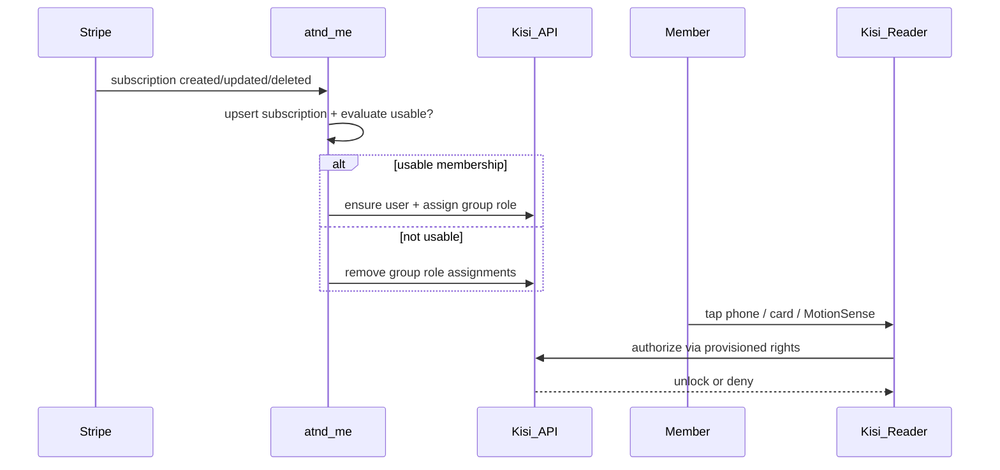
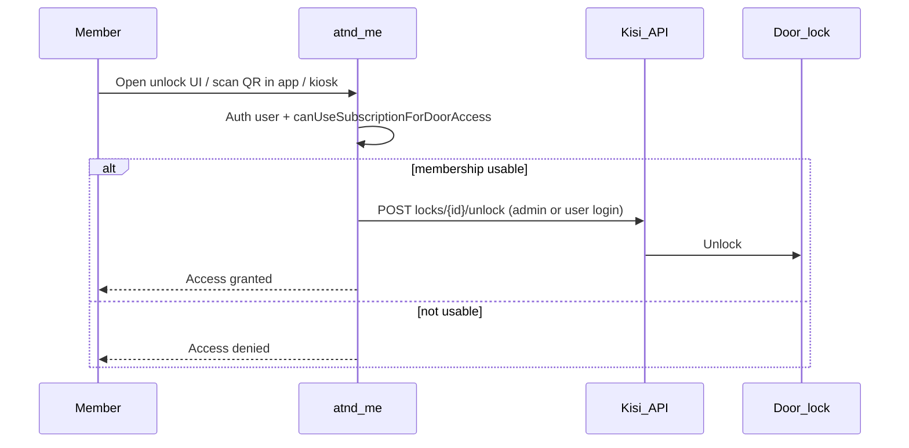
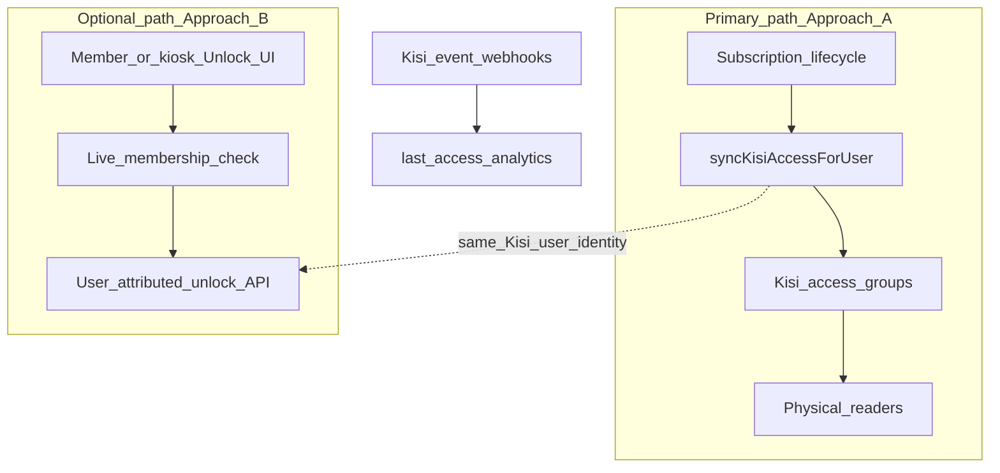

# Kisi gate access ↔ atnd-me membership integration

**Status:** Design  
**Scope:** `apps/atnd-me` + shared membership packages  
**Goal:** When a member presents a credential at a Kisi reader (or unlocks via app), access is granted only if they have an **active usable membership** in atnd-me.

---

## Recommendation (TL;DR)

**Ship Approach A (membership → Kisi group provisioning) as the primary integration.**

This is how fitness platforms (Finegym, Gymflow) integrate with Kisi. Physical readers decide access from provisioned rights (works offline, low latency, per-user audit). The “check active membership” rule runs when subscription status changes in atnd-me, not in the milliseconds after a card tap.

**Use Approach B (real-time check + unlock API) only as an optional complement** for in-app / kiosk unlock buttons, or later if Kisi’s delegated third-party QR evaluation ships and you need atnd-me QR codes evaluated at the terminal.

Do **not** rely on Approach B alone for door hardware: Kisi does not offer a synchronous “authorize this scan” callback for readers today; webhooks fire *after* events, not as a grant/deny gate.

---

## Context in atnd-me today

| Concept | Where it lives | Notes |
|--------|----------------|--------|
| Membership product | `plans` collection | Admin-labeled “Memberships”; Stripe product sync |
| Member entitlement | `subscriptions` collection | Stripe-aligned statuses |
| Usable for access (bookings) | `canUseSubscriptionForBooking` in `@repo/shared-services` | **`active` \| `trialing` only** |
| Tenant / venue | `tenants`, `locations` | Multi-tenant SaaS; locations = branches |
| Physical door / RFID / Kisi | — | **None today** |
| “Check-in” | Booking confirm / kiosk | Class attendance, not door unlock |
| Integration pattern precedent | Stripe Connect on `tenants` | Per-tenant IDs/status in DB; platform secrets in env |

Relevant sources:

- [`packages/shared-services/src/subscription.ts`](../../../packages/shared-services/src/subscription.ts) — `canUseSubscriptionForBooking`, `hasActiveSubscription`
- [`packages/bookings-payments/src/membership/collections/subscriptions.ts`](../../../packages/bookings-payments/src/membership/collections/subscriptions.ts)
- [`apps/atnd-me/src/app/api/stripe/webhook/route.ts`](../src/app/api/stripe/webhook/route.ts) — subscription lifecycle
- [`apps/atnd-me/src/collections/Tenants/index.ts`](../src/collections/Tenants/index.ts) — Connect field pattern

### Active membership rule for door access

Align door access with booking usability unless product explicitly wants something stricter:

| Subscription status | Door access |
|---------------------|-------------|
| `active`, `trialing` | **Grant** |
| `past_due`, `unpaid`, `paused`, `canceled`, `incomplete*` | **Revoke** |
| Outside `startDate`–`endDate` (when set) | **Revoke** |
| User `banned` | **Revoke** |

Centralize this in one helper (e.g. `canUseSubscriptionForDoorAccess`) so booking and door rules can diverge later without scattering conditionals.

---

## Approach A — Membership sync → Kisi access groups (recommended)

### How it satisfies “scan → check membership → grant”



The membership check is **authoritative in atnd-me** and **projected into Kisi**. At scan time, Kisi enforces the projection (including offline cache on readers).

### Why this is the right default

- Matches Kisi’s primary integration method ([user provisioning](https://docs.kisi.io/platform/integrate_kisi/integration_methods/user_provisioning/)).
- Offline / low-latency unlocks at the door.
- Unlock events attributed to the individual Kisi user (audit).
- Same pattern as Finegym / Gymflow: map plans → access groups; sync on lifecycle events.
- Fits multi-tenant SaaS: each tenant brings their own Kisi org API key and group mappings.

### Data model

#### Tenant-level Kisi connection

Add fields on `tenants` (mirror Stripe Connect access patterns: admin-readable, super-admin-controlled updates for secrets):

| Field | Type | Purpose |
|-------|------|---------|
| `kisiEnabled` | checkbox | Feature flag per tenant |
| `kisiApiKey` | text (secret, never public) | Organization API key (`KISI-LOGIN …`) |
| `kisiOrganizationId` | text (optional) | For ops / debugging |
| `kisiLastSyncAt` / `kisiLastError` | date / text | Ops visibility |

**Do not** put per-tenant Kisi keys in env vars (multi-tenant). Encrypt at rest if the platform later adds a secrets store; for v1, field-level access + admin-only is consistent with current Connect practices, with a follow-up to encrypt.

#### Plan → group mapping

On `plans` (or a small tenant-scoped join collection):

| Field | Type | Purpose |
|-------|------|---------|
| `kisiAccessGroups` | array of `{ groupId, location? }` | Which Kisi groups this plan grants |

Or a dedicated `kisi-group-mappings` collection: `tenant`, `plan`, `kisiGroupId`, optional `location`. Prefer a collection if admins will map many plans / multi-location variants without bloating plan forms.

#### Location → place (optional but useful)

On `locations`:

| Field | Type | Purpose |
|-------|------|---------|
| `kisiPlaceId` | text | Kisi place for this branch (filtering, future unlock UI) |

#### User link

On `users` (or a side table `kisi-identities`):

| Field | Type | Purpose |
|-------|------|---------|
| `kisiUserId` | text / number | Kisi user id for this member (per-tenant: prefer join table) |

Because one platform user can belong to multiple tenants, store **`kisiUserId` per tenant**:

```text
kisiIdentities[]: { tenant, kisiUserId, emailSynced }
```

Match Kisi users by **email** (same as Finegym). Creating a Kisi user with the member’s email is the join key.

### Sync triggers

| Event | Source | Action |
|-------|--------|--------|
| Subscription created / updated / paused / deleted | Stripe Connect webhook → after local `subscriptions` write | Recompute access for that user+tenant |
| Subscription `afterChange` hook | Payload (covers admin edits / non-Stripe) | Same recompute |
| User banned / unbanned | Users hooks | Revoke / restore |
| Plan mapping changed | Admin | Enqueue resync for affected subscribers |
| Nightly reconcile job | Payload job / cron | Diff atnd-me usable members vs Kisi group members; repair drift |
| Manual “Sync now” | Admin endpoint | Full or per-user sync |

Reuse the Stripe webhook path in [`apps/atnd-me/src/app/api/stripe/webhook/route.ts`](../src/app/api/stripe/webhook/route.ts): after subscription upsert, call `syncKisiAccessForUser({ tenantId, userId })` asynchronously (do not block webhook ACK; queue or fire-and-forget with structured logging).

### Sync algorithm (`syncKisiAccessForUser`)

1. Load tenant Kisi config; no-op if `!kisiEnabled` or missing API key.
2. Load user’s subscriptions for that tenant with depth on `plan`.
3. Compute `desiredGroupIds = union of kisiAccessGroups for every subscription where canUseSubscriptionForDoorAccess(sub)`.
4. Ensure Kisi user exists (create managed or regular user by email; store `kisiUserId`).
5. Fetch current role assignments for that user on mapped groups.
6. Add missing `role_assignments` (`role_id: group_basic`, optional `valid_until` from `endDate` / `cancelAt`).
7. Delete role assignments for groups no longer desired.
8. Record sync result / errors on tenant or a small `kisi-sync-logs` collection.

Kisi API primitives (auth header `Authorization: KISI-LOGIN <key>`):

- Create/find user
- `POST /role_assignments` with `user_id`, `group_id`, `role_id: "group_basic"`
- Delete role assignment to revoke
- `GET /groups` for admin mapping UI

Rate limit: **5 req/s** per authenticated user — batch carefully; prefer per-user sync on events + nightly reconcile over hammering full roster sync on every webhook.

### Member experience (Approach A)

1. Member buys / activates membership in atnd-me.
2. Sync creates/links Kisi user and assigns groups.
3. Member receives Kisi invite email (regular users) **or** uses cards/credentials issued in Kisi / via API.
4. Member unlocks with Kisi app tap / MotionSense / card at the reader.
5. Cancel / pause / expire → sync removes group roles → next scan denied (and offline cache eventually drops rights per Kisi behavior).

Admin setup checklist:

1. Create Kisi organization, places, locks, access groups.
2. Paste API key into tenant settings; enable integration.
3. Map each membership plan → one or more Kisi groups.
4. Optional: map locations → Kisi places.
5. Run initial sync.

### Edge cases (A)

| Case | Behavior |
|------|----------|
| Multiple active plans | Union of groups |
| Plan change (upgrade/downgrade) | Diff groups; remove old, add new |
| `past_due` | Revoke (align with “needs portal”); optionally grace period later |
| Email change | Re-link or update Kisi user; treat carefully |
| Same email across tenants | Separate Kisi orgs per tenant → separate users; OK |
| Sync failure | Keep retry queue; surface `kisiLastError`; do not fail Stripe webhook |
| Soft-deleted plan | Stop granting that plan’s groups |

### Pros / cons (A)

| Pros | Cons |
|------|------|
| Works with physical readers offline | Access change not literally “at the moment of scan” — delayed by sync (seconds if event-driven) |
| Industry-standard, well documented | Members need Kisi credentials (app or card) |
| Per-user audit in Kisi | Requires plan→group mapping UI + reconcile job |
| Scales to multi-location groups | Drift possible if only webhooks and no reconcile |

---

## Approach B — Real-time membership check + unlock API

### How it works



Variant **B2 — post-event webhook** (not a gate): Kisi notifies atnd-me *after* an unlock for analytics / last-check-in. This does **not** grant or deny access.

Variant **B3 — delegated third-party QR** (Kisi “coming soon”): Terminal forwards non-Kisi QR to your webhook for grant/deny. Treat as future option for atnd-me-issued QR; not available as a production dependency today.

### What B can and cannot do

| Capability | Supported? |
|------------|------------|
| In-app / kiosk “Open door” after membership check | Yes — [cloud unlock](https://docs.kisi.io/platform/integrate_kisi/integration_methods/cloud_unlocks/) or [user unlock](https://docs.kisi.io/platform/integrate_kisi/integration_methods/user_unlock/) |
| Physical reader tap decides from live atnd-me DB | **No** (no sync authorize callback) |
| Attribute unlock to member in Kisi audit | Prefer **user unlock** (member login secret), not admin cloud unlock |
| Offline unlock at reader | **No** for pure B |
| Latency at door | Depends on network + API; worse than provisioned rights |

### Implementation sketch (complementary)

1. Tenant config: same `kisiApiKey`, plus `kisiLocks[]` or location→`kisiLockId` map.
2. Authenticated endpoint / tRPC: `doors.unlock({ locationId | lockId })`.
3. Server: verify session user → `canUseSubscriptionForDoorAccess` for tenant → call Kisi unlock.
4. Prefer **user unlock**: provision managed user + login secret once (overlaps A), then unlock as that user so audit is correct.
5. Optional: proximity / geofence checks client-side before calling unlock.
6. Rate-limit and abuse-protect the endpoint (membership does not imply unlimited remote unlock from anywhere unless product allows it).

Admin cloud unlock (`POST /locks/{id}/unlock` with org API key) is simpler but attributes every open to the API key owner — **avoid for member door access**.

### Pros / cons (B)

| Pros | Cons |
|------|------|
| Literally checks membership at unlock request time | Does not gate physical reader taps by itself |
| Good for staff kiosk / “buzz me in” UX | No offline; API latency / outage = locked out |
| Can share Kisi client + identity store with A | Admin unlock muddies audit; user unlock needs provisioning anyway |
| Future QR delegated eval could make B primary for QR-only sites | Higher implementation risk if used as sole door strategy |

---

## Recommended architecture (combined)



1. **MVP:** Approach A only — tenant API key, plan→group mapping, event-driven sync + nightly reconcile, user `kisiIdentities`.
2. **Phase 2 (optional):** Approach B unlock button for authenticated members at a location, reusing provisioned users from A.
3. **Phase 3 (optional):** Ingest Kisi unlock webhooks into analytics (“last door access”) alongside booking check-ins.
4. **Later:** Revisit B3 if Kisi ships delegated QR evaluation and product wants atnd-me QR as the credential.

---

## Suggested package / file layout

Keep Kisi code out of Stripe webhook handlers beyond a single hook call.

```text
packages/kisi/   (or apps/atnd-me/src/lib/kisi/)
  client.ts              # fetch wrapper, auth header, retry/429 backoff
  syncAccess.ts          # syncKisiAccessForUser / reconcileTenant
  membershipGate.ts      # canUseSubscriptionForDoorAccess
  types.ts

apps/atnd-me/src/
  collections/Tenants/   # kisi* fields
  collections/…          # mappings / kisiIdentities fields or collection
  app/api/kisi/webhook/  # optional unlock-event ingest (Phase 3)
  endpoints or tRPC      # admin: test connection, list groups, manual sync
                         # member: unlock (Phase 2)
```

Prefer a small `@repo/kisi` package if `kyuzo` / other apps will share it; otherwise start under `apps/atnd-me/src/lib/kisi` and extract later.

### Security checklist

- Never expose `kisiApiKey` to the client or public REST without field access denial.
- Unlock endpoints: authenticated user only; `overrideAccess: false` when acting as user; tenant-scope lock IDs.
- Verify Kisi webhook signatures if ingesting events.
- Log sync failures without logging full API keys.
- Follow Payload Local API rules (`overrideAccess`, pass `req` in hooks) from [security-critical](../.cursor/rules/security-critical.mdc).

---

## MVP implementation outline (Approach A)

1. **Schema:** tenant Kisi fields; plan or mapping collection for `kisiGroupId`; per-tenant `kisiUserId` on user.
2. **Client:** typed Kisi HTTP client (users, groups, role_assignments).
3. **Gate helper:** `canUseSubscriptionForDoorAccess` (reuse `active`/`trialing`).
4. **Sync service:** ensure user + diff role assignments.
5. **Hooks:** subscription `afterChange` → enqueue sync; user ban → sync.
6. **Webhook:** after Stripe subscription upsert → enqueue sync (non-blocking).
7. **Admin UI:** enable + API key; fetch groups; map plans; “Sync now” + last error.
8. **Job:** nightly reconcile per enabled tenant.
9. **Tests:** unit tests for gate + diff logic; int tests with mocked Kisi HTTP; webhook → sync invoked.
10. **Docs:** tenant setup runbook (this doc + short admin help).

Out of scope for MVP: Approach B unlock UI, card issuance UI, Kisi SDK in a native app, delegated QR.

---

## Decision summary

| Question | Decision |
|----------|----------|
| Primary integration | **A — provision users into Kisi groups from membership status** |
| Membership statuses that grant access | `active`, `trialing` (same as booking usability) |
| Real-time scan-time check at hardware | Not available from Kisi; simulated via fresh provisioning |
| Approach B | Optional later for in-app/kiosk unlock; shares identity with A |
| Secret storage | Per-tenant API key on `tenants` (field access); encrypt later |
| Multi-location | Map plans → groups; optional `locations.kisiPlaceId` |
| Analytics | Optional Kisi unlock webhooks → “last access” |

---

## References

- [Kisi integration methods](https://docs.kisi.io/platform/integrate_kisi/integration_methods/)
- [User provisioning](https://docs.kisi.io/platform/integrate_kisi/integration_methods/user_provisioning/)
- [Assign access rights / role_assignments](https://docs.kisi.io/platform/integrate_kisi/integration_methods/user_provisioning/assign_access_rights/)
- [Cloud unlocks](https://docs.kisi.io/platform/integrate_kisi/integration_methods/cloud_unlocks/)
- [User unlock](https://docs.kisi.io/platform/integrate_kisi/integration_methods/user_unlock/)
- [Webhooks](https://docs.kisi.io/platform/apis/webhooks/)
- [Finegym ↔ Kisi](https://www.getkisi.com/integrations/finegym) (membership ↔ group pattern)
- [Gymflow ↔ Kisi](https://docs.kisi.io/marketplace/fitness/gymflow/)
